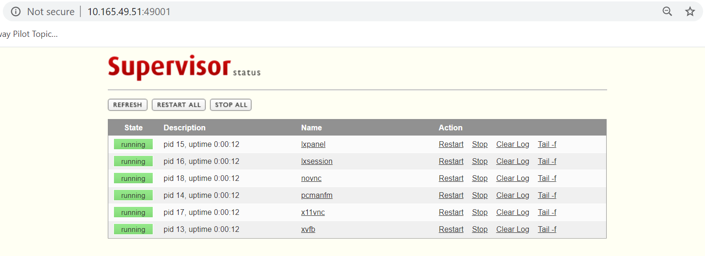
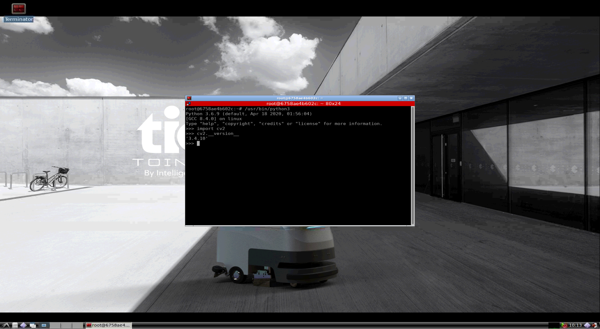

# Docker for Visual Inertial Odometry Development

This is the Docker image for Visual Inertial Odometry development.

---

## Build Images

The environments can be built with docker-compose as follows:
```bash 
docker-compose build
```

---

## Configuration

### Volume Mounting

Local directories for source code and data are configured in **docker-compose.yml**

```yaml
    volumes:
      # workspace:
      - ${PWD}/workspace/assignments:/workspace/assignments
      # data:
      - ${PWD}/workspace/data:/workspace/data
```

### Network Port Mapping

Config port mappings for supervisord monitor and VNC client access in **docker-compose.yml** 

```yaml
    ports:
      # standard vnc client:
      - 45901:5900
      # supervisord admin:
      - 49001:9001
```

---

## Up and Running 

### Launch VNC Instance
```bash
# for cpu instance -- use docker-compose
docker-compose up workspace-vnc-cpu
# for gpu instance -- use docker run

```

### Health Check

Access supervisord monitor to make sure all processes have been started: http://[HOST_IP]:49001



### VNC Access:

You can access the desktop with standard VNC client

#### VNC Client

On the system you can use 

* Remmina on Ubuntu
* TightVNC Viewer on Windows

to create a VNC session to connect to: http://[HOST_IP]:45901



---
