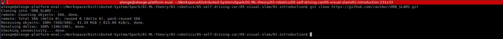
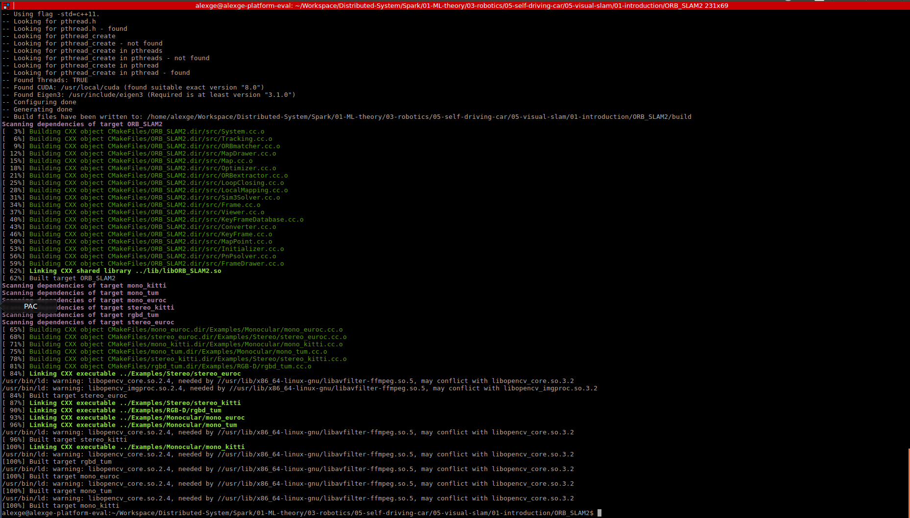
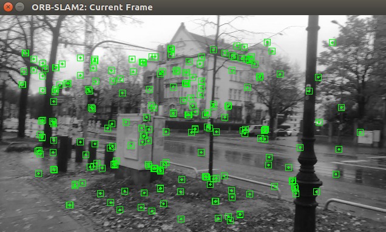
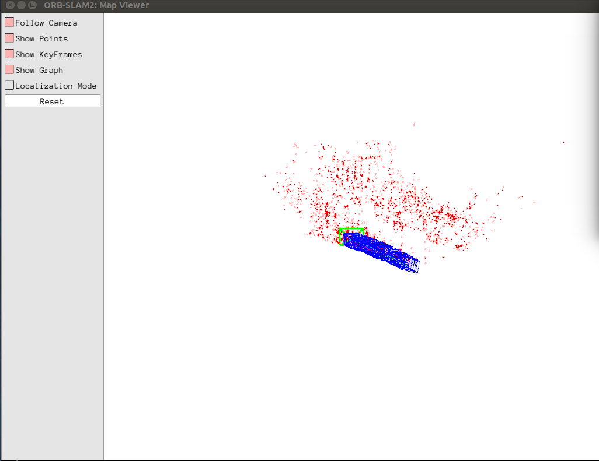
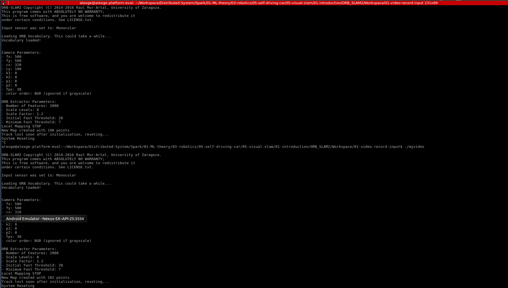

# Introduction to Visual SLAM

---

## Introduction to Linux

### 1. How to install softwares in Ubuntu? Where are the installed programs?

To install downloaded software in the package format, i.e., *.deb file:

```shell
sudo dpkg –i [PACKAGE_NAME].deb
```

To install application using package from Internet:

```shell
sudo apt-get install [APPLICATION_NAME]
```

The installed programs can be found in:
```
/usr/bin
```

### 2. What is environment variable? How to add environment variables?

**Environment Variable** is a dynamic-named value that can affect the way running processes will behave on a computer. Environment variables are part of the environment in which a process runs.

To add new environment variable:

* To set only for current shell:
```shell
VARIABLE_NAME="VARIABLE_VALUE"
```

* To set for current shell and all processes started from current shell:
```shell
export VARIABLE_NAME="VARIABLE_VALUE"
```

* To set permanently for all future bash sessions:
```shell
echo 'export VARIABLE_NAME="VARIABLE_VALUE"' >> $HOME/.bashrc
```

* To set permanently and system wide, first open the config file for system wide ENVs, then append new ENV as the format in the first section:
```shell
sudo -H gedit /etc/environment
```

### 3. What is Linux filesystem hierarchy? Describe the purpose of at least 3 directories.

This is the full definition of Linux Filesystem Hierarchy.

<table class="wikitable" summary="A description of the hierarchy specified in the FHS.">
<tbody><tr>
<th>Directory</th>
<th>Description</th>
</tr>
<tr>
<td>
<dl>
<dd><code>/</code></dd>
</dl>
</td>
<td><i>Primary hierarchy</i> root and <a href="/wiki/Root_directory" title="Root directory">root directory</a> of the entire file system hierarchy.</td>
</tr>
<tr>
<td>
<dl>
<dd><code>/bin</code></dd>
</dl>
</td>
<td>Essential command <a href="/wiki/Executable" title="Executable">binaries</a> that need to be available in <a href="/wiki/Single_user_mode" title="Single user mode">single user mode</a>; for all users, <i>e.g.</i>, <a href="/wiki/Cat_(Unix)" title="Cat (Unix)">cat</a>, <a href="/wiki/Ls" title="Ls">ls</a>, <a href="/wiki/Cp_(Unix)" title="Cp (Unix)">cp</a>.</td>
</tr>
<tr>
<td>
<dl>
<dd><code><a href="/wiki//boot" class="mw-redirect" title="/boot">/boot</a></code></dd>
</dl>
</td>
<td><a href="/wiki/Boot_loader" class="mw-redirect" title="Boot loader">Boot loader</a> files, <i>e.g.</i>, <a href="/wiki/Kernel_(computer_science)" class="mw-redirect" title="Kernel (computer science)">kernels</a>, <a href="/wiki/Initrd" class="mw-redirect" title="Initrd">initrd</a>.</td>
</tr>
<tr>
<td>
<dl>
<dd><code><a href="/wiki//dev" class="mw-redirect" title="/dev">/dev</a></code></dd>
</dl>
</td>
<td>Essential <a href="/wiki/Device_file" title="Device file">device files</a>, <i>e.g.</i>, <code><a href="/wiki/Null_device" title="Null device">/dev/null</a></code>.</td>
</tr>
<tr>
<td>
<dl>
<dd><code>/etc</code></dd>
</dl>
</td>
<td>Host-specific system-wide <a href="/wiki/Configuration_file" title="Configuration file">configuration files</a><br>
<p>There has been controversy over the meaning of the name itself. In early versions of the UNIX Implementation Document from Bell labs, <code>/etc</code> is referred to as the <i><a href="/wiki/Et_cetera" title="Et cetera">etcetera</a> directory</i>,<sup id="cite_ref-3" class="reference"><a href="#cite_note-3">[3]</a></sup> as this directory historically held everything that did not belong elsewhere (however, the FHS restricts <code>/etc</code> to static configuration files and may not contain binaries).<sup id="cite_ref-/etc_4-0" class="reference"><a href="#cite_note-/etc-4">[4]</a></sup> Since the publication of early documentation, the directory name has been re-explained in various ways. Recent interpretations include <a href="/wiki/Backronym" title="Backronym">backronyms</a> such as "Editable Text Configuration" or "Extended Tool Chest".<sup id="cite_ref-5" class="reference"><a href="#cite_note-5">[5]</a></sup></p>
</td>
</tr>
<tr>
<td>
<dl>
<dd>
<dl>
<dd><code>/etc/opt</code></dd>
</dl>
</dd>
</dl>
</td>
<td>Configuration files for add-on packages that are stored in <code>/opt</code>.</td>
</tr>
<tr>
<td>
<dl>
<dd>
<dl>
<dd><code>/etc/sgml</code></dd>
</dl>
</dd>
</dl>
</td>
<td>Configuration files, such as catalogs, for software that processes <a href="/wiki/SGML" class="mw-redirect" title="SGML">SGML</a>.</td>
</tr>
<tr>
<td>
<dl>
<dd>
<dl>
<dd><code>/etc/X11</code></dd>
</dl>
</dd>
</dl>
</td>
<td>Configuration files for the <a href="/wiki/X_Window_System" title="X Window System">X Window System</a>, version 11.</td>
</tr>
<tr>
<td>
<dl>
<dd>
<dl>
<dd><code>/etc/xml</code></dd>
</dl>
</dd>
</dl>
</td>
<td>Configuration files, such as catalogs, for software that processes <a href="/wiki/XML" title="XML">XML</a>.</td>
</tr>
<tr>
<td>
<dl>
<dd><code>/home</code></dd>
</dl>
</td>
<td>Users' <a href="/wiki/Home_directory" title="Home directory">home directories</a>, containing saved files, personal settings, etc.</td>
</tr>
<tr>
<td>
<dl>
<dd><code>/lib</code></dd>
</dl>
</td>
<td><a href="/wiki/Library_(computer_science)" class="mw-redirect" title="Library (computer science)">Libraries</a> essential for the <a href="/wiki/Binaries" class="mw-redirect" title="Binaries">binaries</a> in <code>/bin</code> and <code>/sbin</code>.</td>
</tr>
<tr>
<td>
<dl>
<dd><code>/lib&lt;qual&gt;</code></dd>
</dl>
</td>
<td>Alternate format essential libraries. Such directories are optional, but if they exist, they have some requirements.</td>
</tr>
<tr>
<td>
<dl>
<dd><code>/media</code></dd>
</dl>
</td>
<td>Mount points for <a href="/wiki/Removable_media" title="Removable media">removable media</a> such as <a href="/wiki/CD-ROM" title="CD-ROM">CD-ROMs</a> (appeared in FHS-2.3 in 2004).</td>
</tr>
<tr>
<td>
<dl>
<dd><code>/mnt</code></dd>
</dl>
</td>
<td>Temporarily <a href="/wiki/Mount_(computing)" title="Mount (computing)">mounted</a> filesystems.</td>
</tr>
<tr>
<td>
<dl>
<dd><code>/opt</code></dd>
</dl>
</td>
<td>Optional <a href="/wiki/Application_software" title="Application software">application software</a> <a href="/wiki/Software_package_(installation)" class="mw-redirect" title="Software package (installation)">packages</a>.<sup id="cite_ref-/opt_6-0" class="reference"><a href="#cite_note-/opt-6">[6]</a></sup></td>
</tr>
<tr>
<td>
<dl>
<dd><code><a href="/wiki//proc" class="mw-redirect" title="/proc">/proc</a></code></dd>
</dl>
</td>
<td>Virtual <a href="/wiki/File_system" title="File system">filesystem</a> providing <a href="/wiki/Process_(computing)" title="Process (computing)">process</a> and <a href="/wiki/Kernel_(computing)" class="mw-redirect" title="Kernel (computing)">kernel</a> information as files. In Linux, corresponds to a <a href="/wiki/Procfs" title="Procfs">procfs</a> mount. Generally automatically generated and populated by the system, on the fly.</td>
</tr>
<tr>
<td>
<dl>
<dd><code>/root</code></dd>
</dl>
</td>
<td><a href="/wiki/Home_directory" title="Home directory">Home directory</a> for the <a href="/wiki/Superuser" title="Superuser">root</a> user.</td>
</tr>
<tr>
<td>
<dl>
<dd><code>/run</code></dd>
</dl>
</td>
<td>Run-time variable data: Information about the running system since last boot, <i>e.g.</i>, currently logged-in users and running <a href="/wiki/Daemon_(computer_software)" class="mw-redirect" title="Daemon (computer software)">daemons</a>. Files under this directory must be either removed or truncated at the beginning of the boot process; but this is not necessary on systems that provide this directory as a <a href="/wiki/Temporary_filesystem" class="mw-redirect" title="Temporary filesystem">temporary filesystem</a> (<a href="/wiki/Tmpfs" title="Tmpfs">tmpfs</a>).</td>
</tr>
<tr>
<td>
<dl>
<dd><code>/sbin</code></dd>
</dl>
</td>
<td>Essential system binaries, <i>e.g.</i>, fsck, init, route.</td>
</tr>
<tr>
<td>
<dl>
<dd><code>/srv</code></dd>
</dl>
</td>
<td>Site-specific data served by this system, such as data and scripts for web servers, data offered by <a href="/wiki/FTP" class="mw-redirect" title="FTP">FTP</a> servers, and repositories for <a href="/wiki/Version_control_systems" class="mw-redirect" title="Version control systems">version control systems</a> (appeared in FHS-2.3 in 2004).</td>
</tr>
<tr>
<td>
<dl>
<dd><code>/sys</code></dd>
</dl>
</td>
<td>Contains information about devices, drivers, and some kernel features.<sup id="cite_ref-/sys_7-0" class="reference"><a href="#cite_note-/sys-7">[7]</a></sup></td>
</tr>
<tr>
<td>
<dl>
<dd><code>/tmp</code></dd>
</dl>
</td>
<td>Temporary files (see also <code>/var/tmp</code>). Often not preserved between system reboots, and may be severely size restricted.</td>
</tr>
<tr>
<td>
<dl>
<dd><code>/usr</code></dd>
</dl>
</td>
<td><i>Secondary hierarchy</i> for read-only user data; contains the majority of (<a href="/wiki/Multi-user" class="mw-redirect" title="Multi-user">multi-</a>)user utilities and applications.<sup id="cite_ref-8" class="reference"><a href="#cite_note-8">[8]</a></sup></td>
</tr>
<tr>
<td>
<dl>
<dd>
<dl>
<dd><code>/usr/bin</code></dd>
</dl>
</dd>
</dl>
</td>
<td>Non-essential command <a href="/wiki/Executable" title="Executable">binaries</a> (not needed in <a href="/wiki/Single_user_mode" title="Single user mode">single user mode</a>); for all users.</td>
</tr>
<tr>
<td>
<dl>
<dd>
<dl>
<dd><code>/usr/include</code></dd>
</dl>
</dd>
</dl>
</td>
<td>Standard <a href="/wiki/Header_file" class="mw-redirect" title="Header file">include files</a>.</td>
</tr>
<tr>
<td>
<dl>
<dd>
<dl>
<dd><code>/usr/lib</code></dd>
</dl>
</dd>
</dl>
</td>
<td><a href="/wiki/Library_(computer_science)" class="mw-redirect" title="Library (computer science)">Libraries</a> for the <a href="/wiki/Binaries" class="mw-redirect" title="Binaries">binaries</a> in <code>/usr/bin</code> and <code>/usr/sbin</code>.</td>
</tr>
<tr>
<td>
<dl>
<dd>
<dl>
<dd><code>/usr/lib&lt;qual&gt;</code></dd>
</dl>
</dd>
</dl>
</td>
<td>Alternate format libraries, <i>e.g.</i> <code>/usr/lib32</code> for 32-bit libraries on a 64-bit machine (optional).</td>
</tr>
<tr>
<td>
<dl>
<dd>
<dl>
<dd><code>/usr/local</code></dd>
</dl>
</dd>
</dl>
</td>
<td><i>Tertiary hierarchy</i> for local data, specific to this host. Typically has further subdirectories, <i>e.g.</i>, <code>bin</code>, <code>lib</code>, <code>share</code>.<sup id="cite_ref-9" class="reference"><a href="#cite_note-9">[9]</a></sup></td>
</tr>
<tr>
<td>
<dl>
<dd>
<dl>
<dd><code>/usr/sbin</code></dd>
</dl>
</dd>
</dl>
</td>
<td>Non-essential system binaries, <i>e.g.</i>, <a href="/wiki/Daemon_(computer_software)" class="mw-redirect" title="Daemon (computer software)">daemons</a> for various <a href="/wiki/Network-services" class="mw-redirect" title="Network-services">network-services</a>.</td>
</tr>
<tr>
<td>
<dl>
<dd>
<dl>
<dd><code>/usr/share</code></dd>
</dl>
</dd>
</dl>
</td>
<td>Architecture-independent (shared) data.</td>
</tr>
<tr>
<td>
<dl>
<dd>
<dl>
<dd><code>/usr/src</code></dd>
</dl>
</dd>
</dl>
</td>
<td><a href="/wiki/Source_code" title="Source code">Source code</a>, <i>e.g.</i>, the kernel source code with its header files.</td>
</tr>
<tr>
<td>
<dl>
<dd>
<dl>
<dd><code>/usr/X11R6</code></dd>
</dl>
</dd>
</dl>
</td>
<td><a href="/wiki/X_Window_System" title="X Window System">X Window System</a>, Version 11, Release 6 (up to FHS-2.3, optional).</td>
</tr>
<tr>
<td>
<dl>
<dd><code>/var</code></dd>
</dl>
</td>
<td>Variable files—files whose content is expected to continually change during normal operation of the system—such as logs, spool files, and temporary e-mail files.</td>
</tr>
<tr>
<td>
<dl>
<dd>
<dl>
<dd><code>/var/cache</code></dd>
</dl>
</dd>
</dl>
</td>
<td>Application cache data. Such data are locally generated as a result of time-consuming I/O or calculation. The application must be able to regenerate or restore the data. The cached files can be deleted without loss of data.</td>
</tr>
<tr>
<td>
<dl>
<dd>
<dl>
<dd><code>/var/lib</code></dd>
</dl>
</dd>
</dl>
</td>
<td>State information. Persistent data modified by programs as they run, <i>e.g.</i>, databases, packaging system metadata, etc.</td>
</tr>
<tr>
<td>
<dl>
<dd>
<dl>
<dd><code>/var/lock</code></dd>
</dl>
</dd>
</dl>
</td>
<td>Lock files. Files keeping track of resources currently in use.</td>
</tr>
<tr>
<td>
<dl>
<dd>
<dl>
<dd><code>/var/log</code></dd>
</dl>
</dd>
</dl>
</td>
<td>Log files. Various logs.</td>
</tr>
<tr>
<td>
<dl>
<dd>
<dl>
<dd><code>/var/mail</code></dd>
</dl>
</dd>
</dl>
</td>
<td>Mailbox files. In some distributions, these files may be located in the deprecated <code>/var/spool/mail</code>.</td>
</tr>
<tr>
<td>
<dl>
<dd>
<dl>
<dd><code>/var/opt</code></dd>
</dl>
</dd>
</dl>
</td>
<td>Variable data from add-on packages that are stored in <code>/opt</code>.</td>
</tr>
<tr>
<td>
<dl>
<dd>
<dl>
<dd><code>/var/run</code></dd>
</dl>
</dd>
</dl>
</td>
<td>Run-time variable data. This directory contains system information data describing the system since it was booted.<sup id="cite_ref-10" class="reference"><a href="#cite_note-10">[10]</a></sup><br>
<p>In FHS 3.0, <code>/var/run</code> is replaced by <code>/run</code>; a system should either continue to provide a <code>/var/run</code> directory, or provide a symbolic link from <code>/var/run</code> to <code>/run</code>, for backwards compatibility.<sup id="cite_ref-11" class="reference"><a href="#cite_note-11">[11]</a></sup></p>
</td>
</tr>
<tr>
<td>
<dl>
<dd>
<dl>
<dd><code>/var/spool</code></dd>
</dl>
</dd>
</dl>
</td>
<td><a href="/wiki/Spooling" title="Spooling">Spool</a> for tasks waiting to be processed, <i>e.g.</i>, print queues and outgoing mail queue.</td>
</tr>
<tr>
<td>
<dl>
<dd>
<dl>
<dd>
<dl>
<dd><code>/var/spool/mail</code></dd>
</dl>
</dd>
</dl>
</dd>
</dl>
</td>
<td><a href="/wiki/Deprecated" class="mw-redirect" title="Deprecated">Deprecated</a> location for users' mailboxes.<sup id="cite_ref-12" class="reference"><a href="#cite_note-12">[12]</a></sup></td>
</tr>
<tr>
<td>
<dl>
<dd>
<dl>
<dd><code>/var/tmp</code></dd>
</dl>
</dd>
</dl>
</td>
<td>Temporary files to be preserved between reboots.</td>
</tr>
</tbody></table>

### 4. How to make _a.sh_ executable?
```shell
sudo chmod +x a.sh
```

### 5. How to set the ownership of _a.sh_?
```shell
sudo chown xiang:xiang a.sh
```

---

## SLAM Research Review

### 1. List at least three applications of SLAM

1. Automatic car piloting on unrehearsed off-road terrains.
2. Rescue tasks for high-risk or difficult-navigation environments
3. Planetary, aerial, terrestrial and oceanic exploration

### 2. What is the relationship between localization and mapping for SLAM? Why localization and mapping are both needed for SLAM?

Localization and mapping are dependent subtasks for SLAM.

The reason for the need of both localization and mapping for SLAM is: 

* For being precisely localized in an environment, a correct map is necessary so mapping is necessary.
* In order to construct a good map it is necessary to be properly localized when elements are added to the map.

### 3. What is the development history of SLAM? How many eras can we categorize it into?

The development history of SLAM can be summarized as the following table

|     Time     |            Age           |                                                                             Milestones                                                                            |
|:------------:|:------------------------:|:-----------------------------------------------------------------------------------------------------------------------------------------------------------------:|
|   1986-2004  |       classical age      |                       probabilistic formulations for SLAM and identification of efficiency and robust data association as basic challenges                        |
|   2004-2015  | algorithmic analysis age | the study of fundamental properties, namely observability, convergence and consistency. efficency through sparsity and development of main open-source frameworks |
| 2015-present |   robust perception age  |                                     robust performance, high-level understanding, resource awareness and task-driven inference                                    |

### 4. List three classic literature on SLAM

 1. Durrant H, Bailey T (2006) Simultaneous localization and mapping (SLAM): part I the essential algorithms. IEEE Robot Autom Mag 13(2):99–110.
 2. Bailey T, Durrant H (2006) Simultaneous localization and mapping (SLAM): Part II. IEEE Robot Autom Mag 13(3):108–117.
 3. G. Dissanayake, S. Huang, Z. Wang, and R. Ranasinghe. A review of recent developments in Simultaneous Localization and Mapping. In International Conference on Industrial and Information Systems, pages 477–482. IEEE, 2011.

---

## CMake Practice

```cmake
CMAKE_MINIMUM_REQUIRED(VERSION 3.5)

# project name:
PROJECT(HELLO_SLAM)

# default build mode:
SET(CMAKE_BUILD_TYPE Release)

# libhello:
SET(LIB_SRC_LIST src/hello.cpp)

ADD_LIBRARY(hello_shared SHARED ${LIB_SRC_LIST})

SET_TARGET_PROPERTIES(hello_shared PROPERTIES OUTPUT_NAME "hello")
SET_TARGET_PROPERTIES(hello_shared PROPERTIES CLEAN_DIRECT_OUTPUT 1)
SET_TARGET_PROPERTIES(hello_shared PROPERTIES VERSION 1.0 SOVERSION 1)

INSTALL(
  TARGETS hello_shared
  LIBRARY DESTINATION lib
)

INSTALL(
  DIRECTORY include/
  DESTINATION include
)

# executable:
SET(SRC_LIST useHello.cpp)
SET(EXECUTABLE_OUTPUT_PATH ${PROJECT_BINARY_DIR}/bin)

INCLUDE_DIRECTORIES(include)

ADD_EXECUTABLE(sayhello ${SRC_LIST} ${LIB_SRC_LIST})

```

---

## Organization of ORB-SLAM2

### 1. Show the terminal output after git pull of ORB SLAM2



### 2. ORB SLAM2 project organization

#### a. What is the CMake compilation output of ORB SLAM2? How many libraries and executables will be generated?

* 1 library

| No. |    Name   |
|:---:|:---------:|
|  1  | ORB_SLAM2 |

* 6 executables

| No |     Name     |
|:--:|:------------:|
|  1 |   rgbd_tum   |
|  2 | stereo_kitti |
|  3 | stereo_euroc |
|  4 |   mono_tum   |
|  5 |  mono_kitti  |
|  6 |  mono_euroc  |

#### b. What is the respective contents of include, src and Examples?

|   Name   |        Contents        |
|:--------:|:----------------------:|
|  include | ORB SLAM2 header files |
|    src   | ORB SLAM2 source files |
| Examples |  Application examples  |

#### c. What is the detailed list of external libraries linked by ORB SLAM2?

| No |   Name   |
|:--:|:--------:|
|  1 |  OpenCV  |
|  2 |  Eigen3  |
|  3 | Pangolin |
|  4 |   DBoW2  |
|  5 |    g20   |

---

## Hands-On ORB-SLAM2

### 1. Set up and compile ORB SLAM2



### 2. How to add our own application to ORB SLAM2

Just mimic the CMake segment for example compilation:

```cmake
# Build applications
SET(CMAKE_RUNTIME_OUTPUT_DIRECTORY ${PROJECT_SOURCE_DIR}/Workspace/01-video-record-input)

ADD_EXECUTABLE(myvideo Workspace/01-video-record-input/myvideo.cpp)
TARGET_LINK_LIBRARIES(myvideo ${PROJECT_NAME})
```

### 3. Show the output of application execution

First is the front-end for salient feature tracking:



Second is the back-end for map building:



Finally is the terminal output:


