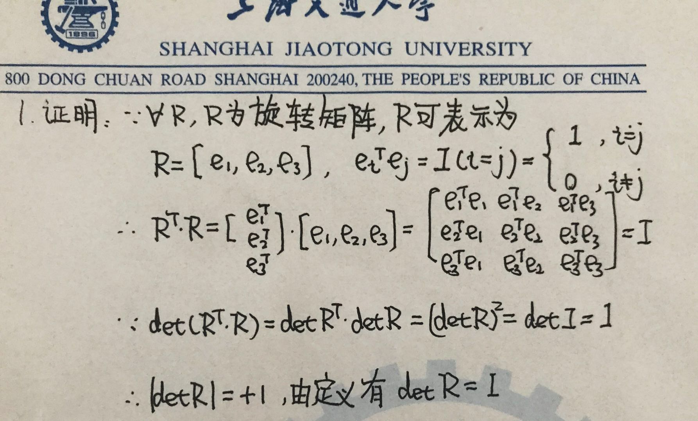
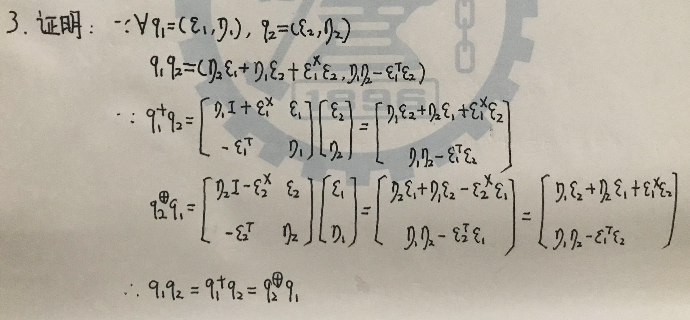
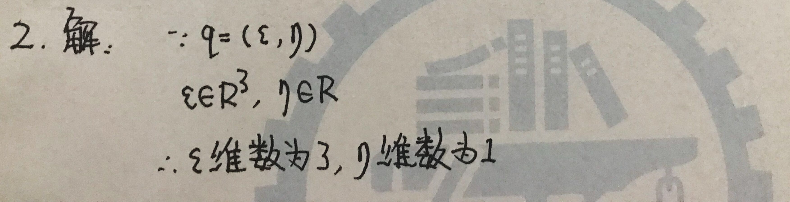
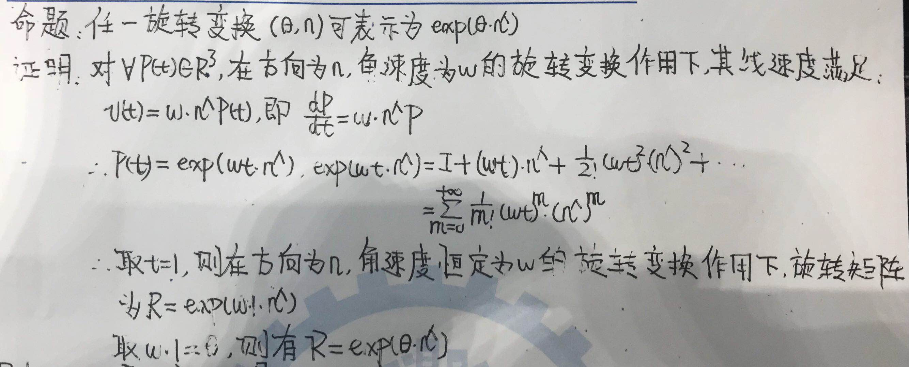
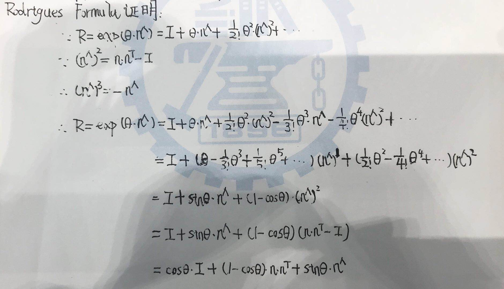
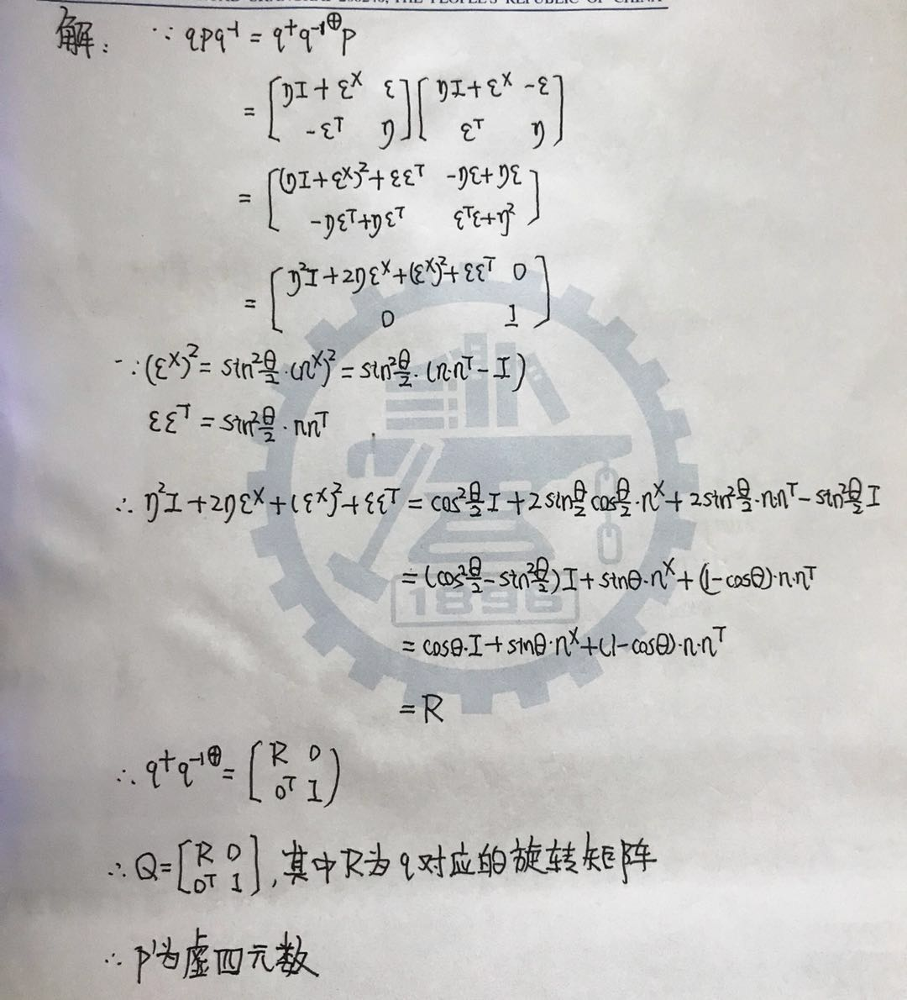

# Kinematics-in-3D-Space

---

## Hands-On Eigen Matrix Library

Given the linear equations $Ax = b$, in which A is a square matrix 

### 1. Under what conditions the equations have unique solution?

Under the following conditions the equations would have unique solution:

* The determinant is non-zero.
* A is full rank.

### 2. What is the principle of Gaussian elimination?

Gaussian elimination is an algorithm for solving systems of linear equations. It uses a sequence of elementary row operations, namely swapping two rows, multiplying a row by a nonzero number and adding a multiple of one row to another row, to modify the matrix until the lower left-hand corner of the matrix is filled with zeros. In numerical analysis, Gaussian elimination is implemented through LU decomposition.

### 3. What is the principle of QR decomposition?

The QR decomposition of a matrix is a decomposition of a matrix A into a product A = QR of an orthogonal matrix Q and an upper triangular matrix R. QR decomposition is often used to solve the linear least squares problem and is the basis for a particular eigenvalue algorithm, the QR algorithm.

### 4. What is the principle of Cholesky decomposition?

The Cholesky decomposition (pronounced sholeski) is a decomposition of a Hermitian, positive-definite matrix into the product of a lower triangular matrix and its conjugate transpose, which is useful for efficient numerical solutions. When it is applicable, the Cholesky decomposition is roughly twice as efficient as the LU decomposition for solving systems of linear equations.

### 5. Use Eigen lib to solve the linear equations with both QR and Cholesky decompostions. A should be 100-by-100 random matrix.

The source code for linear equations solution is as follows:

```c++
#include <iostream>

#include <Eigen/Dense>

using namespace std;
using namespace Eigen;

int main()
{
    const int N = 100;

    // random Hermitian, semi-definite matrix A:
    MatrixXf A = MatrixXf::Random(N, N);
    A = A * A.transpose();
    
    // random vector b:
    VectorXf b = VectorXf::Random(N);
    double b_norm = b.norm();

    // LU decomposition:
    VectorXf x_lu = A.fullPivLu().solve(b);
    double e_lu = 100.0 * (A*x_lu - b).norm() / b_norm;
    // QR decomposition:
    VectorXf x_qr = A.householderQr().solve(b);
    double e_qr = 100.0 * (A*x_qr - b).norm() / b_norm;
    // Cholesky decomposition:
    VectorXf x_cholesky = A.ldlt().solve(b);
    double e_cholesky = 100.0 * (A*x_cholesky - b).norm() / b_norm;

    // solution summary:
    cout << "Relative error of LU: " << e_lu << endl;
    cout << "Relative error of QR: " << e_qr << endl;
    cout << "Relative error of Cholesky: " << e_cholesky << endl;
}
```

The corresponding CMake file is as follows:

```cmake
CMAKE_MINIMUM_REQUIRED (VERSION 3.5)

PROJECT (THREE_DIMENSIONAL_MACHINERY_WITH_EIGEN)

SET(EIGEN3_INCLUDE_DIR "Eigen" )

INCLUDE_DIRECTORIES(
    ${EIGEN3_INCLUDE_DIR}
)

# solve linear equations using Eigen
SET(CMAKE_RUNTIME_OUTPUT_DIRECTORY ${PROJECT_SOURCE_DIR}/01-solve-linear-equations)
ADD_EXECUTABLE (solve-linear-equations 01-solve-linear-equations/solve-linear-equations.cpp)
```
---

## Coordinate Transform Using Eigen

The source code for coordinate transform is as follows:

```c++
#include <iostream>

#include <Eigen/Core>
#include <Eigen/Geometry>

using namespace std;
using namespace Eigen;

int main () {
    // camera frame 1:
    Eigen::Quaterniond q1(0.55, 0.3, 0.2, 0.2);
    q1.normalize();
    Eigen::Matrix3d R1 = q1.toRotationMatrix(); 
    Eigen::Vector3d t1(0.7, 1.1, 0.2);

    // camera frame 2:
    Eigen::Quaterniond q2(-0.1, 0.3, -0.7, 0.2);
    q2.normalize();
    Eigen::Matrix3d R2 = q2.toRotationMatrix(); 
    Eigen::Vector3d t2(-0.1, 0.4, 0.8);

    // observation in camera frame 1:
    Eigen::Vector3d p1(0.5, -0.1, 0.2);

    // observation in camera frame 2:
    Eigen::Vector3d p2 = R2 * R1.transpose() * (p1 - t1) + t2;

    // display:
    cout << "Observation in camera frame 2 is: " << p2 << endl;
}
```

The corresponding CMake file is as follows:

```cmake
CMAKE_MINIMUM_REQUIRED (VERSION 3.5)

PROJECT (THREE_DIMENSIONAL_MACHINERY_WITH_EIGEN)

SET(EIGEN3_INCLUDE_DIR "Eigen" )

INCLUDE_DIRECTORIES(
    ${EIGEN3_INCLUDE_DIR}
)

# coordinate transform using Eigen
SET(CMAKE_RUNTIME_OUTPUT_DIRECTORY ${PROJECT_SOURCE_DIR}/02-coordinate-transform)
ADD_EXECUTABLE (coordinate-transform 02-coordinate-transform/coordinate-transform.cpp)
```

---

## Representations of Rotations

### 1. Properties of rotation matrix



### 2. Dimension of quaternion components



### 3. Representations of quaternion multiplication



---

## Proof of Rogrigues Formula

First is the proposition: every rotation transform (theta, n) could be represented as follows:



Then is the proof of Rodrigues formula:



---

## Properties of Unit Quaternion

Point rotation using quaternion multiplication can be expressed as:



---

## Introduction to C++11

Identify new features in the following code snippet introduced by C++ 11

```c++
#include <iostream>
#include <vector>
#include <algorithm>

using namespace std;

class A {
public:
    A(const int& i ) : index(i) {}
    
    int index = 0;
};

int main() {
    A a1(3), a2(5), a3(9);
    vector<A> avec{a1, a2, a3};
    std::sort(avec.begin(), avec.end(), [](const A&a1, const A&a2) {return a1.index<a2.index;});
    
    for ( auto& a: avec ) 
        cout<<a.index<<" ";
    cout<<endl;
    
    return 0;
}
```

1. Type Inference:
```c++
    auto& a: avec
```

2. For Iteration:
```c++
    for ( auto& a: avec ) 
        cout<<a.index<<" ";
    cout<<endl;
```

3. Lambda Expression:
```c++
    [](const A&a1, const A&a2) {return a1.index<a2.index;}
```