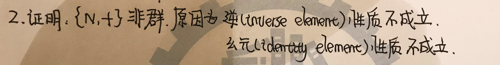
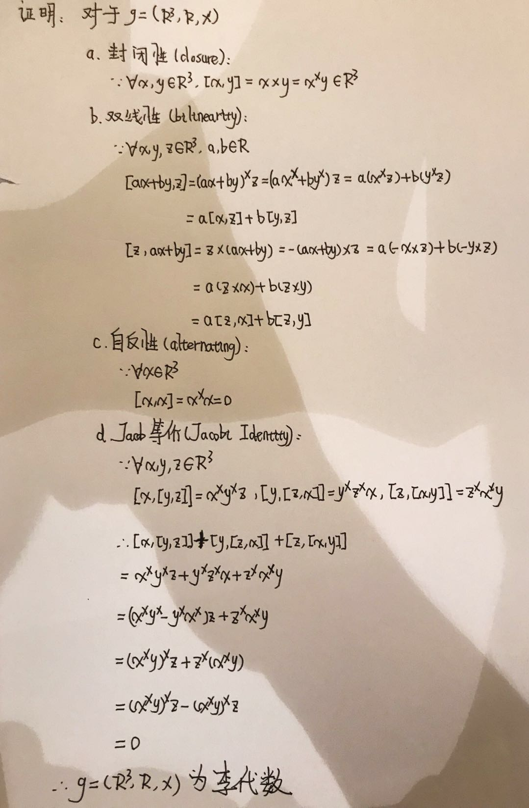
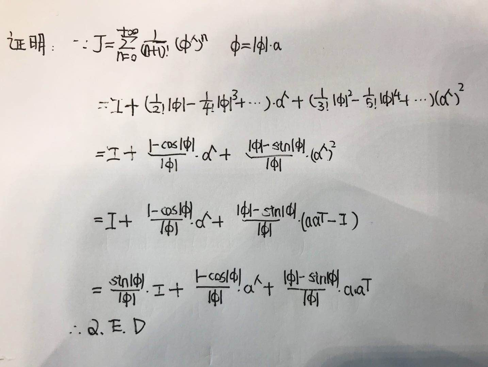
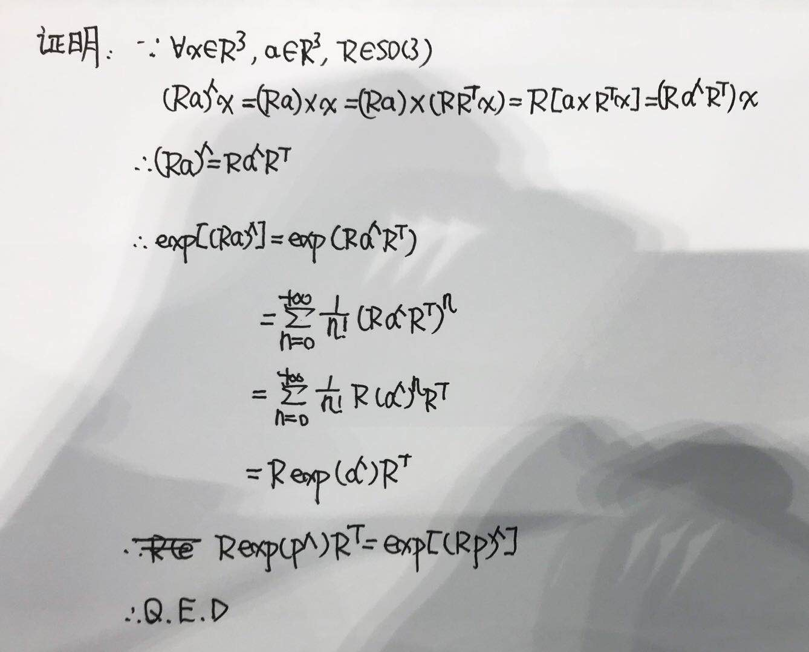
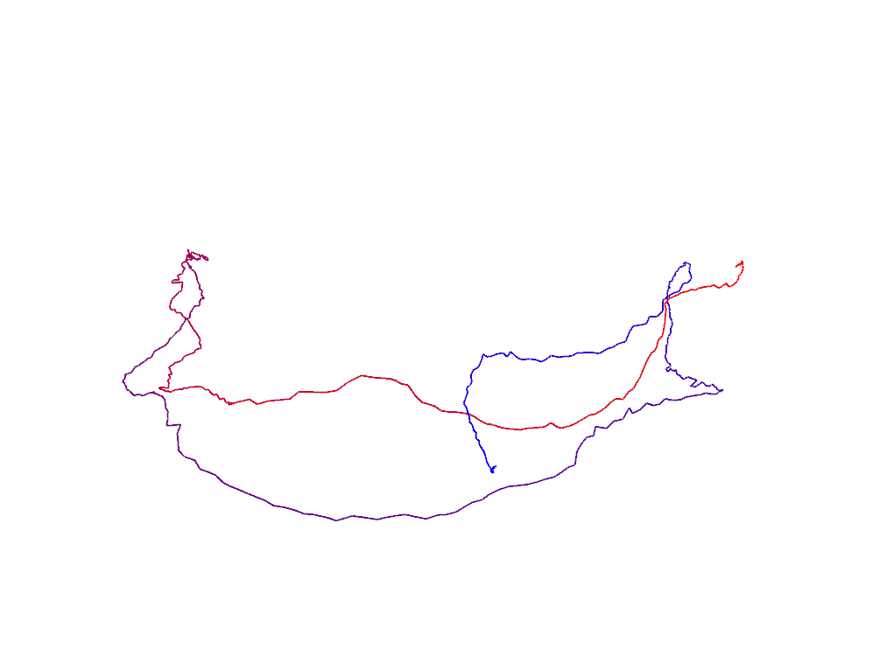

# Matrix Lie Group

---

## Group Properties Verification

### 1. Do the set integer number and the operation + form a group?

The set integer and operation + form a group. The proof is as follows:


### 2. Do the set natural number and the operation + form a group?



--

## Lie Algebra Properties Verification

The vector space R3, field R and cross product form a Lie algebra. The proof is as follows:



--

## Left Jacobian Derivation for Exponential Map of SE(3)

The derivation of left Jacobian for exponential map of SE(3) is as follows:



--

## Adjoint of SO(3)

The derivation of adjoint of SO(3) is as follows:



--

## Visualization of Trajectory

### 1. How to visualize the trajectory?

The translation part of SE(3) can be used to identify the position of target at every timestamp.

### 2. Implement trajectory visualization

The visualized trajectory is as follows:



Below is the source code for visualization:

```c++
#include <sophus/se3.h>
#include <string>
#include <iostream>
#include <fstream>

// need pangolin for plotting trajectory
#include <pangolin/pangolin.h>

using namespace std;

// path to trajectory file
string trajectory_file = "./trajectory.txt";

// function for plotting trajectory, don't edit this code
// start point is red and end point is blue
void DrawTrajectory(vector<Sophus::SE3, Eigen::aligned_allocator<Sophus::SE3>>);

int main(int argc, char **argv) {

    vector<Sophus::SE3, Eigen::aligned_allocator<Sophus::SE3>> poses;

    // memory buffer:
    Eigen::Quaterniond q;
    Eigen::Vector3d t(0.0, 0.0, 0.0);
    
    // trajectory reader:
    ifstream trajectory(trajectory_file);
    const int D = 8;
    double value[D]; int d = 0;

    while (trajectory >> value[d]) {
        // update index:
        d = (d + 1) % D;

        if (0 == d) {
            // update translation:
            t.x() = value[1];
            t.y() = value[2];
            t.z() = value[3];
            // update quaternion:
            q.x() = value[4];
            q.y() = value[5];
            q.z() = value[6];
            q.w() = value[7];
            
            // create pose:
            Sophus::SE3 pose(q, t);
            poses.push_back(pose);

            cout << "t: " << t.x() << ", " << t.y() << ", " << t.z() << endl;
            cout << "q: " << q.x() << ", " << q.y() << ", " << q.z() << ", " << q.w() << endl;
            cout << endl;
        }
    }
    
    // draw trajectory in pangolin
    DrawTrajectory(poses);

    return 0;
}

/*******************************************************************************************/
void DrawTrajectory(vector<Sophus::SE3, Eigen::aligned_allocator<Sophus::SE3>> poses) {
    if (poses.empty()) {
        cerr << "Trajectory is empty!" << endl;
        return;
    }

    // create pangolin window and plot the trajectory
    pangolin::CreateWindowAndBind("Trajectory Viewer", 1024, 768);
    glEnable(GL_DEPTH_TEST);
    glEnable(GL_BLEND);
    glBlendFunc(GL_SRC_ALPHA, GL_ONE_MINUS_SRC_ALPHA);

    pangolin::OpenGlRenderState s_cam(
            pangolin::ProjectionMatrix(1024, 768, 500, 500, 512, 389, 0.1, 1000),
            pangolin::ModelViewLookAt(0, -0.1, -1.8, 0, 0, 0, 0.0, -1.0, 0.0)
    );

    pangolin::View &d_cam = pangolin::CreateDisplay()
            .SetBounds(0.0, 1.0, pangolin::Attach::Pix(175), 1.0, -1024.0f / 768.0f)
            .SetHandler(new pangolin::Handler3D(s_cam));


    while (pangolin::ShouldQuit() == false) {
        glClear(GL_COLOR_BUFFER_BIT | GL_DEPTH_BUFFER_BIT);

        d_cam.Activate(s_cam);
        glClearColor(1.0f, 1.0f, 1.0f, 1.0f);

        glLineWidth(2);
        for (size_t i = 0; i < poses.size() - 1; i++) {
            glColor3f(1 - (float) i / poses.size(), 0.0f, (float) i / poses.size());
            glBegin(GL_LINES);
            auto p1 = poses[i], p2 = poses[i + 1];
            glVertex3d(p1.translation()[0], p1.translation()[1], p1.translation()[2]);
            glVertex3d(p2.translation()[0], p2.translation()[1], p2.translation()[2]);
            glEnd();
        }
        pangolin::FinishFrame();
        usleep(5000);   // sleep 5 ms
    }
}
```

And the corresponding CMake file:
```cmake
CMAKE_MINIMUM_REQUIRED(VERSION 3.5)

PROJECT(TRAJECTORY_ANALYSIS)

# Eigen3:
FIND_PACKAGE(Eigen3 REQUIRED)
# Pangolin:
FIND_PACKAGE(Pangolin REQUIRED)
# Sophus:
SET(SOPHUS_INCLUDE_DIR "/home/alexge/svslocal/include")
INCLUDE_DIRECTORIES(
    ${SOPHUS_INCLUDE_DIR}
)
LINK_DIRECTORIES(/home/alexge/svslocal/lib)

# runnable:
ADD_COMPILE_OPTIONS(-std=c++11)

# 01: draw trajectory:
SET(CMAKE_RUNTIME_OUTPUT_DIRECTORY ${PROJECT_SOURCE_DIR}/01-draw-trajectory)
ADD_EXECUTABLE(draw-trajectory 01-draw-trajectory/draw_trajectory.cpp)
TARGET_LINK_LIBRARIES(
    draw-trajectory 
    ${EIGEN3_LIBS}
    ${Pangolin_LIBRARIES}
    Sophus
)
```

---

## Error Analysis of Trajectory

Below is the source code for trajectory estimation error analysis:

```c++
#include <sophus/se3.h>
#include <string>
#include <iostream>
#include <fstream>

// need pangolin for plotting trajectory
#include <pangolin/pangolin.h>

using namespace std;

// path to trajectory files
string estimated_trajectory_file = "./estimated.txt";
string ground_truth_trajectory_file = "./groundtruth.txt";

// function for reading trajectory
void LoadTrajectory(
    const string &trajectory_file, vector<Sophus::SE3, 
    Eigen::aligned_allocator<Sophus::SE3>> &poses
);

// function for plotting trajectory
// start point is red and end point is blue
void DrawTrajectory(vector<Sophus::SE3, Eigen::aligned_allocator<Sophus::SE3>>);

// function for error analysis
void EstimateTrajectoryError(
    const vector<Sophus::SE3, Eigen::aligned_allocator<Sophus::SE3>> &estimated,
    const vector<Sophus::SE3, Eigen::aligned_allocator<Sophus::SE3>> &ground_truth
);

int main(int argc, char **argv) {
    // estimated poses:
    vector<Sophus::SE3, Eigen::aligned_allocator<Sophus::SE3>> estimated_poses;
    LoadTrajectory(estimated_trajectory_file, estimated_poses);
    // ground-truth poses:   
    vector<Sophus::SE3, Eigen::aligned_allocator<Sophus::SE3>> ground_truth_poses;
    LoadTrajectory(ground_truth_trajectory_file, ground_truth_poses);

    EstimateTrajectoryError(estimated_poses, ground_truth_poses);

    return 0;
}

/**
    Load trajectory from doc file.

    @param trajectory_file The file name of to-be loaded trajectory.
    @param poses The trajectory represented as vector of poses.
    @return None.
*/
void LoadTrajectory(const string &trajectory_file, vector<Sophus::SE3, Eigen::aligned_allocator<Sophus::SE3>> &poses) {
    // memory buffer:
    Eigen::Quaterniond q;
    Eigen::Vector3d t;

    // input file stream:
    ifstream trajectory(trajectory_file);
    const int D = 8;
    double value[D]; int d = 0;

    while (trajectory >> value[d]) {
        // update index:
        d = (d + 1) % D;

        if (0 == d) {
            // update translation:
            t.x() = value[1];
            t.y() = value[2];
            t.z() = value[3];
            // update quaternion:
            q.x() = value[4];
            q.y() = value[5];
            q.z() = value[6];
            q.w() = value[7];
            
            // create pose:
            Sophus::SE3 pose(q, t);
            poses.push_back(pose);
        }
    }
}

/**
    Visualize trajectory represented as vector of poses.

    @param poses The trajectory represented as vector of poses.
    @return None.
*/
void DrawTrajectory(vector<Sophus::SE3, Eigen::aligned_allocator<Sophus::SE3>> poses) {
    if (poses.empty()) {
        cerr << "Trajectory is empty!" << endl;
        return;
    }

    // create pangolin window and plot the trajectory
    pangolin::CreateWindowAndBind("Trajectory Viewer", 1024, 768);
    glEnable(GL_DEPTH_TEST);
    glEnable(GL_BLEND);
    glBlendFunc(GL_SRC_ALPHA, GL_ONE_MINUS_SRC_ALPHA);

    pangolin::OpenGlRenderState s_cam(
            pangolin::ProjectionMatrix(1024, 768, 500, 500, 512, 389, 0.1, 1000),
            pangolin::ModelViewLookAt(0, -0.1, -1.8, 0, 0, 0, 0.0, -1.0, 0.0)
    );

    pangolin::View &d_cam = pangolin::CreateDisplay()
            .SetBounds(0.0, 1.0, pangolin::Attach::Pix(175), 1.0, -1024.0f / 768.0f)
            .SetHandler(new pangolin::Handler3D(s_cam));


    while (pangolin::ShouldQuit() == false) {
        glClear(GL_COLOR_BUFFER_BIT | GL_DEPTH_BUFFER_BIT);

        d_cam.Activate(s_cam);
        glClearColor(1.0f, 1.0f, 1.0f, 1.0f);

        glLineWidth(2);
        for (size_t i = 0; i < poses.size() - 1; i++) {
            glColor3f(1 - (float) i / poses.size(), 0.0f, (float) i / poses.size());
            glBegin(GL_LINES);
            auto p1 = poses[i], p2 = poses[i + 1];
            glVertex3d(p1.translation()[0], p1.translation()[1], p1.translation()[2]);
            glVertex3d(p2.translation()[0], p2.translation()[1], p2.translation()[2]);
            glEnd();
        }
        pangolin::FinishFrame();
        usleep(5000);   // sleep 5 ms
    }
}

/**
    Calculate the error between estimated and ground truth trajectories.

    @param estimated The estimated trajectory.
    @param ground_truth The ground truth trajectory.
    @return None.
*/
void EstimateTrajectoryError(
    const vector<Sophus::SE3, Eigen::aligned_allocator<Sophus::SE3>> &estimated,
    const vector<Sophus::SE3, Eigen::aligned_allocator<Sophus::SE3>> &ground_truth
) {
    typedef Eigen::Matrix<double, 6, 1> Vector6d;
    
    if (estimated.size() == ground_truth.size()) {
        const int N = estimated.size();
        Sophus::SE3 error_SE3;
        Vector6d error_se3;
        double rmse = 0.0;

        for (int i = 0; i < N; ++i) {
            error_SE3 = ground_truth[i].inverse() * estimated[i];
            error_se3 = error_SE3.log();

            rmse += error_se3.squaredNorm();
        }
        rmse = sqrt(rmse / N);

        cout << "[RMSE]: " << rmse << endl;
    }
}
```

And the corresponding CMake file:
```cmake
CMAKE_MINIMUM_REQUIRED(VERSION 3.5)

PROJECT(TRAJECTORY_ANALYSIS)

# Eigen3:
FIND_PACKAGE(Eigen3 REQUIRED)
# Pangolin:
FIND_PACKAGE(Pangolin REQUIRED)
# Sophus:
SET(SOPHUS_INCLUDE_DIR "/home/alexge/svslocal/include")
INCLUDE_DIRECTORIES(
    ${SOPHUS_INCLUDE_DIR}
)
LINK_DIRECTORIES(/home/alexge/svslocal/lib)

# runnable:
ADD_COMPILE_OPTIONS(-std=c++11)

# 02: error analysis
SET(CMAKE_RUNTIME_OUTPUT_DIRECTORY ${PROJECT_SOURCE_DIR}/02-error-analysis)
ADD_EXECUTABLE(error-analysis 02-error-analysis/error-analysis.cpp)
TARGET_LINK_LIBRARIES(
    error-analysis 
    ${EIGEN3_LIBS}
    ${Pangolin_LIBRARIES}
    Sophus
)
```

The final RMSE is **2.20728**.
