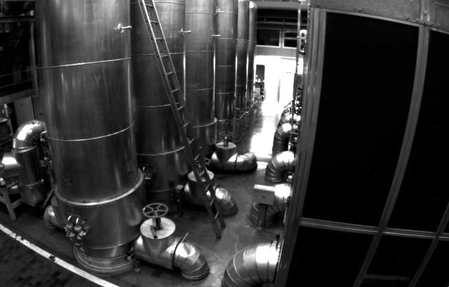

# Camera Observation Model

---

## Image Undistortion

The original and the undistorted images are as follows:

<div>
    
    
</div>

The source code for undistortion is as follows:

```c++
#include <opencv2/opencv.hpp>
#include <string>

using namespace std;

// default input image:
string image_file = "./test.png";

int main(int argc, char **argv) {
    // undistortion params:
    double k1 = -0.28340811, k2 = 0.07395907, p1 = 0.00019359, p2 = 1.76187114e-05;
    // intrinsic params:
    double fx = 458.654, fy = 457.296, cx = 367.215, cy = 248.375;

    // original image, CV_8UC1
    cv::Mat image = cv::imread(image_file,0);   
    int rows = image.rows, cols = image.cols;
    // undistorted image, CV_8UC1
    cv::Mat image_undistort = cv::Mat(rows, cols, CV_8UC1); 

    // 计算去畸变后图像的内容
    for (int v = 0; v < rows; v++)
        for (int u = 0; u < cols; u++) {
            // normalized camera coordinates:
            double x = (u - cx) / fx;
            double y = (v - cy) / fy;

            // radius:
            double r_squared = x * x + y * y;
            double r_quad = r_squared * r_squared;

            // undistorted camera coordinates:
            double x_undistorted = x*(1 + k1*r_squared + k2*r_quad) + 2*p1*x*y + p2*(r_squared + 2*x*x);
            double y_undistorted = y*(1 + k1*r_squared + k2*r_quad) + 2*p2*x*y + p1*(r_squared + 2*y*y);

            // undistorted pixel coordinates:
            double u_distorted = fx*x_undistorted + cx;
            double v_distorted = fy*y_undistorted + cy;

            // nearest neighbor assignment:
            if (u_distorted >= 0 && v_distorted >= 0 && u_distorted < cols && v_distorted < rows) {
                image_undistort.at<uchar>(v, u) = image.at<uchar>((int) v_distorted, (int) u_distorted);
            } else {
                image_undistort.at<uchar>(v, u) = 0;
            }
        }

    // visualize undistorted image
    cv::imshow("image undistorted", image_undistort);
    cv::waitKey();

    // save undistorted image:
    cv::imwrite("undistorted.png", image_undistort);

    return 0;
}
```

And the corresponding CMake file:
```cmake
CMAKE_MINIMUM_REQUIRED(VERSION 3.5)

PROJECT(OBSERVATION_MODEL)

# OpenCV3:
FIND_PACKAGE(OpenCV 3.0 QUIET)
IF(NOT OpenCV_FOUND)
   FIND_PACKAGE(OpenCV 2.4.3 QUIET)
   IF(NOT OpenCV_FOUND)
      MESSAGE(FATAL_ERROR "OpenCV > 2.4.3 not found.")
   ENDIF()
ENDIF()

# runnable:
ADD_COMPILE_OPTIONS(-std=c++11)

# 01: undistort image:
SET(CMAKE_RUNTIME_OUTPUT_DIRECTORY ${PROJECT_SOURCE_DIR}/01-undistort-image)
ADD_EXECUTABLE(undistort-image 01-undistort-image/undistort_image.cpp)
TARGET_LINK_LIBRARIES(
    undistort-image 
    ${OpenCV_LIBS}
)
```

---

## Stereo Vision

The rebuilt scenario is as follows.


The source code is shown below:
```c++
//
// Created by 高翔 on 2017/12/15.
//

#include <opencv2/opencv.hpp>
#include <string>
#include <Eigen/Core>
#include <pangolin/pangolin.h>
#include <unistd.h>

using namespace std;
using namespace Eigen;

// 文件路径，如果不对，请调整
string left_file = "./left.png";
string right_file = "./right.png";
string disparity_file = "./disparity.png";

// 在panglin中画图，已写好，无需调整
void showPointCloud(const vector<Vector4d, Eigen::aligned_allocator<Vector4d>> &pointcloud);

int main(int argc, char **argv) {

    // 内参
    double fx = 718.856, fy = 718.856, cx = 607.1928, cy = 185.2157;
    // 间距
    double d = 0.573;

    // 读取图像
    cv::Mat left = cv::imread(left_file, 0);
    cv::Mat right = cv::imread(right_file, 0);
    cv::Mat disparity = cv::imread(disparity_file, 0); // disparty 为CV_8U,单位为像素

    // 生成点云
    vector<Vector4d, Eigen::aligned_allocator<Vector4d>> pointcloud;

    // TODO 根据双目模型计算点云
    // 如果你的机器慢，请把后面的v++和u++改成v+=2, u+=2
    for (int v = 0; v < left.rows; v++)
        for (int u = 0; u < left.cols; u++) {
            Vector4d point(0, 0, 0, left.at<uchar>(v, u) / 255.0); // 前三维为xyz,第四维为颜色

            // 根据双目模型计算 point 的位置
            point.z() = fx*d / (disparity.at<uchar>(v, u));
            point.x() = point.z() * (u - cx) / fx;
            point.y() = point.z() * (v - cy) / fy;

            pointcloud.push_back(point);
        }

    // 画出点云
    showPointCloud(pointcloud);

    return 0;
}

void showPointCloud(const vector<Vector4d, Eigen::aligned_allocator<Vector4d>> &pointcloud) {

    if (pointcloud.empty()) {
        cerr << "Point cloud is empty!" << endl;
        return;
    }

    pangolin::CreateWindowAndBind("Point Cloud Viewer", 1024, 768);
    glEnable(GL_DEPTH_TEST);
    glEnable(GL_BLEND);
    glBlendFunc(GL_SRC_ALPHA, GL_ONE_MINUS_SRC_ALPHA);

    pangolin::OpenGlRenderState s_cam(
            pangolin::ProjectionMatrix(1024, 768, 500, 500, 512, 389, 0.1, 1000),
            pangolin::ModelViewLookAt(0, -0.1, -1.8, 0, 0, 0, 0.0, -1.0, 0.0)
    );

    pangolin::View &d_cam = pangolin::CreateDisplay()
            .SetBounds(0.0, 1.0, pangolin::Attach::Pix(175), 1.0, -1024.0f / 768.0f)
            .SetHandler(new pangolin::Handler3D(s_cam));

    while (pangolin::ShouldQuit() == false) {
        glClear(GL_COLOR_BUFFER_BIT | GL_DEPTH_BUFFER_BIT);

        d_cam.Activate(s_cam);
        glClearColor(1.0f, 1.0f, 1.0f, 1.0f);

        glPointSize(2);
        glBegin(GL_POINTS);
        for (auto &p: pointcloud) {
            glColor3f(p[3], p[3], p[3]);
            glVertex3d(p[0], p[1], p[2]);
        }
        glEnd();
        pangolin::FinishFrame();
        usleep(5000);   // sleep 5 ms
    }
    return;
}
```

Corresponding CMake file:
```cmake
CMAKE_MINIMUM_REQUIRED(VERSION 3.5)

PROJECT(OBSERVATION_MODEL)

# OpenCV3:
FIND_PACKAGE(OpenCV 3.0 QUIET)
IF(NOT OpenCV_FOUND)
   FIND_PACKAGE(OpenCV 2.4.3 QUIET)
   IF(NOT OpenCV_FOUND)
      MESSAGE(FATAL_ERROR "OpenCV > 2.4.3 not found.")
   ENDIF()
ENDIF()
# Eigen3:
FIND_PACKAGE(Eigen3 REQUIRED)
# Pangolin:
FIND_PACKAGE(Pangolin REQUIRED)

# runnable:
ADD_COMPILE_OPTIONS(-std=c++11)

# 02: stereo vision:
SET(CMAKE_RUNTIME_OUTPUT_DIRECTORY ${PROJECT_SOURCE_DIR}/02-stereo-vision)
ADD_EXECUTABLE(stereo-vision 02-stereo-vision/disparity.cpp)
TARGET_LINK_LIBRARIES(
    stereo-vision 
    ${OpenCV_LIBS}
    ${EIGEN3_LIBS}
    ${Pangolin_LIBRARIES}
)
```

---

## Matrix Derivatives


---

## Gaussian-Newton Method

The source code for Gaussian Newton estimation is as follows:
```c++
#include <iostream>
#include <opencv2/opencv.hpp>
#include <Eigen/Core>
#include <Eigen/Dense>

using namespace std;
using namespace Eigen;

int main(int argc, char **argv) {
    // ground truth params:
    double ar = 1.0, br = 2.0, cr = 1.0;

    // num points: 
    int N = 100;
    // noise standard deviation:                                 
    double w_sigma = 1.0;                        
    // OpenCV random number generator:
    cv::RNG rng;                                 

    // observations:
    vector<double> x_data, y_data;      
    for (int i = 0; i < N; i++) {
        double x = i / 100.0;
        x_data.push_back(x);
        y_data.push_back(exp(ar * x * x + br * x + cr) + rng.gaussian(w_sigma));
    }

    // Gauss-Newton iteration:
    // a. initial params:
    double ae = 2.0, be = -1.0, ce = 5.0;
    // b. max iterations:
    int iterations = 100;    
    // c. costs:
    double cost = 0, lastCost = 0;  

    for (int iter = 0; iter < iterations; iter++) {
        MatrixXd H = MatrixXd::Zero(3, 3);             // Hessian = J^T J in Gauss-Newton
        VectorXd b = VectorXd::Zero(3);             // bias
        cost = 0;

        for (int i = 0; i < N; i++) {
            // observation i:
            double xi = x_data[i], yi = y_data[i];
            double zi = exp(ae*xi*xi + be*xi + ce);
            // error i:
            double error = yi - zi;   

            // Jacobian i:
            VectorXd J = VectorXd::Zero(3); 
            J[0] = -zi * xi*xi;
            J[1] = -zi * xi;
            J[2] = -zi;

            // Hessian i:
            H += J * J.transpose(); 
            b += - error * J;

            cost += error * error;
        }

        // Solve Hx=d using LDLT:
        H /= N; b /= N;

        VectorXd dx = H.ldlt().solve(b);

        // solution is nan: abort
        if (isnan(dx[0])) {
            cout << "result is nan!" << endl;
            break;
        }

        // increased cost: abort
        if (iter > 0 && cost > lastCost) {
            cout << "cost: " << cost << ", last cost: " << lastCost << endl;
            break;
        }

        // update estimation:
        ae += dx[0];
        be += dx[1];
        ce += dx[2];

        lastCost = cost;

        cout << "total cost: " << cost << endl;
    }

    cout << "estimated abc = " << ae << ", " << be << ", " << ce << endl;
    return 0;
}
```

Below is the corresponding CMake file:
```cmake
CMAKE_MINIMUM_REQUIRED(VERSION 3.5)

PROJECT(OBSERVATION_MODEL)

# OpenCV3:
FIND_PACKAGE(OpenCV 3.0 QUIET)
IF(NOT OpenCV_FOUND)
   FIND_PACKAGE(OpenCV 2.4.3 QUIET)
   IF(NOT OpenCV_FOUND)
      MESSAGE(FATAL_ERROR "OpenCV > 2.4.3 not found.")
   ENDIF()
ENDIF()
# Eigen 3:
FIND_PACKAGE(Eigen3 REQUIRED)
# Pangolin:
FIND_PACKAGE(Pangolin REQUIRED)

# include directories:
INCLUDE_DIRECTORIES(
    ${EIGEN3_INCLUDE_DIR}
    ${Pangolin_INCLUDE_DIRS}
)

# runnable:
ADD_COMPILE_OPTIONS(-std=c++11)

# 03: Gaussian-Newton estimation:
SET(CMAKE_RUNTIME_OUTPUT_DIRECTORY ${PROJECT_SOURCE_DIR}/03-gaussian-newton-estimation)
ADD_EXECUTABLE(gaussian-newton 03-gaussian-newton-estimation/gaussnewton.cpp)
TARGET_LINK_LIBRARIES(
    gaussian-newton
    ${OpenCV_LIBS}
)
```

---

## Batch Maximum Likelihood Estimation

