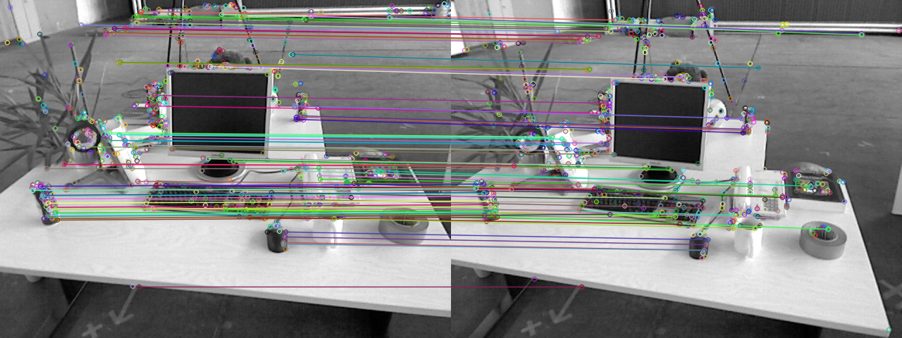
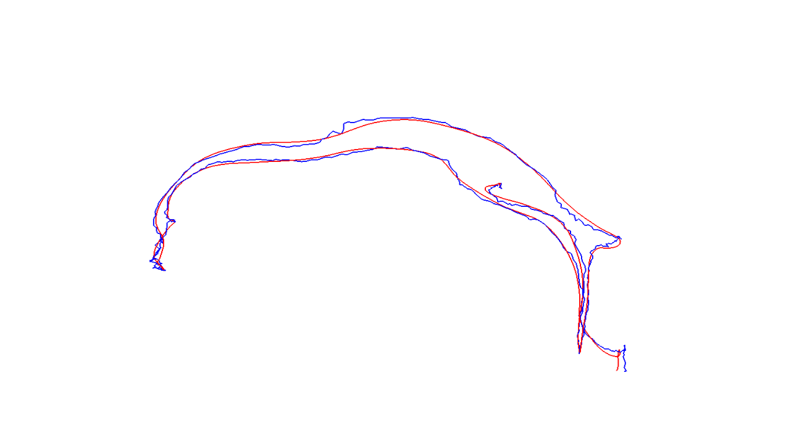

# Visual Odometry: Feature Matching -- 视觉里程计: 特征点法

This is the solution of Assignment 05 of Visual SLAM: Theory and Practice from [深蓝学院](https://www.shenlanxueyuan.com/my/course/240).

深蓝学院视觉SLAM理论与实践第五节课习题答案. 版权归深蓝学院所有. 请勿抄袭.

---

## Solutions

### 1. ORB Feature Matching
### 1. ORB 特征点

The solution is available at (click to follow the link) [here](01-orb-feature-matching/compute_orb.cpp)

#### Oriented Fast

```c++
void computeAngle(const cv::Mat &image, vector<cv::KeyPoint> &keypoints) {
    static const int HALF_PATCH_SIZE = 8;
    static const float RADIUS_TO_DEGREE = 180.0 / M_PI;

    for (auto &keypoint : keypoints) {
        int row = static_cast<int>(keypoint.pt.y);
        int col = static_cast<int>(keypoint.pt.x);
        
        keypoint.angle = 0.0f;

        // whether the keypoint is inside ROI:
        if (
            (HALF_PATCH_SIZE <= row && row < image.rows - HALF_PATCH_SIZE) && 
            (HALF_PATCH_SIZE <= col && col < image.cols - HALF_PATCH_SIZE)
        ) {
            // if so, calculate angle for the keypoint:
            int m10{0}, m01{0};
            for (int y = -HALF_PATCH_SIZE; y < +HALF_PATCH_SIZE; ++y) {
                for (int x = -HALF_PATCH_SIZE; x < +HALF_PATCH_SIZE; ++x) {
                    int I = static_cast<int>(
                        image.at<unsigned char>(row+y, col+x)
                    );

                    m10 += x * I;
                    m01 += y * I;
                }
            }
            // calculate orientation:
            keypoint.angle = static_cast<float>(
                atan2(
                    static_cast<double>(m01), 
                    static_cast<double>(m10)
                )
            );

            // convert to OpenCV angle:
            keypoint.angle *= RADIUS_TO_DEGREE;
        }
    }

    return;
}
```

#### ORB Description

```c++
void computeORBDesc(const cv::Mat &image, vector<cv::KeyPoint> &keypoints, vector<DescType> &desc) {
    static const size_t N = 256;
    static const float DEGREE_TO_RADIAN = M_PI / 180.0;

    for (auto &keypoint: keypoints) {
        DescType d;
        bool out_of_bound = false;

        // calculate descriptor:
        for (int i = 0; i < N; i++) {
            // get current ORB pattern:
            int u_p{ORB_pattern[(i << 2) + 0]}, v_p{ORB_pattern[(i << 2) + 1]};
            int u_q{ORB_pattern[(i << 2) + 2]}, v_q{ORB_pattern[(i << 2) + 3]};

            // get feature point orientation:
            double theta = keypoint.angle * DEGREE_TO_RADIAN;
            double cos_theta{cos(theta)}, sin_theta{sin(theta)};

            // get pixel coordinates in oriented keypoint frame:
            int x_p = static_cast<int>(keypoint.pt.x + cos_theta*u_p - sin_theta*v_p);
            int y_p = static_cast<int>(keypoint.pt.y + sin_theta*u_p + cos_theta*v_p);
            int x_q = static_cast<int>(keypoint.pt.x + cos_theta*u_q - sin_theta*v_q);
            int y_q = static_cast<int>(keypoint.pt.y + sin_theta*u_q + cos_theta*v_q);

            // whether the sample pixel is still inside the image:
            if (
                (0 <= x_p && x_p < image.cols) && (0 <= x_q && x_q < image.cols) && 
                (0 <= y_p && y_p < image.rows) && (0 <= y_q && y_q < image.rows)
            ) {
                // std::cout << "\t Pair" << i << std::endl;
                d[i] = (
                    (image.at<unsigned char>(y_p, x_p) > image.at<unsigned char>(y_q, x_q)) ? true : false
                );
            } else {
                out_of_bound = true;
                break;
            }
        }

        if (!out_of_bound) {
            desc.push_back(d);
        }
    }

    int total = keypoints.size();
    int bad = keypoints.size() - desc.size();
    cout << "bad/total: " << bad << "/" << total << endl;
    return;
}
```

#### Brute-Force Matching

```c++
void bfMatch(const vector<DescType> &desc1, const vector<DescType> &desc2, vector<cv::DMatch> &matches) {
    static const size_t N = 256;
    static const int D_MAX = 50;

    for (int i = 0; i < desc1.size(); ++i) {
        cv::DMatch match{i, 0, N};

        for (int j = 0; j < desc2.size(); ++j) { 
            int distance = (desc1.at(i) ^ desc2.at(j)).count();

            if (distance >= D_MAX) continue;

            if (distance < match.distance) {
                match.trainIdx = j;
                match.distance = distance;
            }
        }

        if (match.distance < D_MAX) {
            matches.push_back(match);
        }
    }

    for (auto &m: matches) {
        cout << m.queryIdx << ", " << m.trainIdx << ", " << m.distance << endl;
    }

    return;
}
```

#### Results and Review

The matching result is shown below.



##### 1. Why ORB is a binary feature?
##### 1. 为什么说 ORB 是一种二进制特征?

Because each ORB description is a vector on boolean field.

##### 2. Why 50 is used as distance threhold? How would its value influence matching?
##### 2. 为什么在匹配时使用 50 作为阈值,取更大或更小值会怎么样?

The value is chosen to strike a balance between **quality of matching** and **the number of matchings available for later constraint optimization**.

- Smaller value would keep only high quality matches but the number of constraints available for optimization would be smaller.
- Larger value would create more constraints but the quality of matching would be reduced.

##### 3. How could the implementation be further optimized?
##### 3. 暴力匹配在你的机器上表现如何?你能想到什么减少计算量的匹配方法吗?

The execution time is shown below. Here C++ `bitset` is used to replace `std::vector<bool>` as `DescType`.

```bash
# run ORB feature matching:
time ./orb_feature_matching 
# time it:
real	0m0.167s
user	0m0.322s
sys	0m0.786s
```

Further optimization could be achieved by **Using KDTree for feature matching**. But the search tree should be adapted to work on bitset.

---

### 2. Reconstruct Relative Pose from Essential Matrix
### 2. 从 E 恢复 R, t

The solution is available at (click to follow the link) [here](02-essential-matrix-to-pose/E2Rt.cpp)

#### Implementation

```c++
    // SVD:
    BDCSVD<Matrix3d> svd(E, Eigen::ComputeFullU|Eigen::ComputeFullV);
    const MatrixXd &U = svd.matrixU();
    const MatrixXd &V = svd.matrixV();
    double sigma = (svd.singularValues()(0) + svd.singularValues()(1)) / 2.0;
    DiagonalMatrix<double, 3> S(sigma, sigma, 0.0);

    // rotation matrices:
    Vector3d axis{0.0, 0.0, 1.0};
    auto R_z_pos = AngleAxisd(+M_PI/2, axis).toRotationMatrix();
    auto R_z_neg = AngleAxisd(-M_PI/2, axis).toRotationMatrix();

    // set t1, t2, R1, R2 
    Matrix3d t_wedge1 = U * R_z_pos * S * U.transpose();
    Matrix3d t_wedge2 = U * R_z_neg * S * U.transpose();

    Matrix3d R1 = U * R_z_pos.transpose() * V.transpose();
    Matrix3d R2 = U * R_z_neg.transpose() * V.transpose();

    // show results:
    cout << "[Essential Matrix to Relative Pose]:" << endl;
    cout << "\tR1 = \n" << R1 << endl;
    cout << "\tt1 = \n" << +1.0 * Sophus::SO3d::vee(t_wedge1) << endl;
    cout << "\tR2 = \n" << R1 << endl;
    cout << "\tt2 = \n" << -1.0 * Sophus::SO3d::vee(t_wedge1) << endl;
    cout << "\tR3 = \n" << R2 << endl;
    cout << "\tt3 = \n" << +1.0 * Sophus::SO3d::vee(t_wedge2) << endl;
    cout << "\tR4 = \n" << R2 << endl;
    cout << "\tt4 = \n" << -1.0 * Sophus::SO3d::vee(t_wedge2) << endl;

    // check t^R=E up to scale
    Matrix3d tR = t_wedge1 * R1;
    cout << "\t Reconstructed, from t^R =\n" << tR << endl;

    // compute relative error:
    double relative_error = 100.0 * (tR - E).norm() / E.norm();
    cout << "\t Relative error, F-norm: " << relative_error << endl;
```

#### Result

```bash
[Essential Matrix to Relative Pose]:
	R1 = 
  -0.365887  -0.0584576    0.928822
-0.00287462    0.998092   0.0616848
   0.930655  -0.0198996    0.365356
	t1 = 
 -0.581301
-0.0231206
  0.401938
	R2 = 
  -0.365887  -0.0584576    0.928822
-0.00287462    0.998092   0.0616848
   0.930655  -0.0198996    0.365356
	t2 = 
 0.581301
0.0231206
-0.401938
	R3 = 
 -0.998596  0.0516992 -0.0115267
-0.0513961   -0.99836 -0.0252005
 0.0128107  0.0245727  -0.999616
	t3 = 
 0.581301
0.0231206
-0.401938
	R4 = 
 -0.998596  0.0516992 -0.0115267
-0.0513961   -0.99836 -0.0252005
 0.0128107  0.0245727  -0.999616
	t4 = 
 -0.581301
-0.0231206
  0.401938
	 Reconstructed, from t^R =
 -0.0203619   -0.400711  -0.0332407
   0.393927   -0.035064    0.585711
-0.00678849   -0.581543  -0.0143826
	 Relative error, F-norm, %: 5.74042e-14
```

---

### 3. Gaussian-Newton for PnP Pose Estimation
### 3. 用 G-N 实现 Bundle Adjustment 中的位姿估计

The solution is available at (click to follow the link) [here](03-pnp/GN-BA.cpp)

#### Implementation

```c++
    const size_t N = p3d.size();
    int iterations = 100;
    cout << "[PnP G-N]: Num. of points: " << N << ". Max Iternation:" << iterations << endl;

    // init estimated pose
    double cost{0.0}, lastCost{std::numeric_limits<double>::max()};
    Sophus::SE3<double, Eigen::AutoAlign> T_esti; 

    for (int iter = 0; iter < iterations; iter++) {
        Matrix<double, 6, 6> H = Matrix<double, 6, 6>::Zero();
        Vector6d b = Vector6d::Zero();

        cost = 0;

        for (int i = 0; i < N; i++) {
            // update cost:
            Vector3d P = T_esti.rotationMatrix()*p3d.at(i) + T_esti.translation();
            Vector3d P_esti = K*P;
            Vector2d p_esti{P_esti(0)/P_esti(2), P_esti(1)/P_esti(2)};

            Vector2d e = p2d.at(i) - p_esti;

            cost += 0.5*e.squaredNorm();

	        // compute jacobian
            Matrix<double, 2, 6> J;
            
            double x{P(0)}, y{P(1)}, z{P(2)};

            J(0, 0) = +fx/z;
            J(0, 1) = 0.0;
            J(0, 2) = -fx*x/(z*z);
            J(0, 3) = -fx*x*y/(z*z);
            J(0, 4) = +fx*(1 + x*x/(z*z));
            J(0, 5) = -fx*(y/z);
            J(1, 0) = 0.0;
            J(1, 1) = +fy/z;
            J(1, 2) = -fy*y/(z*z);
            J(1, 3) = -fy*(1 + y*y/(z*z));
            J(1, 4) = +fy*x*y/(z*z);
            J(1, 5) = +fy*x/z;

            J *= -1.0;

            // update G-N:
            H += J.transpose() * J;
            b += -J.transpose() * e;
        }

	    // solve dx 
        Vector6d dT = H.fullPivHouseholderQr().solve(b);

        // validity check:
        if (isnan(dT[0])) {
            cout << "[PnP G-N]: Result is nan at iteration " << iter << ". Aborted." << endl;
            break;
        }

        // early stopping:
        if (iter > 0 && cost >= lastCost) {
            // cost increase, update is not good
            cout << "[PnP G-N]: Cost increased. current: " << cost << ", last: " << lastCost << ". Aborted." << endl;
            break;
        }

        cout << "\tIteration " << iter << " current cost: " << cout.precision(12) << cost << " last cost: " << cout.precision(12) << lastCost << endl;

        // update pose:
        T_esti = Sophus::SE3<double, Eigen::AutoAlign>::exp(dT) * T_esti;
        
        lastCost = cost;
    }

    cout << "[PnP G-N]: estimated pose: \n" << T_esti.matrix() << endl;
```

#### Results and Review

The iterative optimization log is shown below:

```bash
[PnP G-N]: Num. of points: 76. Max Iternation:100
	Iteration 0 current cost: 622769.1141257 last cost: 121.79769313486e+308
	Iteration 1 current cost: 12206.604278533 last cost: 1222769.1141257
	Iteration 2 current cost: 12150.675965788 last cost: 12206.604278533
	Iteration 3 current cost: 12150.6753269 last cost: 12150.675965788
	Iteration 4 current cost: 12150.6753269 last cost: 12150.6753269
	Iteration 5 current cost: 12150.6753269 last cost: 12150.6753269
[PnP G-N]: Cost increased. current: 150.6753269, last: 150.6753269. Aborted.
[PnP G-N]: estimated pose: 
   0.997866186837  -0.0516724392948   0.0399128072707   -0.127226620999
  0.0505959188721    0.998339770315   0.0275273682287 -0.00750679765283
  -0.041268949107  -0.0254492048094    0.998823914318   0.0613860848809
                0                 0                 0                 1
```

##### 1. How should projection error be defined?
##### 1. 如何定义重投影误差?

See the code snippet below.

```c++
    // project 3D point to pixel plane:
    Vector3d P = T_esti.rotationMatrix()*p3d.at(i) + T_esti.translation();
    Vector3d P_esti = K*P;
    Vector2d p_esti{P_esti(0)/P_esti(2), P_esti(1)/P_esti(2)};

    // calculate error:
    Vector2d e = p2d.at(i) - p_esti;

    // update cost:
    cost += 0.5*e.squaredNorm();
```

##### 2. How should Jacobian matrix of the error be defined?
##### 2. 该误差关于自变量的雅可比矩阵是什么?

See the code snippet below.

```c++
    // Jacobian matrix error with respect to ln(T_esti):
    J << +fx/z,   0.0, -fx*x/(z*z),       -fx*x*y/(z*z), +fx*(1 + x*x/(z*z)), -fx*(y/z), 
           0.0, +fy/z, -fy*y/(z*z), -fy*(1 + y*y/(z*z)),       +fy*x*y/(z*z),   +fy*x/z;
```

##### 3. How should pose estimation be updated?
##### 3. 解出更新量之后,如何更新至之前的估计上?

See the code snippet below.

```c++
    // update pose:
    T_esti = Sophus::SE3<double, Eigen::AutoAlign>::exp(dT) * T_esti;
```

---

### 4. ICP for Trajectory Alignment
### 4. 用 ICP 实现轨迹对齐

The solution is available at (click to follow the link) [here](04-icp). Below are the implemented solvers:

- [SVD](04-icp/SVD.cpp)
- [Gaussian-Newton](04-icp/G-N.cpp)
- [g2o](04-icp/g2o.cpp)

#### Implementation

Here is the C++ implementation of the Gaussian-Newton solver:

```c++
    // start optimization:
    size_t N = traj.size();
    size_t MAX_ITERATIONS = 100;
    std::cout << "[ICP G-N]: Trajectory length " << N << ", Max Num. of iterations: " << MAX_ITERATIONS << std::endl;

    // init estimated pose
    OptimizationState state;

    for (size_t i = 0; i < MAX_ITERATIONS; ++i) {
        Eigen::Matrix<double, 6, 6> H = Eigen::Matrix<double, 6, 6>::Zero();
        Eigen::Matrix<double, 6, 1> b = Eigen::Matrix<double, 6, 1>::Zero();

        state.cost_curr = 0.0;
        for (size_t j = 0; j < N; j++) {
            // re-project::
            Eigen::Vector3d t_source = traj.at(j).source.pose.translation();
            Eigen::Vector3d t_target_esti = state.T.rotationMatrix()*t_source + state.T.translation();
            Eigen::Vector3d t_target = traj.at(j).target.pose.translation();

            // calcuate error:
            Eigen::Vector3d e = t_target - t_target_esti;

            // update cost:
            state.cost_curr += 0.5*e.squaredNorm();

	        // compute jacobian
            Eigen::Matrix<double, 3, 6> J = Eigen::Matrix<double, 3, 6>::Zero();
            
            double x{t_target_esti(0)}, y{t_target_esti(1)}, z{t_target_esti(2)};

            // first part:
            J(0, 0) = J(1, 1) = J(2, 2) = 1.0;
            // second part:
            J(0, 4) = +z;
            J(0, 5) = -y;
            J(1, 3) = -z;
            J(1, 5) = +x;
            J(2, 3) = +y;
            J(2, 4) = -x;
        
            J *= -1.0;

            // update G-N:
            H += J.transpose() * J;
            b += -J.transpose() * e;
        }

	    // solve dx 
        Eigen::Matrix<double, 6, 1> dT = H.fullPivHouseholderQr().solve(b);

        // validity check:
        if (std::isnan(dT[0])) {
            std::cout << "[ICP G-N]: Result is nan at iteration " << i << ". Aborted." << std::endl;
            break;
        }

        // early stopping:
        if (i > 0 && state.cost_curr >= state.cost_prev) {
            // cost increase, update is not good
            std::cout << "[ICP G-N]: Cost increased. current: " << state.cost_curr << ", last: " << state.cost_prev << ". Aborted." << std::endl;
            break;
        }

        std::cout << "\tIteration " << i << " current cost: " << std::cout.precision(12) << state.cost_curr << " last cost: " << std::cout.precision(12) << state.cost_prev << std::endl;

        // update pose:
        state.T = Sophus::SE3d::exp(dT) * state.T;
        
        state.cost_prev = state.cost_curr;
    }

    std::cout << "[ICP G-N]: estimated pose: \n" << state.T.matrix() << std::endl;

    // visualize registration result:
    DrawTrajectory(traj, state.T);
```

#### Results

The iterative optimization log is shown below:

```bash
[ICP G-N]: Trajectory length 612, Max Num. of iterations: 100
	Iteration 0 current cost: 62009.68783765 last cost: 121.79769313486e+308
	Iteration 1 current cost: 12336.06938919 last cost: 122009.68783765
	Iteration 2 current cost: 1270.6509739879 last cost: 12336.06938919
	Iteration 3 current cost: 123.12429002881 last cost: 1270.6509739879
	Iteration 4 current cost: 120.163280239885 last cost: 123.12429002881
	Iteration 5 current cost: 120.16314975302 last cost: 120.163280239885
	Iteration 6 current cost: 120.163149752985 last cost: 120.16314975302
	Iteration 7 current cost: 120.163149752985 last cost: 120.163149752985
	Iteration 8 current cost: 120.163149752985 last cost: 120.163149752985
	Iteration 9 current cost: 120.163149752985 last cost: 120.163149752985
	Iteration 10 current cost: 120.163149752985 last cost: 120.163149752985
[ICP G-N]: Cost increased. current: 0.163149752985, last: 0.163149752985. Aborted.
[ICP G-N]: estimated pose: 
 0.923062125637  0.133591608366 -0.360707075602    1.5394046544
  0.36904641773 -0.571969202882  0.732568066813  0.932636230528
-0.108448392223 -0.809323491027 -0.577264612718   1.44617984341
              0               0               0               1
```

The registration result is visualized with Pangolin as follows:

