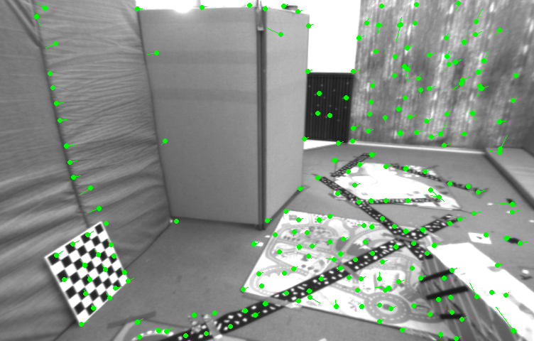
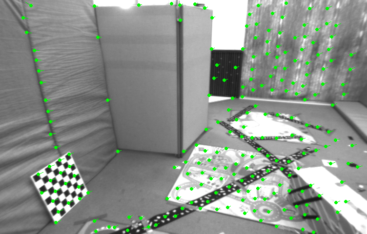
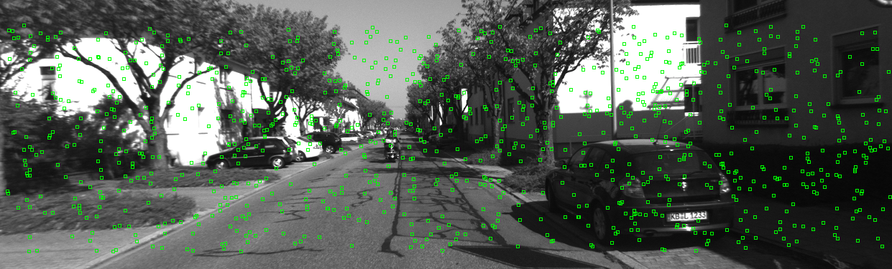
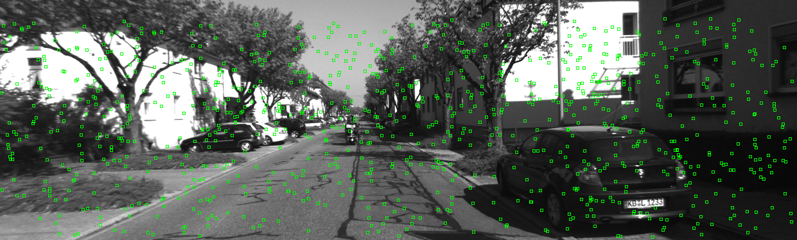
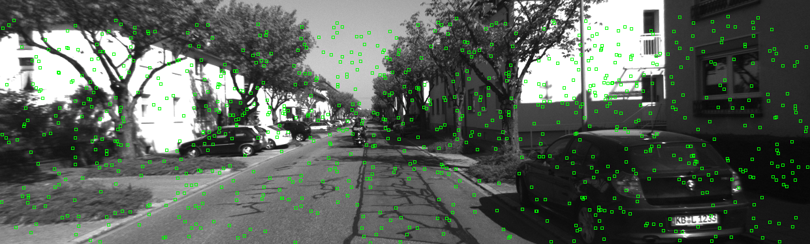
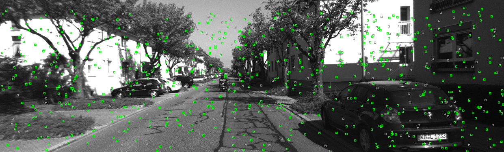
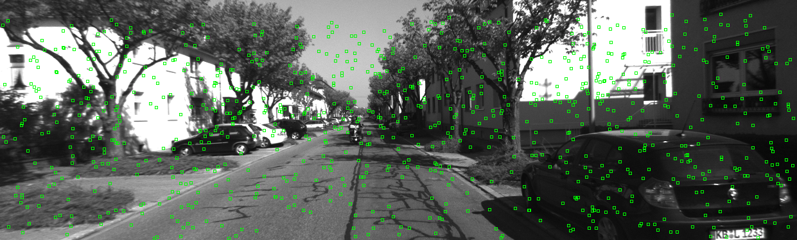
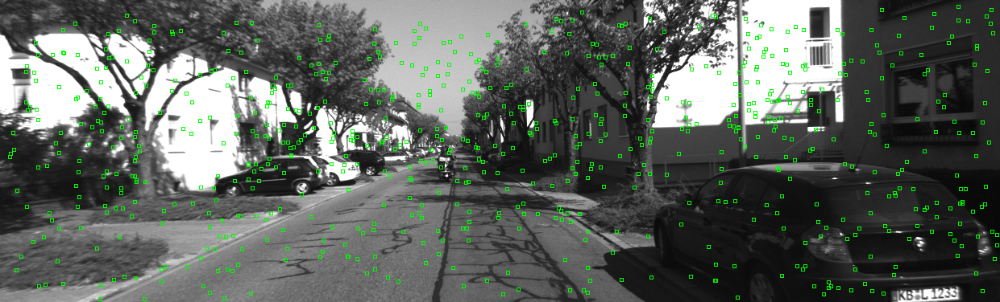
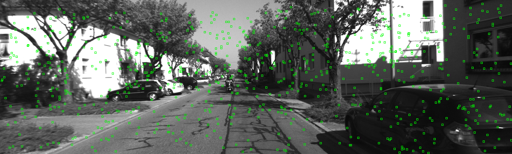
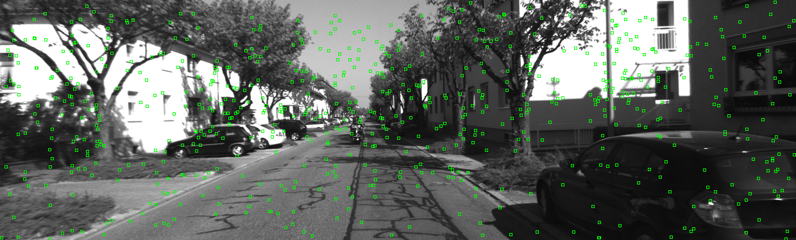

# Visual Odometry: Direct Method -- 视觉里程计: 直接法

This is the solution of Assignment 06 of Visual SLAM: Theory and Practice from [深蓝学院](https://www.shenlanxueyuan.com/my/course/240).

深蓝学院视觉SLAM理论与实践第六节课习题答案. 版权归深蓝学院所有. 请勿抄袭.

---

### Up and Running

The solution has been tested inside Docker CPU/GPU.

```bash
# go to workspace:
cd /workspace/assignments/06-frontend-direct-method
# build:
mkdir build && cd build && cmake .. && make -j8
# execute the solution 
```

---

## Solutions

### 1. Lucas-Kanade Optical Flow
### 1. LK 光流

The solution is available at (click to follow the link) [here](01-optical-flow/optical_flow.cpp)

#### Implementation

Below is the C++ implementation of **Lucas-Kanade Optical Flow**

```c++
void OpticalFlowSingleLevel(
        const Mat &image_target,
        const Mat &image_source,
        const vector<KeyPoint> &keypoints_target,
        vector<KeyPoint> &keypoints_source,
        vector<bool> &success,
        bool inverse
) {
    // parameters
    int HALF_PATCH_SIZE = 4;
    int MAX_ITERATIONS = 10;
    bool have_initial = !keypoints_source.empty();

    // initialize images:
    ImageWithGradient T(image_target);
    ImageWithGradient I(image_source);

    for (size_t i = 0; i < keypoints_target.size(); ++i) {
        const auto &keypoint = keypoints_target[i];

        // initialize x0 and y0:
        double x0{keypoint.pt.x}, y0{keypoint.pt.y};

        // initialize dx and dy:
        double dx{0.0}, dy{0.0};
        if (have_initial) {
            dx = keypoints_source.at(i).pt.x - x0;
            dy = keypoints_source.at(i).pt.y - y0;
        }

        // initialize Hessian:
        Eigen::Matrix2d H;

        State state(dx, dy);

        // Gauss-Newton iterations
        if (T.IsValidPatch(x0, y0, HALF_PATCH_SIZE)) {
            for (int j = 0; j < MAX_ITERATIONS; j++) {
                dx = state.p(0), dy = state.p(1);
                double x = x0 + dx;
                double y = y0 + dy;

                // whether the current patch is inside the image:
                if (!I.IsValidPatch(x, y, HALF_PATCH_SIZE)) {
                    state.success = false;
                    break;
                }

                Eigen::Vector2d b = Eigen::Vector2d::Zero();

                if (!inverse) {
                    H = Eigen::Matrix2d::Zero();
                } else {
                    if (!state.is_inverse_initialized) {
                        // for inverse method the approximated Hessian will not change for each patch
                        H = Eigen::Matrix2d::Zero();
                        for (int du = -HALF_PATCH_SIZE; du < HALF_PATCH_SIZE; ++du) {
                            for (int dv = -HALF_PATCH_SIZE; dv < HALF_PATCH_SIZE; ++dv) {
                                Eigen::Vector2d J = T.GetGradient(x0 + du, y0 + dv);
                                H += J * J.transpose(); 
                            }
                        }
                        state.is_inverse_initialized = true;
                    }
                }   
                
                double cost = 0.0;

                // compute cost and jacobian:
                Eigen::Vector2d J;
                for (int du = -HALF_PATCH_SIZE; du < HALF_PATCH_SIZE; ++du) {
                    for (int dv = -HALF_PATCH_SIZE; dv < HALF_PATCH_SIZE; ++dv) {
                        // compute error:
                        double error = T.GetPixelValue(x0 + du, y0 + dv) - I.GetPixelValue(x + du, y + dv);

                        // compute Jacobian:
                        if (!inverse) {
                            J = I.GetGradient(x + du, y + dv);
                            H += J * J.transpose();
                        } else {
                            J = T.GetGradient(x0 + du, y0 + dv);
                        }

                        // update b and cost;
                        b += error * J;

                        cost += 0.5 * error*error;
                    }
                }

                // compute update
                Eigen::Vector2d dp = H.fullPivHouseholderQr().solve(b);

                if (!state.Update(dp, cost)) {
                    break;
                }
            }
        }

        success.push_back(state.success);

        // set source keypoint:
        dx = state.p(0), dy = state.p(1);
        if (have_initial) {
            keypoints_source.at(i).pt = keypoint.pt + Point2f(dx, dy);
        } else {
            KeyPoint tracked = keypoint;
            tracked.pt += cv::Point2f(dx, dy);
            keypoints_source.push_back(tracked);
        }
    }
}
```

Below is the implementation of **Coarse-to-Fine Estimation using Image Pyramid**

```c++
void OpticalFlowMultiLevel(
        const Mat &image_target,
        const Mat &image_source,
        const vector<KeyPoint> &keypoints_target,
        vector<KeyPoint> &keypoints_source,
        vector<bool> &success,
        bool inverse
) {
    // parameters
    int NUM_PYRAMIDS = 4;
    double PYRAMID_SCALE = 0.5;

    // get input config:
    const size_t N = keypoints_target.size();
    bool has_initial = (keypoints_source.size() != 0);

    // create pyramids
    vector<Mat> pyramid_target, pyramid_source;
    vector<cv::KeyPoint> keypoints_target_;

    pyramid_target.push_back(image_target);
    pyramid_source.push_back(image_source);

    for (int i = 0; i < NUM_PYRAMIDS - 1; i++) {
        const cv::Mat &image_target_ = pyramid_target.at(i);
        const cv::Mat &image_source_ = pyramid_source.at(i);

        cv::Mat image_target_downsampled;
        cv::Mat image_source_downsampled;

        cv::pyrDown(image_target_, image_target_downsampled, cv::Size(PYRAMID_SCALE*image_target_.cols, PYRAMID_SCALE*image_target_.rows));
        cv::pyrDown(image_source_, image_source_downsampled, cv::Size(PYRAMID_SCALE*image_source_.cols, PYRAMID_SCALE*image_source_.rows));

        pyramid_target.push_back(image_target_downsampled);
        pyramid_source.push_back(image_source_downsampled);
    }

    // perform coarse-to-fine estimation:
    for (int i = NUM_PYRAMIDS - 1; 0 <= i; --i) {
        // compute current scale:
        double scale = pow(PYRAMID_SCALE, i);
        
        const cv::Mat &image_target_ = pyramid_target.at(i);
        const cv::Mat &image_source_ = pyramid_source.at(i);

        // scale keypoints:
        for (size_t j = 0; j < N; ++j) {
            cv::KeyPoint keypoint_target_ = keypoints_target.at(j);

            keypoint_target_.pt.x *= scale;
            keypoint_target_.pt.y *= scale;

            keypoints_target_.push_back(keypoint_target_);
        }

        // optical flow estimation:
        OpticalFlowSingleLevel(
            image_target_, image_source_,
            keypoints_target_, keypoints_source,
            success, inverse
        );

        // already reach the original scale, terminate:
        if (i == 0) { break; }
        
        // clear keypoint target:
        keypoints_target_.clear();

        // scale back for next iteration:
        for (size_t j = 0; j < N; ++j) {
            keypoints_source.at(j).pt.x /= PYRAMID_SCALE;
            keypoints_source.at(j).pt.y /= PYRAMID_SCALE;
        }

        // clear indicators:
        success.clear();
    }
}
```

#### Results and Review

The results from the implemented `single-level` estimators are as follows:

Single-Level Forward       |Single-Level Inverse
:-------------------------:|:-------------------------:
  |  

The results from the implemented `multi-level` estimators are as follows:

Multi-Level Forward        |Multi-Level Inverse
:-------------------------:|:-------------------------:
  |  

The result from OpenCV is shown below:


#### 1.a Overview
#### 1.a 文献综述

1. 按此文的分类,光流法可分为哪几类?

    * Forward Additive
    * Forward Compositional
    * Inverse Compositional
    * Inverse Additive

2. 在 compositional 中,为什么有时候需要做原始图像的 warp?该 warp 有何物理意义?

    Warp是线性变换的参数化表达。Warp可以用来表达各种各样的线性变换， 比如光流法中的Translation， 等。

3. forward 和 inverse 有何差别?

    `forward`是算法的直接实现，简单易懂。`inverse`是对直接实现的优化。 后者利用特征点的梯度生成Approximated Hessian Matrix, 且矩阵在迭代过程中不发生变化，相比直接法计算量更小，估计质量更高。

#### 1. b Forward Additive using Gaussian-Newton
#### 1. b 直接法

1. 从最小二乘角度来看,每个像素的误差怎么定义?
    
    See the code snippet below.

    ```c++
    double error = T.GetPixelValue(x0 + du, y0 + dv) - I.GetPixelValue(x + du, y + dv);
    ```

2. 误差相对于自变量的导数如何定义?

    See the code snippet below.

    ```c++
    // compute Jacobian:
    if (!inverse) {
        J = I.GetGradient(x + du, y + dv);
        H += J * J.transpose();
    } else {
        J = T.GetGradient(x0 + du, y0 + dv);
    }
    ```

#### 1. d Multi-Level through Image Pyramid
#### 1. d 推广至金字塔

1. 所谓 coarse-to-fine 是指怎样的过程?

    首先在下采样的图片上, 进行光流估计; 然后以该估计为初值, 在上一层级的图片上继续进行光流估计.

2. 光流法中的金字塔用途和特征点法中的金字塔有何差别?

    光流法的金字塔, 旨在在系统快速运动时，为光流法估计提供较好的初始值。特征点法中的金字塔，旨在生成Hierarchical Feature Description.

---

### 1. Direct Method
### 2. 直接法

The solution is available at (click to follow the link) [here](02-direct-method/direct_method.cpp)

#### Implementation

Below is the C++ implementation of **Single-Layer Direct Method**

```c++
void DirectPoseEstimationSingleLayer(
    const cv::Mat &img1,
    const cv::Mat &img2,
    const Camera &camera,
    const vector<Eigen::Vector3d> &keypoints,
    Sophus::SE3d &T21,
    int MAX_ITERATIONS 
) {
    // parameters
    int HALF_PATCH_SIZE = 4;

    // initialize image handlers:
    ImageWithGradient T(img1);
    ImageWithGradient I(img2);

    double cost = 0, lastCost = 0;
    // good projections
    VecVector2d goodProjection;

    for (int iter = 0; iter < MAX_ITERATIONS; iter++) {
        goodProjection.clear();

        auto R = T21.rotationMatrix();
        auto t = T21.translation();

        // Define Hessian and bias
        Matrix6d H = Matrix6d::Zero();  // 6x6 Hessian
        Vector6d b = Vector6d::Zero();  // 6x1 bias

        for (size_t i = 0; i < keypoints.size(); i++) {
            const Eigen::Vector3d &P_target = keypoints.at(i);

            // project to target frame:
            Eigen::Vector2d p_target = camera.ToPixelFrame(P_target);

            // project to source frame:
            Eigen::Vector3d P_source = R*P_target + t;
            Eigen::Vector2d p_source = camera.ToPixelFrame(P_source);

            // check validity:
            if (I.IsValidPatch(p_source, HALF_PATCH_SIZE)) {
                goodProjection.push_back(p_source);
            } else {
                continue;
            }

            // Jacobian of pixel coordinates with respect to se3:
            Matrix26d J_pixel_xi = camera.GetJacobian(P_source);

            // and compute error and jacobian
            for (int x = -HALF_PATCH_SIZE; x < HALF_PATCH_SIZE; x++) {
                for (int y = -HALF_PATCH_SIZE; y < HALF_PATCH_SIZE; y++) {
                    Eigen::Vector2d p_target_ = Eigen::Vector2d(p_target.x() + x, p_target.y() + y);
                    Eigen::Vector2d p_source_ = Eigen::Vector2d(p_source.x() + x, p_source.y() + y);

                    double error = T.GetPixelValue(p_target_) - I.GetPixelValue(p_source_);

                    // image Jacobian:
                    Eigen::Vector2d J_img_pixel = I.GetGradient(p_source_);    

                    // total jacobian
                    Vector6d J = J_img_pixel.transpose() * J_pixel_xi;

                    // update H, b and cost:
                    H += J * J.transpose();
                    b += error * J;

                    cost += 0.5 * error*error;
                }
            }
        }

        const size_t N = goodProjection.size();

        // average over all good projections:
        cost /= N;

        // solve update and put it into estimation
        Vector6d update = H.fullPivHouseholderQr().solve(b);
        T21 = Sophus::SE3d::exp(update) * T21;

        if (isnan(update[0])) {
            // sometimes occurred when we have a black or white patch and H is irreversible
            cout << "update is nan" << endl;
            break;
        }
        if (iter > 0 && cost >= lastCost) {
            cout << "cost increased: " << cost << ", " << lastCost << endl;
            break;
        }
        lastCost = cost;
        cout << "cost = " << cost << ", good = " << goodProjection.size() << " at " << iter << endl;
    }
    cout << "good projection: " << goodProjection.size() << endl;
    cout << "T21 = \n" << T21.matrix() << endl;
}
```

Below is the implementation of **Coarse-to-Fine Estimation using Direct Method**

```c++
void DirectPoseEstimationMultiLayer(
    const cv::Mat &image_target,
    const cv::Mat &image_source,
    Camera &camera,
    std::vector<Eigen::Vector3d> &keypoints,
    Sophus::SE3d &T21,
    int MAX_ITERATIONS 
) {
    // parameters
    int NUM_PYRAMIDS = 4;
    double PYRAMID_SCALE = 0.5;

    // create image pyramids
    vector<cv::Mat> pyramid_target, pyramid_source;

    pyramid_target.push_back(image_target);
    pyramid_source.push_back(image_source);

    for (int level = 0; level < NUM_PYRAMIDS; ++level) {
        const cv::Mat &image_target_ = pyramid_target.at(level);
        const cv::Mat &image_source_ = pyramid_source.at(level);

        cv::Mat image_target_downsampled;
        cv::Mat image_source_downsampled;

        cv::pyrDown(
            image_target_, image_target_downsampled, 
            cv::Size(PYRAMID_SCALE*image_target_.cols, PYRAMID_SCALE*image_target_.rows)
        );
        cv::pyrDown(
            image_source_, image_source_downsampled, 
            cv::Size(PYRAMID_SCALE*image_source_.cols, PYRAMID_SCALE*image_source_.rows)
        );

        pyramid_target.push_back(image_target_downsampled);
        pyramid_source.push_back(image_source_downsampled);
    }

    for (int level = NUM_PYRAMIDS - 1; level >= 0; --level) {
        double scale = pow(PYRAMID_SCALE, level);

        cv::Mat &image_target_ = pyramid_target.at(level);
        cv::Mat &image_source_ = pyramid_source.at(level);

        Camera camera_(
            scale*camera.GetFx(), scale*camera.GetFy(), scale*camera.GetCx(), scale*camera.GetCy()
        );

        DirectPoseEstimationSingleLayer(image_target_, image_source_, camera_, keypoints, T21, MAX_ITERATIONS);
    }
}
```

#### Results and Review

First comes the estimated trajectory from `Single-Layer` method:

```bash
# observation 01:
Image ../data/02-direct-method/000001.png, Pose = 
   0.999991  0.00240945  0.00337804 -0.00204298
-0.00241685    0.999995  0.00218773  0.00274849
-0.00337275 -0.00219587    0.999992   -0.724754
          0           0           0           1
# observation 02:
Image ../data/02-direct-method/000002.png, Pose = 
   0.999973  0.00136864  0.00728795  0.00754102
-0.00139701    0.999991  0.00388917 -0.00128753
-0.00728257 -0.00389925    0.999966    -1.47003
          0           0           0           1
# observation 03:
Image ../data/02-direct-method/000003.png, Pose = 
    0.999909  0.000449684    0.0134511    -0.235722
-0.000522703     0.999985   0.00542543 -0.000589808
  -0.0134484  -0.00543197     0.999895     -1.86832
           0            0            0            1
# observation 04:
Image ../data/02-direct-method/000004.png, Pose = 
   0.999857  0.00262317   0.0167018   -0.294455
-0.00271008    0.999983    0.005183   0.0214327
 -0.0166879 -0.00522753    0.999847    -2.02179
          0           0           0           1
# observation 05:
Image ../data/02-direct-method/000005.png, Pose = 
   0.999734  0.00152337   0.0230244    -0.40915
-0.00162931    0.999988  0.00458283   0.0625754
 -0.0230172 -0.00461912    0.999724    -2.97014
          0           0           0           1
```

Below is the estimated trajectory from `Multi-Layer` method:

```bash
# observation 01:
Image ../data/02-direct-method/000001.png, Pose = 
   0.999991  0.00240945  0.00337804 -0.00204298
-0.00241685    0.999995  0.00218773  0.00274849
-0.00337275 -0.00219587    0.999992   -0.724754
          0           0           0           1
# observation 02:
Image ../data/02-direct-method/000002.png, Pose = 
   0.999973  0.00136864  0.00728795  0.00754094
-0.00139701    0.999991  0.00388917 -0.00128751
-0.00728257 -0.00389925    0.999966    -1.47003
          0           0           0           1
# observation 03:
Image ../data/02-direct-method/000003.png, Pose = 
   0.999937  0.00163339   0.0110926  0.00840143
-0.00168998    0.999986  0.00509423  0.00347674
 -0.0110841 -0.00511266    0.999925    -2.20921
          0           0           0           1
# observation 04:
Image ../data/02-direct-method/000004.png, Pose = 
    0.999874  0.000355519    0.0158756   0.00882546
-0.000446735     0.999983   0.00574246   0.00279928
  -0.0158733  -0.00574883     0.999857     -2.99584
           0            0            0            1
# observation 05:
Image ../data/02-direct-method/000005.png, Pose = 
   0.999803  0.00120434   0.0198218   0.0189633
-0.00133428    0.999978  0.00654327  -0.0105501
 -0.0198134 -0.00656842    0.999782    -3.79388
          0           0           0           1
```

The results of keypoints tracking from the two methods are shown below:

Single-Level               |Multi-Level 
:-------------------------:|:-------------------------:
  |  
  |  
  |  
  |  
  |  

#### 2.a 直接法是否可以类似光流,提出 inverse, compositional 的概念?它们有意义吗?

    I think the concept of inverse is meaningful. Based on the algorithm assumption, the image gradient from target image patch can be used to approximate that from source image. This can accelerate the computing since the approximated Hessian will not change during iteration.

#### 2.b 请思考上面算法哪些地方可以缓存或加速?

    For the bi-linear interpolated pixel value and image gradient, they can be cached to accelerate the computing speed.

#### 2.c 在上述过程中,我们实际假设了哪两个 patch 不变?

    The algorithm assumes the patches around the original keypoint in target image and the projected keypoint in source image are the same.

#### 2.d 为何可以随机取点?而不用取角点或线上的点?那些不是角点的地方,投影算对了吗?

    

#### 2.e 请总结直接法相对于特征点法的异同与优缺点。

---
