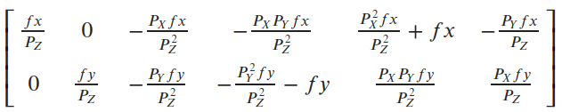
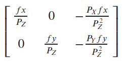

# Visual Odometry: Backend Optimization --  

This is the solution of Assignment 07 of Visual SLAM: Theory and Practice from [深蓝学院](https://www.shenlanxueyuan.com/my/course/240).

深蓝学院视觉SLAM理论与实践第六节课习题答案. 版权归深蓝学院所有. 请勿抄袭.

---

### Up and Running

The solution has been tested inside Docker CPU/GPU.

```bash
# go to workspace:
cd /workspace/assignments/07-backend-optimization
# build:
mkdir build && cd build && cmake .. && make -j8
# execute the solution 
```

---

## Solutions

---

### 1. Bundle Adjustment
### 1. Bundle Adjustment

---

#### 1.a Research Review
#### 1.a 文献综述

##### Why the claim 'Bundle adjustment is slow' is not correct?
##### 为何说 Bundle Adjustment is slow 是不对的?

The claimed slowness is almost always due to the unthinking use of a general-purpose optimization routine that completely ignores
the bundle adjustment problem structure and sparseness. 

##### How could pose and point be parameterized? What are the pros and cons of each method?
##### BA中有哪些需要注意参数化的地方?Pose 和 Point 各有哪些参数化方式?有何优缺点。

* Cost Function
    * Use Taylor expansion to linearize the cost function around current state so as to estimate a state update.
* Pose
    * `Unit Quaternion` can be used to represent the rotation part of pose.
    * `Lie Algebra` and corresponding `perturbation model` can be used to represent the rotation and its derivative.
* Point
    * `Homogenerous Coordinates` can be used to mitigate the large error caused by distant points.
    * `Inverse Depth Parameterization` can also be used to mitigate the large error caused by distant points.

I think the `Lie Algebra` for `Pose` and the `Inverse Depth Parameterization` for `Point` are one suitable choice for bundle adjustment.

---

#### 1.b BAL-dataset
#### 1.b BAL-dataset

The solution is available at (click to follow the link) [here](01-bal-g2o/src/bal_g2o.cpp)

##### Analytic Jacobian Implementation

Below is the C++ implementation of **Analytic Jacobian for BAL PnP**

**First**, implement `linearizeOplus` of the binary edge as follows:

```c++
    // use analytic Jacobian:
    virtual void linearizeOplus() override {
        // get vertex handlers:
        const VertexPoseAndIntrinsics *vertex_camera = static_cast<VertexPoseAndIntrinsics *>(_vertices[0]);
        const VertexPoint *vertex_point = static_cast<VertexPoint *>(_vertices[1]);

        // get camera pose:
        // get camera intrinsics:
        double f = vertex_camera->estimate().focal;
        double k1 = vertex_camera->estimate().k1;
        double k2 = vertex_camera->estimate().k2;
        // get intermediate variables:
        Eigen::Vector3d X = vertex_point->estimate();
        Eigen::Vector3d P = vertex_camera->estimate().T.map(X);
        double P_X = P(0), P_Y = P(1), P_Z = P(2);

        double P_X_2 = P_X*P_X;
        double P_X_4 = P_X_2*P_X_2;

        double P_Y_2 = P_Y*P_Y;
        double P_Y_4 = P_Y_2*P_Y_2;

        double P_Z_2 = P_Z*P_Z;
        double P_Z_3 = P_Z*P_Z_2;
        double P_Z_4 = P_Z_2*P_Z_2;
        double P_Z_5 = P_Z*P_Z_4;
        double P_Z_6 = P_Z_3*P_Z_3;

        double R_2 = P_X_2 + P_Y_2;
        double R_4 = R_2*R_2;

        // Jacobian with respect to camera pose:
        Eigen::Matrix<double, 2, 3> JP;
        JP(0, 0) = -f*(2*P_X_2*(P_Z_2*k1 + 2*k2*R_2) + P_Z_4 + R_2*(P_Z_2*k1 + k2*R_2))/P_Z_5;
        JP(0, 1) = -2*P_X*P_Y*f*(P_Z_2*k1 + 2*k2*R_2)/P_Z_5;
        JP(0, 2) = P_X*f*(P_Z_4 + R_2*(P_Z_2*k1 + k2*R_2) + 2*R_2*(P_Z_2*k1 + 2*k2*R_2))/P_Z_6;
        JP(1, 0) = -2*P_X*P_Y*f*(P_Z_2*k1 + 2*k2*R_2)/P_Z_5;
        JP(1, 1) = -f*(2*P_Y_2*(P_Z_2*k1 + 2*k2*R_2) + P_Z_4 + R_2*(P_Z_2*k1 + k2*R_2))/P_Z_5;
        JP(1, 2) = P_Y*f*(P_Z_4 + R_2*(P_Z_2*k1 + k2*R_2) + 2*R_2*(P_Z_2*k1 + 2*k2*R_2))/P_Z_6;

        // Jacobian with respect to camera intrinsic:
        Eigen::Matrix<double, 2, 3> JI;
        JI(0, 0) = -P_X*(P_Z_4 + R_2*(P_Z_2*k1 + k2*R_2))/P_Z_5;
        JI(0, 1) = -P_X*f*R_2/P_Z_3;
        JI(0, 2) = -P_X*f*R_2/P_Z_5;
        JI(1, 0) = -P_Y*(P_Z_4 + R_2*(P_Z_2*k1 + k2*R_2))/P_Z_5;
        JI(1, 1) = -P_Y*f*R_2/P_Z_3;
        JI(1, 2) = -P_Y*f*R_2/P_Z_5;

        if (!vertex_camera->fixed()) {
            // a. camera pose:
            _jacobianOplusXi.block<2, 3>(0, 0) = JP;
            _jacobianOplusXi.block<2, 3>(0, 3) = -JP * g2o::skew(P);
            // b. camera intrinsics:
            _jacobianOplusXi.block<2, 3>(0, 6) = JI;
        }

        // Jacobian for landmark:
        if (!vertex_point->fixed()) {
            _jacobianOplusXj = JP * vertex_camera->estimate().T.rotation().toRotationMatrix();
        }
    }
```

Besides, the method `oplusImpl` and `project` of `VertexPoseAndIntrinsics` also have to be changed as follows. Here `g2o::SE3Quat` is used to manipulate the camera pose:

```c++
    virtual void oplusImpl(const double *update) override {
        // update camera pose:
        Eigen::Matrix3d dR = SO3d::exp(
            Vector3d(update[3], update[4], update[5])
        ).matrix();
        Eigen::Vector3d dt(
            update[0], update[1], update[2]
        );

        _estimate.T = g2o::SE3Quat(dR, dt) * _estimate.T;
        // update camera intrinsics:
        _estimate.focal += update[6];
        _estimate.k1 += update[7];
        _estimate.k2 += update[8];
    }

    Vector2d project(const Vector3d &point) {
        // transform to camera frame:
        Eigen::Vector3d P = _estimate.T.map(point);
        // perspective division:
        Eigen::Vector2d p(
            -P(0)/P(2), -P(1)/P(2)
        );
        // distortion:
        double r_squared = p.squaredNorm();
        double distortion = 1.0 + r_squared * (_estimate.k1 + _estimate.k2 * r_squared);
        Eigen::Vector2d p_prime(
            _estimate.focal * distortion * p(0),
            _estimate.focal * distortion * p(1)
        );
        return p_prime;
    }
```

##### Up and Running

Compile, and execute the following commands to reproduce the results

```bash
# go to working directory:
cd /workspace/assignments/07-backend-optimization/
# build:
mkdir build && cd build && cmake .. && make -j4
# execute:
./bal_g2o /workspace/assignments/07-backend-optimization/data/01-bal/problem-16-22106-pre.txt
```

##### Results and Review

The two key sub matrices needed for analytic Jacobian are shown below. For further details please refer to [here](01-bal-g2o/README.md)

First comes the matrix needed for `camera pose` and `point position` Jacobian derivation


Then comes the matrix needed for `camera intrinsic` Jacobian derivation


---

The `log` of optimization using analytic Jacobian is as follows. We can see that compared with using default numerical Jacobian, **using the optimized analytic Jacobian can greatly accelerate the optimization process**.

```bash
# problem overview:
Header: 16 22106 83718
# optimization log:
iteration= 40	 chi2= 245706.706863	 time= 6.87834	 cumTime= 339.817	 edges= 83718	 schur= 1	 lambda= 53.487834	 levenbergIter= 1
iteration= 41	 chi2= 243992.112708	 time= 10.5269	 cumTime= 350.344	 edges= 83718	 schur= 1	 lambda= 142.634225	 levenbergIter= 3
iteration= 42	 chi2= 243505.627885	 time= 6.75474	 cumTime= 357.098	 edges= 83718	 schur= 1	 lambda= 95.089483	 levenbergIter= 1
iteration= 43	 chi2= 242945.720663	 time= 8.8158	 cumTime= 365.914	 edges= 83718	 schur= 1	 lambda= 126.785978	 levenbergIter= 2
iteration= 44	 chi2= 242628.672642	 time= 6.88683	 cumTime= 372.801	 edges= 83718	 schur= 1	 lambda= 84.523985	 levenbergIter= 1
iteration= 45	 chi2= 242554.885146	 time= 8.84349	 cumTime= 381.645	 edges= 83718	 schur= 1	 lambda= 112.698647	 levenbergIter= 2
iteration= 46	 chi2= 241922.861962	 time= 8.7295	 cumTime= 390.374	 edges= 83718	 schur= 1	 lambda= 150.264862	 levenbergIter= 2
iteration= 47	 chi2= 241168.393494	 time= 9.11838	 cumTime= 399.492	 edges= 83718	 schur= 1	 lambda= 200.353150	 levenbergIter= 2
iteration= 48	 chi2= 240597.908638	 time= 7.06	 cumTime= 406.552	 edges= 83718	 schur= 1	 lambda= 133.568767	 levenbergIter= 1
iteration= 49	 chi2= 240385.271166	 time= 7.38516	 cumTime= 413.938	 edges= 83718	 schur= 1	 lambda= 89.045844	 levenbergIter= 183¤¹•†¤Ý¶Rf¸ÁA
...
```

---

The view of `King's Landing, Dubrovnik-16` is shown below


---

### 2. Direct Method Using Bundle Adjustment
### 2. 直接法的 Bundle Adjustment

---

#### 2.a Optimization Problem
#### 2.a 数学模型

##### How to Describe the Error of Landmark Projection?
##### 如何描述任意一点投影在任意一图像中形成的 error?

See the following code snippet:

```c++
    virtual void computeError() override {
        // parse vertices:
        auto vertex_camera = static_cast<VertexCamera *>(_vertices[0]);
        auto vertex_landmark = static_cast<VertexLandmark *>(_vertices[1]);

        // parse pose and point:
        const CameraWithObservation &camera_observation = vertex_camera->estimate();
        const Landmark &landmark = vertex_landmark->estimate();

        // get patch anchor:
        Eigen::Vector3d X = landmark.GetPosition();
        Eigen::Vector2d p = camera_observation.Project(X);
        const int HALF_PATCH_SIZE = landmark.GetHalfPatchSize();

        if (!camera_observation.IsValidPatch(p, HALF_PATCH_SIZE)) {
            // stop optimization:
            setLevel(1);
            _error = Vector16d::Zero();
            return;
        }

        // get projection:
        Vector16d I_camera;
        for (int dx = -HALF_PATCH_SIZE; dx < HALF_PATCH_SIZE; ++dx) {
            for (int dy = -HALF_PATCH_SIZE; dy < HALF_PATCH_SIZE; ++dy) {
                // get linear index:
                int i = (dx + HALF_PATCH_SIZE) * (HALF_PATCH_SIZE << 1) + (dy + HALF_PATCH_SIZE);

                // get deviation:
                Eigen::Vector2d dp(dx, dy);

                // pixel intensity in observation:
                I_camera[i] = camera_observation.GetIntensity(p + dp);
            }
        }

        // set error:
        _error = I_camera - landmark.GetIntensities();
    }
```

##### How Many Variables Are Associated with the Error?
##### 每个 error 关联几个优化变量?

Error是`相机位姿`与`Landmark位置`的函数，前者为`6`维变量，后者为`3`维变量.

##### What is the Jacobian of Each Variable?
##### error 关于各变量的雅可比是什么?

Error关于`相机位姿`与`Landmark位置`的Jacobian，均可表示为`图像梯度`与另一矩阵的乘积，其中

* 关于`相机位姿`的矩阵如下图所示



* 关于`Landmark位置`的矩阵由下式定义:

```c++
J_position = J_intermediate * T_.rotation().toRotationMatrix() * J_params;
```

其中:

`J_intermediate`定义如下图所示:



`J_params`定义如下图所示，为`逆深度化`后位置相对于参数的Jacobian.


---

#### 2.b Implementation
#### 2.b 算法实现

The solution is available at (click to follow the link) [here](02-direct-ba/direct_ba.cpp)

##### Analytic Jacobian Implementation

Below is the C++ implementation of **Analytic Jacobian for Direct Method** (click to follow the link) [here](02-direct-ba/include/graph.hpp)

**First**, implement `linearizeOplus` of the binary edge as follows:

```c++
    // use analytic Jacobian:
    virtual void linearizeOplus() override {
        // trivial case -- skip:
        if (level()==1) {
            _jacobianOplusXi = Eigen::Matrix<double, 16, 6>::Zero();
            _jacobianOplusXj = Eigen::Matrix<double, 16, 3>::Zero();
            return;
        }

        // parse vertices:
        auto vertex_camera = static_cast<VertexCamera *>(_vertices[0]);
        auto vertex_landmark = static_cast<VertexLandmark *>(_vertices[1]);

        // parse pose and point:
        const CameraWithObservation &camera_observation = vertex_camera->estimate();
        const Landmark &landmark = vertex_landmark->estimate();

        // get patch anchor:
        Eigen::Vector3d X = landmark.GetPosition();
        Eigen::Vector2d p = camera_observation.Project(X);
        const int HALF_PATCH_SIZE = landmark.GetHalfPatchSize();

        // get component matrices from camera observation:
        Eigen::Matrix<double, 2, 6> J_pose;
        Eigen::Matrix<double, 2, 3> J_position;
        camera_observation.GetJacobians(X, J_pose, J_position);

        // get component matrices from landmark:
        Eigen::Matrix3d J_params;
        landmark.GetJacobian(J_params);
        J_position = J_position * J_params;
        
        // get projection:
        for (int dx = -HALF_PATCH_SIZE; dx < HALF_PATCH_SIZE; ++dx) {
            for (int dy = -HALF_PATCH_SIZE; dy < HALF_PATCH_SIZE; ++dy) {
                // get linear index:
                int i = (dx + HALF_PATCH_SIZE) * (HALF_PATCH_SIZE << 1) + (dy + HALF_PATCH_SIZE);

                // get patch location:
                Eigen::Vector2d dp(dx, dy);

                // get image gradient:
                Eigen::Vector2d J_I = camera_observation.GetImageGradient(p + dp);

                // get Jacobian with respect to camera observation:
                Vector6d J_camera = J_I.transpose() * J_pose;

                // get Jacobian with respect to landmark:
                Eigen::Vector3d J_landmark = J_I.transpose() * J_position;

                if (!vertex_camera->fixed()) {
                    _jacobianOplusXi.block<1, 6>(i, 0) = J_camera;
                }
                if (!vertex_landmark->fixed()) {
                    _jacobianOplusXj.block<1, 3>(i, 0) = J_landmark;
                }
            }   
        }     
    }
```

Here `g2o::SE3Quat` is used to represent the camera pose. The same `CameraWithGradient` class from Assignment 06 is used to implement image gradient and Jacobian with respect to camera pose and landmark position.

##### Up and Running

Compile, and execute the following commands to reproduce the results

```bash
# go to working directory:
cd /workspace/assignments/07-backend-optimization/
# build:
mkdir build && cd build && cmake .. && make -j4
# execute:
./direct_ba
```

##### Results and Review

The `log` of optimization using analytic Jacobian is as follows. We can see that compared with using default numerical Jacobian, **using the optimized analytic Jacobian can greatly accelerate the optimization process**.

```bash
# problem overview:
[Direct BA]: num. of observations -- 7, num. of landmarks -- 4118
# optimization log:
...
iteration= 30	 chi2= 31499433.330727	 time= 6.98843	 cumTime= 201.213	 edges= 24501	 schur= 1	 lambda= 34881044.306237	 levenbergIter= 3
iteration= 31	 chi2= 31490064.067150	 time= 5.81772	 cumTime= 207.031	 edges= 24501	 schur= 1	 lambda= 23254029.537491	 levenbergIter= 1
iteration= 32	 chi2= 31485783.030392	 time= 6.99359	 cumTime= 214.024	 edges= 24501	 schur= 1	 lambda= 124021490.866620	 levenbergIter= 3
iteration= 33	 chi2= 31482506.148748	 time= 5.8458	 cumTime= 219.87	 edges= 24501	 schur= 1	 lambda= 82680993.911080	 levenbergIter= 1
iteration= 34	 chi2= 31482043.912967	 time= 6.99432	 cumTime= 226.865	 edges= 24501	 schur= 1	 lambda= 440965300.859094	 levenbergIter= 3
iteration= 35	 chi2= 31481326.077852	 time= 5.81306	 cumTime= 232.678	 edges= 24501	 schur= 1	 lambda= 146988433.619698	 levenbergIter= 1
iteration= 36	 chi2= 31481326.077852	 time= 11.1379	 cumTime= 243.815	 edges= 24501	 schur= 1	 lambda= 529581643.000000	 levenbergIter= 10
...
```

---

The view of the optimized scene is shown below


---

###### Could the position of landmark be parameterized in a different way?
###### 能否不要以[x, y, z]的形式参数化每个点?

能，且最好不要直接使用坐标参数化点, 因为这样会导致Landmark坐标值发生大幅度的变化。本次作业中采用了推荐的`逆深度化`方式参数化点的坐标. 具体实现参见前述`数学模型`相关章节.

###### Is 4-by-4 patch a good choice for this problem? What is the reason behind choosing a smaller or larger patch?
###### 取4x4的patch好吗?取更大的 patch 好还是取小一点的 patch 好?

在直接法灰度不变假设成立的前提下，更大的Patch意味着更加稳定的误差估计，但当假设不完全成立时，选择小一点的Patch，可以降低灰度变化对误差项的影响。

###### What is the difference of BA implementation between direct method and bundle adjustment?
###### 从本题中,你看到直接法与特征点法在BA阶段有何不同?

`特征点法`依靠Landmark重投影在像素平面的坐标来引导优化，然而`直接法`依靠Landmark重投影周围Patch的图像梯度来引导优化.

###### For direct method robust kernel, i.e., Huber kernel, might be needed. In this case how to select the threshold of Huber kernel?
###### 由于图像的差异,你可能需要鲁棒核函数,例如 Huber。此时 Huber 的阈值如何选取?

从`统计的角度`, 当误差符合多元高斯分布，且信息矩阵为误差分布的信息矩阵时，误差的SquaredNorm符合chi2分布. 因此可以根据chi2分布的分位表确定HuberKernel的阈值.

从`实际的角度`, HuberKernel的阈值，定义了怎样的Patch是`近似灰度不变`的，因为仅当误差小于该阈值时，会产生较为显著的更新量. 所以HuberKernel阈值还可以如下决定:

* 首先确定每个Pixel Intensity最大允许的差值，记为dI;
* 则根据误差以及二范数的定义，HuberKernel的阈值应取为4*dI.