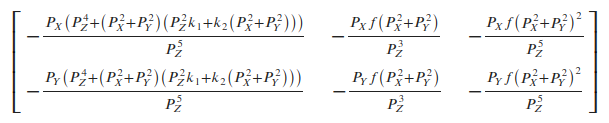

# Visual Odometry: Backend Optimization --  

This is the solution of Assignment 07 of Visual SLAM: Theory and Practice from [深蓝学院](https://www.shenlanxueyuan.com/my/course/240).

深蓝学院视觉SLAM理论与实践第六节课习题答案. 版权归深蓝学院所有. 请勿抄袭.

---

### Up and Running

The solution has been tested inside Docker CPU/GPU.

```bash
# go to workspace:
cd /workspace/assignments/07-backend-optimization
# build:
mkdir build && cd build && cmake .. && make -j8
# execute the solution 
```

---

## Solutions

---

### 1. Bundle Adjustment
### 1. Bundle Adjustment

---

#### 1.a Research Review
#### 1.a 文献综述

---

#### 1.b BAL-dataset
#### 1.b BAL-dataset

The solution is available at (click to follow the link) [here](01-bal-g2o/src/bal_g2o.cpp)

##### Analytic Jacobian Implementation

Below is the C++ implementation of **Analytic Jacobian for BAL PnP**

**First**, implement `linearizeOplus` of the binary edge as follows:

```c++
    // use analytic Jacobian:
    virtual void linearizeOplus() override {
        // get vertex handlers:
        const VertexPoseAndIntrinsics *vertex_camera = static_cast<VertexPoseAndIntrinsics *>(_vertices[0]);
        const VertexPoint *vertex_point = static_cast<VertexPoint *>(_vertices[1]);

        // get camera pose:
        // get camera intrinsics:
        double f = vertex_camera->estimate().focal;
        double k1 = vertex_camera->estimate().k1;
        double k2 = vertex_camera->estimate().k2;
        // get intermediate variables:
        Eigen::Vector3d X = vertex_point->estimate();
        Eigen::Vector3d P = vertex_camera->estimate().T.map(X);
        double P_X = P(0), P_Y = P(1), P_Z = P(2);

        double P_X_2 = P_X*P_X;
        double P_X_4 = P_X_2*P_X_2;

        double P_Y_2 = P_Y*P_Y;
        double P_Y_4 = P_Y_2*P_Y_2;

        double P_Z_2 = P_Z*P_Z;
        double P_Z_3 = P_Z*P_Z_2;
        double P_Z_4 = P_Z_2*P_Z_2;
        double P_Z_5 = P_Z*P_Z_4;
        double P_Z_6 = P_Z_3*P_Z_3;

        double R_2 = P_X_2 + P_Y_2;
        double R_4 = R_2*R_2;

        // Jacobian with respect to camera pose:
        Eigen::Matrix<double, 2, 3> JP;
        JP(0, 0) = -f*(2*P_X_2*(P_Z_2*k1 + 2*k2*R_2) + P_Z_4 + R_2*(P_Z_2*k1 + k2*R_2))/P_Z_5;
        JP(0, 1) = -2*P_X*P_Y*f*(P_Z_2*k1 + 2*k2*R_2)/P_Z_5;
        JP(0, 2) = P_X*f*(P_Z_4 + R_2*(P_Z_2*k1 + k2*R_2) + 2*R_2*(P_Z_2*k1 + 2*k2*R_2))/P_Z_6;
        JP(1, 0) = -2*P_X*P_Y*f*(P_Z_2*k1 + 2*k2*R_2)/P_Z_5;
        JP(1, 1) = -f*(2*P_Y_2*(P_Z_2*k1 + 2*k2*R_2) + P_Z_4 + R_2*(P_Z_2*k1 + k2*R_2))/P_Z_5;
        JP(1, 2) = P_Y*f*(P_Z_4 + R_2*(P_Z_2*k1 + k2*R_2) + 2*R_2*(P_Z_2*k1 + 2*k2*R_2))/P_Z_6;

        // Jacobian with respect to camera intrinsic:
        Eigen::Matrix<double, 2, 3> JI;
        JI(0, 0) = -P_X*(P_Z_4 + R_2*(P_Z_2*k1 + k2*R_2))/P_Z_5;
        JI(0, 1) = -P_X*f*R_2/P_Z_3;
        JI(0, 2) = -P_X*f*R_2/P_Z_5;
        JI(1, 0) = -P_Y*(P_Z_4 + R_2*(P_Z_2*k1 + k2*R_2))/P_Z_5;
        JI(1, 1) = -P_Y*f*R_2/P_Z_3;
        JI(1, 2) = -P_Y*f*R_2/P_Z_5;

        if (!vertex_camera->fixed()) {
            // a. camera pose:
            _jacobianOplusXi.block<2, 3>(0, 0) = JP;
            _jacobianOplusXi.block<2, 3>(0, 3) = -JP * g2o::skew(P);
            // b. camera intrinsics:
            _jacobianOplusXi.block<2, 3>(0, 6) = JI;
        }

        // Jacobian for landmark:
        if (!vertex_point->fixed()) {
            _jacobianOplusXj = JP * vertex_camera->estimate().T.rotation().toRotationMatrix();
        }
    }
```

Besides, the method `oplusImpl` and `project` of `VertexPoseAndIntrinsics` also have to be changed as follows. Here `g2o::SE3Quat` is used to manipulate the camera pose:

```c++
    virtual void oplusImpl(const double *update) override {
        // update camera pose:
        Eigen::Matrix3d dR = SO3d::exp(
            Vector3d(update[3], update[4], update[5])
        ).matrix();
        Eigen::Vector3d dt(
            update[0], update[1], update[2]
        );

        _estimate.T = g2o::SE3Quat(dR, dt) * _estimate.T;
        // update camera intrinsics:
        _estimate.focal += update[6];
        _estimate.k1 += update[7];
        _estimate.k2 += update[8];
    }

    Vector2d project(const Vector3d &point) {
        // transform to camera frame:
        Eigen::Vector3d P = _estimate.T.map(point);
        // perspective division:
        Eigen::Vector2d p(
            -P(0)/P(2), -P(1)/P(2)
        );
        // distortion:
        double r_squared = p.squaredNorm();
        double distortion = 1.0 + r_squared * (_estimate.k1 + _estimate.k2 * r_squared);
        Eigen::Vector2d p_prime(
            _estimate.focal * distortion * p(0),
            _estimate.focal * distortion * p(1)
        );
        return p_prime;
    }
```

##### Up and Running

Compile, and execute the following commands to reproduce the results

```bash
# go to working directory:
cd /workspace/assignments/07-backend-optimization/
# build:
mkdir build && cd build && cmake .. && make -j4
# execute:
./bal_g2o /workspace/assignments/07-backend-optimization/data/01-bal/problem-16-22106-pre.txt
```

##### Results and Review

The two key sub matrices needed for analytic Jacobian are shown below. For further details please refer to [here](01-bal-g2o/README.md)

First comes the matrix needed for `camera pose` and `point position` Jacobian derivation


Then comes the matrix needed for `camera intrinsic` Jacobian derivation



---

The `log` of optimization using analytic Jacobian is as follows. We can see that compared with using default numerical Jacobian, **using the optimized analytic Jacobian can greatly accelerate the optimization process**.

```bash
# problem overview:
Header: 16 22106 83718
# optimization log:
iteration= 0	 chi2= 2132524.720570	 time= 7.32429	 cumTime= 7.32429	 edges= 83718	 schur= 1	 lambda= 888.503326	 levenbergIter= 1
iteration= 1	 chi2= 1220355.327504	 time= 7.24393	 cumTime= 14.5682	 edges= 83718	 schur= 1	 lambda= 296.167775	 levenbergIter= 1
iteration= 2	 chi2= 984382.567199	 time= 7.3394	 cumTime= 21.9076	 edges= 83718	 schur= 1	 lambda= 98.722592	 levenbergIter= 1
iteration= 3	 chi2= 681054.506120	 time= 7.35763	 cumTime= 29.2653	 edges= 83718	 schur= 1	 lambda= 32.907531	 levenbergIter= 1
iteration= 4	 chi2= 489824.754203	 time= 7.69444	 cumTime= 36.9597	 edges= 83718	 schur= 1	 lambda= 10.969177	 levenbergIter= 1
iteration= 5	 chi2= 403070.794266	 time= 11.6948	 cumTime= 48.6545	 edges= 83718	 schur= 1	 lambda= 29.251138	 levenbergIter= 3
iteration= 6	 chi2= 363009.118699	 time= 7.53188	 cumTime= 56.1864	 edges= 83718	 schur= 1	 lambda= 19.500759	 levenbergIter= 1
iteration= 7	 chi2= 314099.844975	 time= 11.8666	 cumTime= 68.0529	 edges= 83718	 schur= 1	 lambda= 52.002024	 levenbergIter= 3
iteration= 8	 chi2= 296637.546781	 time= 12.1796	 cumTime= 80.2326	 edges= 83718	 schur= 1	 lambda= 138.672063	 levenbergIter= 3
iteration= 9	 chi2= 290072.599275	 time= 7.65337	 cumTime= 87.8859	 edges= 83718	 schur= 1	 lambda= 92.448042	 levenbergIter= 1
iteration= 10	 chi2= 287766.552552	 time= 9.9005	 cumTime= 97.7864	 edges= 83718	 schur= 1	 lambda= 123.264056	 levenbergIter= 2
...
```

---

The view of `King's Landing, Dubrovnik-16` is shown below


---

### 2. Direct Method Using Bundle Adjustment
### 2. 直接法的 Bundle Adjustment

---

#### 2.a Optimization Problem
#### 2.a 数学模型

##### How to Describe the Error of Landmark Projection?
##### 如何描述任意一点投影在任意一图像中形成的 error?

The error term can be defined as follows:

##### How Many Variables Are Associated with the Error?
##### 每个 error 关联几个优化变量?

##### What is the Jacobian of Each Variable?
##### error 关于各变量的雅可比是什么?

---

#### 2.b Implementation
#### 2.b 算法实现

The solution is available at (click to follow the link) [here](02-direct-ba/direct_ba.cpp)

##### Analytic Jacobian Implementation

Below is the C++ implementation of **Analytic Jacobian for Direct Method** (click to follow the link) [here](02-direct-ba/include/graph.hpp)

**First**, implement `linearizeOplus` of the binary edge as follows:

```c++
    // use analytic Jacobian:
    virtual void linearizeOplus() override {
        auto vertex_camera = static_cast<VertexCamera *>(_vertices[0]);
        auto vertex_landmark = static_cast<VertexLandmark *>(_vertices[1]);

        Eigen::Vector3d X = vertex_landmark->estimate().GetPosition();
        const int HALF_PATCH_SIZE = vertex_landmark->estimate().GetHalfPatchSize();

        // shall the optimization be stopped:
        if (level()==1) {
            _jacobianOplusXi = Eigen::Matrix<double, 16, 6>::Zero();
            _jacobianOplusXj = Eigen::Matrix<double, 16, 3>::Zero();
            return;
        }

        Eigen::Matrix<double, 2, 6> J_pose;
        Eigen::Matrix<double, 2, 3> J_position;
        vertex_camera->estimate().GetJacobians(X, J_pose, J_position);

        Eigen::Vector2d p_anchor = vertex_camera->estimate().Project(X);
        for (int dx = -HALF_PATCH_SIZE; dx < HALF_PATCH_SIZE; ++dx) {
            for (int dy = -HALF_PATCH_SIZE; dy < HALF_PATCH_SIZE; ++dy) {
                // get linear index:
                int i = (dx + HALF_PATCH_SIZE) * (HALF_PATCH_SIZE << 1) + (dy + HALF_PATCH_SIZE);

                // get current pixel:
                Eigen::Vector2d p(
                    p_anchor.x() + dx,
                    p_anchor.y() + dy
                );

                Eigen::Vector2d J_I = vertex_camera->estimate().GetImageGradient(p);

                Vector6d J_camera = J_I.transpose() * J_pose;
                Eigen::Vector3d J_landmark = J_I.transpose() * J_position;

                _jacobianOplusXi.block<1, 6>(i, 0) = J_camera;
                _jacobianOplusXj.block<1, 3>(i, 0) = J_landmark;
            }   
        }     
    }
```

Here `g2o::SE3Quat` is used to represent the camera pose. The same `CameraWithGradient` class from Assignment 06 is used to implement image gradient and Jacobian with respect to camera pose and landmark position.

##### Up and Running

Compile, and execute the following commands to reproduce the results

```bash
# go to working directory:
cd /workspace/assignments/07-backend-optimization/
# build:
mkdir build && cd build && cmake .. && make -j4
# execute:
./direct_ba
```

##### Results and Review

The `log` of optimization using analytic Jacobian is as follows. We can see that compared with using default numerical Jacobian, **using the optimized analytic Jacobian can greatly accelerate the optimization process**.

```bash
# problem overview
[Direct BA]: num. of observations -- 7, num. of landmarks -- 4118
iteration= 0	 chi2= 12192412.652936	 time= 3.80948	 cumTime= 3.80948	 edges= 20350	 schur= 1	 lambda= 22554.007402	 levenbergIter= 1
iteration= 1	 chi2= 12131178.617487	 time= 3.83759	 cumTime= 7.64707	 edges= 20350	 schur= 1	 lambda= 15036.004935	 levenbergIter= 1
iteration= 2	 chi2= 12066738.777211	 time= 3.86033	 cumTime= 11.5074	 edges= 20350	 schur= 1	 lambda= 10024.003290	 levenbergIter= 1
iteration= 3	 chi2= 12020180.560499	 time= 3.92555	 cumTime= 15.433	 edges= 20350	 schur= 1	 lambda= 6682.668860	 levenbergIter= 1
iteration= 4	 chi2= 11970006.841497	 time= 3.92406	 cumTime= 19.357	 edges= 20350	 schur= 1	 lambda= 4455.112573	 levenbergIter= 1
iteration= 5	 chi2= 11933109.813218	 time= 4.18036	 cumTime= 23.5374	 edges= 20350	 schur= 1	 lambda= 2970.075049	 levenbergIter= 1
iteration= 6	 chi2= 11892790.060755	 time= 4.16817	 cumTime= 27.7055	 edges= 20350	 schur= 1	 lambda= 1980.050033	 levenbergIter= 1
iteration= 7	 chi2= 11871228.270682	 time= 4.02321	 cumTime= 31.7288	 edges= 20350	 schur= 1	 lambda= 1320.033355	 levenbergIter= 1
iteration= 8	 chi2= 11853845.254105	 time= 4.3106	 cumTime= 36.0393	 edges= 20350	 schur= 1	 lambda= 880.022237	 levenbergIter= 1
iteration= 9	 chi2= 11843124.207989	 time= 3.99954	 cumTime= 40.0389	 edges= 20350	 schur= 1	 lambda= 586.681491	 levenbergIter= 1
...
```

---

The view of the optimized scene is shown below


---

###### Could the position of landmark be parameterized in a different way?
###### 能否不要以[x, y, z]的形式参数化每个点?

###### Is 4-by-4 patch a good choice for this problem? What is the reason behind choosing a smaller or larger patch?
###### 取4x4的patch好吗?取更大的 patch 好还是取小一点的 patch 好?

###### What is the difference of BA implementation between direct method and bundle adjustment?
###### 从本题中,你看到直接法与特征点法在BA阶段有何不同?

###### For direct method robust kernel, i.e., Huber kernel, might be needed. In this case how to select the threshold of Huber kernel?
###### 由于图像的差异,你可能需要鲁棒核函数,例如 Huber。此时 Huber 的阈值如何选取?
