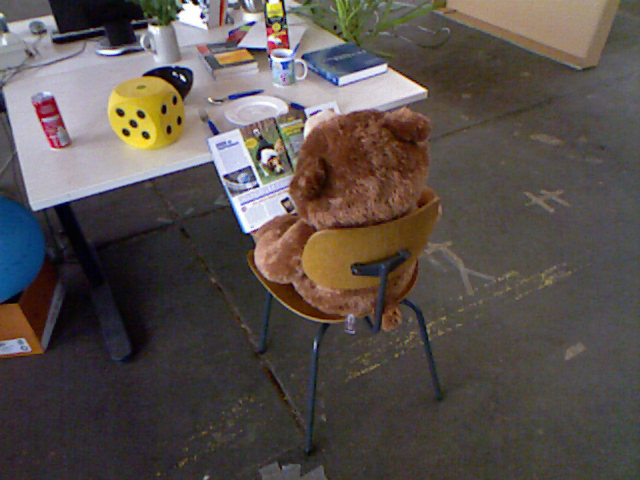

# Visual Odometry: Close Loop Detection -- 视觉SLAM理论与实践: 回环检测

This is the demo practice of close-loop detection utility, DBoW3, of Visual SLAM: Theory and Practice from [深蓝学院](https://www.shenlanxueyuan.com/my/course/240).

深蓝学院视觉SLAM理论与实践第八节回环检测Utility DBoW3 Demo. 版权归深蓝学院所有. 请勿抄袭.

---

## Up and Running

The solution has been tested inside Docker CPU/GPU.

```bash
# go to workspace:
cd /workspace/assignments/08-close-loop-detection
# build:
mkdir build && cd build && cmake .. && make -j2
# execute the solution 
```

---

## Demo

The query result on visual vocabulary built from the 10 sample images are shown below.

```bash
Top 4 Most Similar Images to Image 10.png: 
	Image 10.png, Score 1
	Image  1.png, Score 0.0369596
	Image  6.png, Score 0.03558
	Image  9.png, Score 0.0328473
```

Query        |Most Similar Results (Descending Order, Top-Down)
:-------------------------:|:-------------------------:
  |  
  |  
  |  

---

## Results and Review

From the above results we can see that:

* The absolute similarity score is not distinguishable enough: relative similarity score should be used.
* A larger feature set is needed for building a good enough vocabulary for dataset like KITTI Odometry.

The above knowhow will be used in final project to build close-loop detection system for KITTI Odometry.