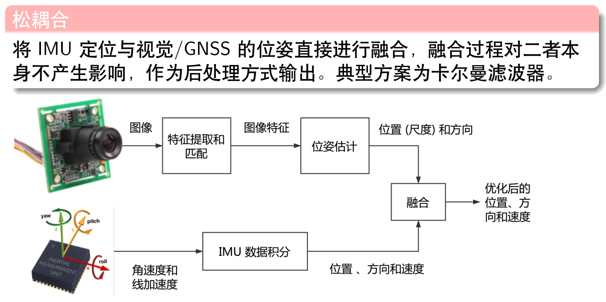
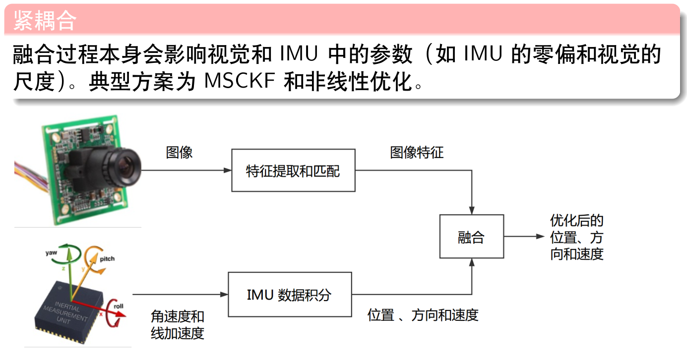
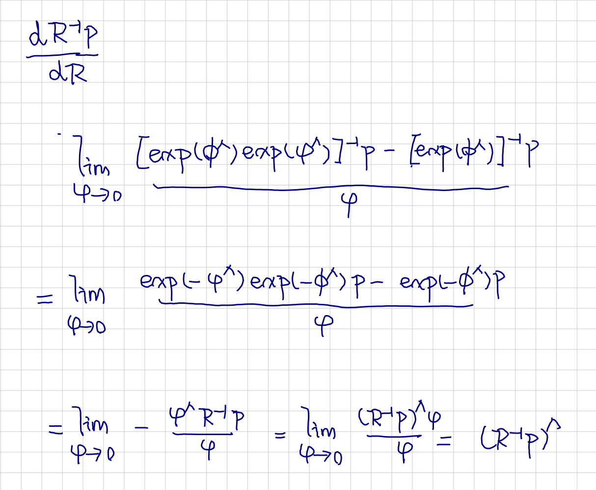
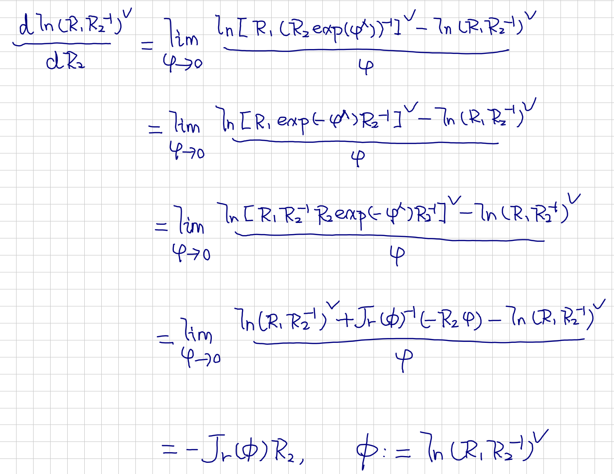

# Visual Inertial Odometry: Introduction -- 从零开始手写VIO: 基础知识回顾

This is the solution of Assignment 01 of Hands on VIO from [深蓝学院](https://www.shenlanxueyuan.com/course/247).

深蓝学院从零开始手写VIO第1节基础知识回顾答案. 版权归深蓝学院所有. 请勿抄袭.

---

### Up and Running

The solution has been tested inside Docker CPU/GPU.

```bash
# go to workspace:
cd /workspace/assignments/11-vio-introduction
# build:
mkdir build && cd build && cmake .. && make -j2
# execute the solution 
```

---

## Solutions

---

### 1. VIO Review

#### a. What is the advantage of VIO?
#### a. 视觉与IMU进行融合之后有何优势?

The comparison between pure visual and pure inertial odometry is shown below.


The advantage of visual inertial odometry is summarized in the following picture:


#### b. How could visual and inertial measurements be fused? Are there any industrial applications?
#### b. 有哪些常见的视觉+IMU融合方案?有没有工业界应用的例子?

Regarding `Visual Inertial Fusion`, there are two common practices:




Two representative industrial applications are:

* Intel RealSense Camera D435i, which can give odometry estimation using VIO.
* Localization for wearable AR/VR devices.

#### c. What is the SOTA result from VIO research? How could statistical learning methods be used in VIO?
#### c. 在学术界,VIO 研究有哪些新进展? 有没有将学习方法用到VIO中的例子?

---

### 2. Rotation Update through Quaternion and Rotation Matrix
### 2. 验证通过四元数或者旋转矩阵对旋转变量的更新等价

The solution is available at (click to follow the link) [here](01-rotation-update/rotation_update.cpp)

```c++
    // generate random rotation matrix:
    RandomAngle random_angle(-M_PI, +M_PI);
    Eigen::AngleAxisd angle_axis(
        // angle:
        random_angle.Get(),
        // axis: 
        Eigen::Vector3d::Random().normalized()
    );

    // format as quaternion:
    Eigen::Quaterniond q(angle_axis);
    // format as SO3:
    Sophus::SO3d phi(q);

    // define update:
    const Eigen::Vector3d dW(0.01, 0.02, 0.03);

    // apply update, quaternion:
    q = q * Eigen::Quaterniond(1.0, 0.5*dW.x(), 0.5*dW.y(), 0.5*dW.z());
    Sophus::SO3d so3_quaternion(q);
    // apply update, SO3:
    Sophus::SO3d so3_rotation_matrix = phi * Sophus::SO3d::exp(dW);

    // error:
    Eigen::Vector3d error = so3_rotation_matrix.log() - so3_quaternion.log();
    double relative_error = 100.0 * error.norm() / phi.log().norm();

    // generate output:
    std::cout.precision(2);
    std::cout << "relative error in SO3: " << std::fixed << relative_error << "%" << std::endl;
```

The shell output is as follows. It indicates that the two update method, using quaternion or rotation matrix, are equivalent

```bash
# launch:
./rotation_update 
# get relative error:
relative error in SO3: 0.00%
```

---

### 3. Derivative through Perturbation
### 3. 其他导数

The two derivatives related to inverse rotation matrix are shown below




