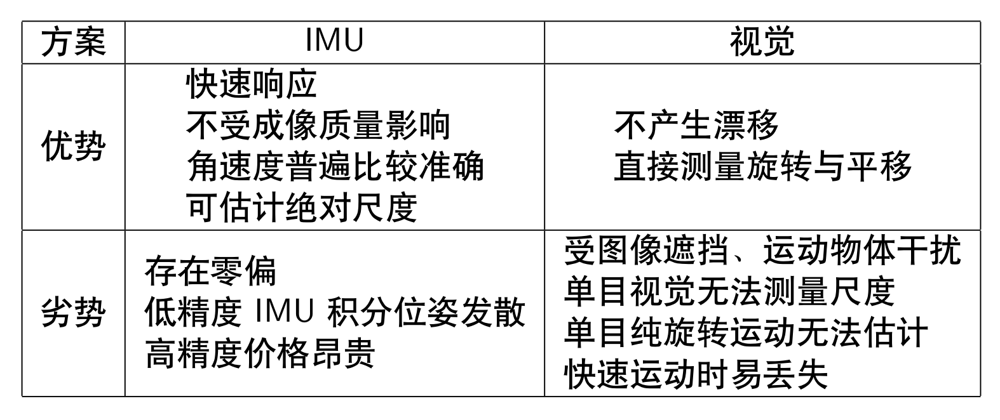

# Visual Inertial Odometry: Introduction -- 从零开始手写VIO: 基础知识回顾

This is the solution of Assignment 01 of Hands on VIO from [深蓝学院](https://www.shenlanxueyuan.com/course/247).

深蓝学院从零开始手写VIO第1节基础知识回顾答案. 版权归深蓝学院所有. 请勿抄袭.

---

### Up and Running

The solution has been tested inside Docker CPU/GPU.

```bash
# go to workspace:
cd /workspace/assignments/11-vio-introduction
# build:
mkdir build && cd build && cmake .. && make -j2
# execute the solution 
```

---

## Solutions

---

### 1. VIO Review

#### a. What is the advantage of VIO?
#### a. 视觉与IMU进行融合之后有何优势?

The comparison between pure visual and pure inertial odometry is shown below.



The advantage of visual inertial odometry is summarized in the following picture:


#### b. How could visual and inertial measurements be fused? Are there any industrial applications?
#### b. 有哪些常见的视觉+IMU融合方案?有没有工业界应用的例子?

Regarding `Visual Inertial Fusion`, there are two common practices:


Two representative industrial applications are:

* Intel RealSense Camera D435i, which can give odometry estimation using VIO.
* Localization for wearable AR/VR devices.

#### c. What is the SOTA result from VIO research? How could statistical learning methods be used in VIO?
#### c. 在学术界,VIO 研究有哪些新进展? 有没有将学习方法用到VIO中的例子?

The most interesting direction to me is `statistical learning methods in VIO`

* **VINet**[here](https://www.aaai.org/ocs/index.php/AAAI/AAAI17/paper/download/14462/14272) models the trajectory estimation problem as an `sequence-to-sequence learning` problem. It uses an `end-to-end` approach for model training. First, `CNN` is used to extract features from the two adjacent camera measurements. `LSTM` is used to extract features from the IMU measurements collected between the two adjacent camera measurements. After that, the high level visual and inertial features are concatenated to generate the relative pose estimation in `translation vector plus rotation quaternion`. 

* **DeepVIO**[here](https://arxiv.org/abs/1906.11435) uses `supervised learning` in monocular VIO estimation. Specifically, It first uses estimation from stereo vision measurements for data labelling. Then it builds `preintegration network` for IMU update and `fusion network` for 2D optical flow feature (OFF) and Inertial Measurement Unit (IMU) fusion. Besides, an IMU status update scheme is also used to improve IMU pose estimation through updating the additional gyroscope and accelerometer bias. The algorithm can reduces the impacts of inaccurate Camera-IMU calibrations, unsynchronized and missing data. The implementation outperforms state-of-the-art learning based methods in terms of accuracy and data adaptability on `KITTI` and `EuRoC` datasets. 

However, the deep-learning based method has very high computing workload and depends on the availability of a high quality labelled data, which depends on measurements generated by other high precision sensors. 

---

### 2. Rotation Update through Quaternion and Rotation Matrix
### 2. 验证通过四元数或者旋转矩阵对旋转变量的更新等价

The solution is available at (click to follow the link) [here](01-rotation-update/rotation_update.cpp)

```c++
    // generate random rotation matrix:
    RandomAngle random_angle(-M_PI, +M_PI);
    Eigen::AngleAxisd angle_axis(
        // angle:
        random_angle.Get(),
        // axis: 
        Eigen::Vector3d::Random().normalized()
    );

    // format as quaternion:
    Eigen::Quaterniond q(angle_axis);
    // format as SO3:
    Sophus::SO3d phi(q);

    // define update:
    const Eigen::Vector3d dW(0.01, 0.02, 0.03);

    // apply update, quaternion:
    q = q * Eigen::Quaterniond(1.0, 0.5*dW.x(), 0.5*dW.y(), 0.5*dW.z());
    Sophus::SO3d so3_quaternion(q);
    // apply update, SO3:
    Sophus::SO3d so3_rotation_matrix = phi * Sophus::SO3d::exp(dW);

    // error:
    Eigen::Vector3d error = so3_rotation_matrix.log() - so3_quaternion.log();
    double relative_error = 100.0 * error.norm() / phi.log().norm();

    // generate output:
    std::cout.precision(2);
    std::cout << "relative error in SO3: " << std::fixed << relative_error << "%" << std::endl;
```

The shell output is as follows. It indicates that the two update method, using quaternion or rotation matrix, are equivalent

```bash
# launch:
./rotation_update 
# get relative error:
relative error in SO3: 0.00%
```

---

### 3. Derivative through Perturbation
### 3. 其他导数

The two derivatives related to inverse rotation matrix are shown below


