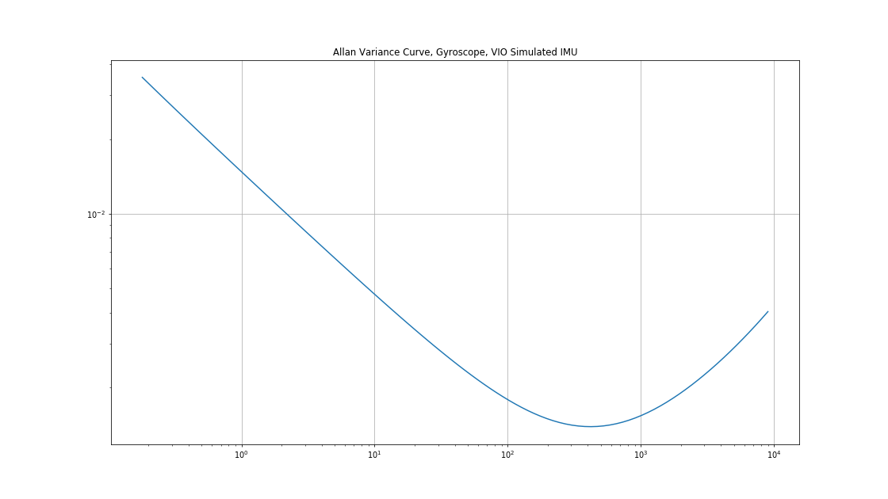
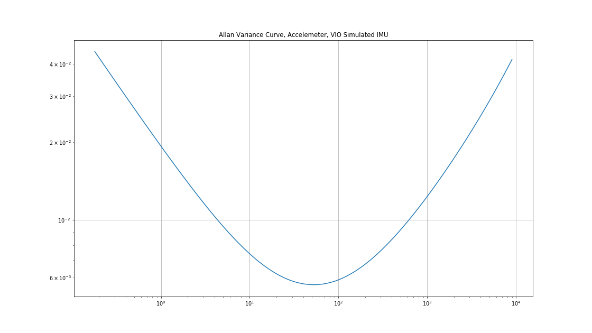
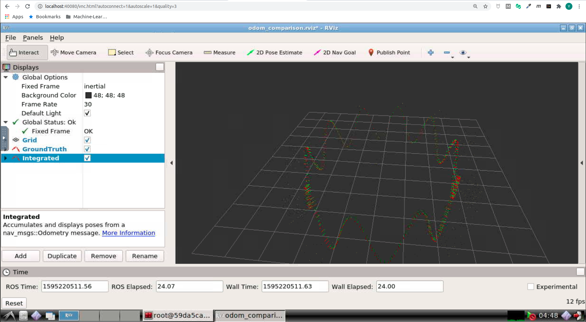
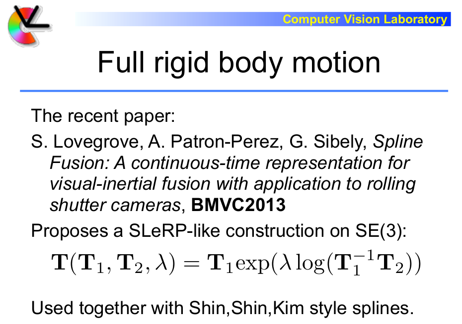

# Visual Inertial Odometry: IMU -- 从零开始手写VIO: IMU

This is the solution of Assignment 02 of Hands on VIO from [深蓝学院](https://www.shenlanxueyuan.com/course/247).

深蓝学院从零开始手写VIO第2节IMU传感器答案. 版权归深蓝学院所有. 请勿抄袭.

当前ROS Melodic Workspace包含两个C++ Package, 两Package为对Dr HeYiJia与GaoWenLiang实现的重构, 方便之后同生产解决方案的集成:

* `simulator`
    * Generate `Simulated IMU Measurement`
    * Publish `Groud Truth Odometry` and `Integrated Odometry from IMU`
* `calibration`
    * Calibrate IMU using `Allan Variance Analysis`
    * Write `Allan Variance Parameters` as `JSON` file
    * Write `Smoothed Allan Variance Curve` as `CSV` file

---

## Set Up Environment

The solution is organized as a ROS Melodic workspace. First init the workspace as:

```bash
# make sure you have properly configured ROS melodic:
catkin_init_workspace
```

Then build release as:

```bash
# build for release then setup session for solution:
catkin config --install && catkin build
```

Finally, setup the session for solution stack with the command below. Then you are ready to reproduce the results.

```bash
# set up session for solution
source install/setup.bash
```

--

## Solutions

### 1. Calibrate IMU with Allan Variance Analysis
### 1. 生成 Allen 方差标定曲线

---

#### Up & Running

First, **generate the simulated IMU measurement for Allan Variance calibration** by:

```bash
# generate simulated static IMU measurement for Allan Variance calibration:
roslaunch simulator calibration.launch
```

Then get the `calibration results`(in JSON) and `Allan Variance curve`(in CSV) using the command below:

```bash
# calibrate using Allan Variance analysis:
roslaunch calibration calibration.launch
```

---

#### Results

原始标定结果请参见:

* [IMU Calibration Results](imu-calibration-results.json)
* [Allan Variance Curve](imu-calibration-results.csv)

绘制曲线所用的脚本参见[Here](src/calibration/calibration/visualize.py):

##### Gyroscope

`Gyroscope`的标定结果如下. 测量噪声能够得到较精准的估计, Bias的随机游走能精准到数量级

```json
{
    "gyro": {
        "measurement_noise_stddev": 0.01468, 
        "bias_random_walk_stddev": 3.436e-05
    }
}
```

其`Allan Variance Curve`为:



##### accelerometer

`Accelerometer`的标定结果如下. 测量噪声能够得到较精准的估计, Bias的随机游走能精准到数量级

```json
{
    "acc": {
        "measurement_noise_stddev": 0.01880, 
        "bias_random_walk_stddev": 3.559e-04
    }
}
```

其`Allan Variance Curve`为:



---

### 2. IMU Integrated Odometry with Euler & Mid-Value Integration
### 2. 将IMU仿真代码中的欧拉积分替换成中值积分

#### Up & Running

First, launch the `odometry comparison node` by:

```bash
# publish ground truth odometry and IMU integrated odometry:
roslaunch simulator odom_comparison.launch
```

Then visualize the two trajectories using:

```bash
# launch RViz:
rviz -d src/simulator/rviz/odom_comparison.rviz
```

---

#### Results

中值积分的实现如下(完整代码参见[here](src/simulator/src/activity.cpp)):

```c++
    // update position:
    Eigen::Vector3d linear_acc_curr = R_integrated_*(linear_acc_ - linear_acc_bias_) - G_;
    Eigen::Vector3d linear_acc_mid_value = 0.5*(linear_acc_prev + linear_acc_curr);

    t_integrated_ = t_integrated_ + delta_t*v_integrated_ + 0.5*delta_t*delta_t*linear_acc_mid_value;
    v_integrated_ = v_integrated_ + delta_t*linear_acc_mid_value;

    // update orientation:
    Eigen::Vector3d angular_vel_curr = angular_vel_ - angular_vel_bias_;
    Eigen::Vector3d angular_vel_mid_value = 0.5*(angular_vel_prev + angular_vel_curr);

    Eigen::Vector3d da = 0.5*delta_t*angular_vel_mid_value;
    Eigen::Quaterniond dq(1.0, da.x(), da.y(), da.z());
    Eigen::Quaterniond q(R_integrated_);

    q = q*dq;
    R_integrated_ = q.normalized().toRotationMatrix();

    // move forward:
    angular_vel_prev = angular_vel_curr;
    linear_acc_prev = linear_acc_curr;
```

积分得到的轨迹与Ground Truth的对比如下:

* 在`有噪声`的情况下，积分得到的轨迹会快速发散.
* 即使在`无噪声`的情况下, 由于浮点误差的累计, 积分得到的轨迹也会很快发散. 

因此**IMU仅适合估计短时间内的运动**.



---

### 3. Generate Trajectory using B-Spline
### 3. 使用B-Spline从已有轨迹生成IMU数据

---

#### Prerequisites

Below are the materials I used to gain the prerequisite knowledge needed to understand the [paper](doc/references/00-spline-fusion-for-vio-fusion.pdf)

* `Interpolation in SE3` [here](doc/references/01-rotations-and-rigid-body-motions.pdf)
* `B-Spline Basis Functions: Definition` [here](https://pages.mtu.edu/~shene/COURSES/cs3621/NOTES/spline/B-spline/bspline-basis.html)
* `B-Spline Hands On` [here](https://opensourc.es/blog/b-spline/)
* `B-Spline Matrix Representation` [here](http://www2.cs.uregina.ca/~anima/408/Notes/Interpolation/UniformBSpline.htm)

---

#### Core Ideas

---

**First**, one possible strategy for `interpolation in SE3`, which uses the linear interpolation strategy in corresponding se3, is as follows:



That is, `the required pose between the two end poses can be linearly interpolated in se3`.

---

Since we need analytics expressions for IMU measurements, which are derived from trajectory representation, we hope that `the first and second order derivatives(angular velocity and linear acceleration measurements, respectively) of interpolated trajectory should be continuous` 

We can use **cubic B-Spline** to meet the above requirements:

* The interpolated trajectory will transit smoothly between `control poses`.
* B-Spline of order `3` is the minimum required basis function for `second order derivative continuity`.

---

