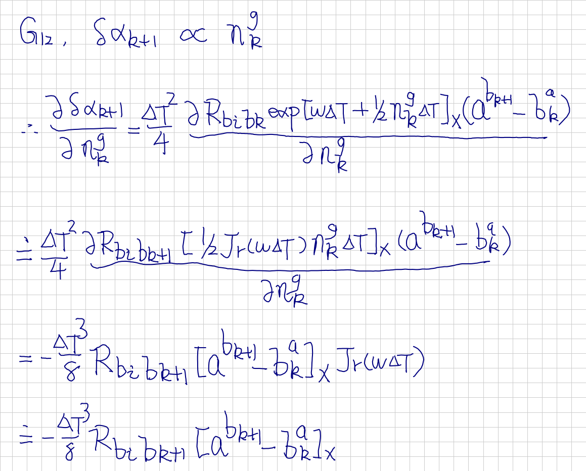

# Visual Inertial Odometry: Bundle Adjustment -- 从零开始手写VIO: Bundle Adjustment

This is the solution of Assignment 03 of Hands on VIO from [深蓝学院](https://www.shenlanxueyuan.com/course/247).

深蓝学院从零开始手写VIO第3节Bundle Adjustment答案. 版权归深蓝学院所有. 请勿抄袭.

当前ROS Melodic Workspace包含一个C++ Package, 可直接与基于ROS的机器人解决方案集成:

* `curve_fitting`
    * Load `Lambda Scheduling Configuration`.
    * Solve the selected problem and generate `Optimization Log for Visualization`.

---

## Set Up Environment

The solution is organized as a ROS Melodic workspace. First init the workspace as:

```bash
# make sure you have properly configured ROS melodic:
catkin_init_workspace
```

Then build release as:

```bash
# build for release then setup session for solution:
catkin config --install && catkin build
```

Finally, setup the session for solution stack with the command below. Then you are ready to reproduce the results.

```bash
# set up session for solution
source install/setup.bash
```

---

## Solutions

### 1. Parameter Estimation using LM Method
### 1. 使用Levenberg–Marquardt方法估计曲线参数

#### Up & Running

First, **setup the testcase using the config YAML**(click [here](src/curve_fitting/config/curve_fitting.yaml)):

```yaml
curve_fitting:
    curve:
        a: 3.0
        b: 2.0
        c: 1.0
    measurement:
        N: 5000
        sigma: 1.0
    problem: exp
    optimization:
        lambda_scheduling: 1
        max_iterations: 100
```

Then install the change and launch curve_fitting node by:

```bash
catkin build && source install setup/bash && roslaunch curve_fitting curve_fitting
```

Finally you can visualize the `lambda as optimization goes by` using the script below:

```bash
# calibrate using Allan Variance analysis:
roslaunch calibration calibration.launch
```

#### Results

##### a. Visualization of Lambda 
##### a. 绘制样例代码中 LM 阻尼因子 μ 随着迭代变化的曲线图

The visualization is generated by using [this](src/curve_fitting/scripts/visualize.py) script.


##### b. Estimate Params for *y = ax**2 + bx + c*
##### b. 将曲线函数改成*y = ax**2 + bx + c*, 完成曲线参数估计 

`Edge Definition` for *y = ax**2 + bx + c* can be found [here](src/curve_fitting/include/curve_fitting.h)

```c++
class CurveFittingPolyEdge: public Edge
{
public:
    EIGEN_MAKE_ALIGNED_OPERATOR_NEW
    
    CurveFittingPolyEdge( double x, double y ): Edge(1,1, std::vector<std::string>{"abc"}) {
        x_ = x;
        y_ = y;
    }
    // 计算曲线模型误差
    virtual void ComputeResidual() override
    {
        Vec3 abc = verticies_[0]->Parameters();  // 估计的参数
        residual_(0) = abc(0)*x_*x_ + abc(1)*x_ + abc(2) - y_;  // 构建残差
    }

    // 计算残差对变量的雅克比
    virtual void ComputeJacobians() override
    {
        Eigen::Matrix<double, 1, 3> jaco_abc;  // 误差为1维，状态量 3 个，所以是 1x3 的雅克比矩阵
        jaco_abc << x_*x_, x_, 1;
        jacobians_[0] = jaco_abc;
    }
    /// 返回边的类型信息
    virtual std::string TypeInfo() const override { return "CurveFittingPolyEdge"; }
public:
    double x_,y_;  // x 值， y 值为 _measurement
};
```

`Problem Construction` for *y = ax**2 + bx + c* can be found [here](src/curve_fitting/src/curve_fitting.cpp)

```c++
        shared_ptr<Edge> edge;
        if ("exp" == config.type) {
            // 观测 y
            double y = std::exp(config.a*x*x + config.b*x + config.c) + n;

            // 每个观测对应的残差函数
            std::unique_ptr<Edge> problem_edge(new CurveFittingExpEdge(x,y));
            edge = std::move(problem_edge); 
        } else {
            // 观测 y
            double y = config.a*x*x + config.b*x + config.c + n;

            // 每个观测对应的残差函数
            std::unique_ptr<Edge> problem_edge(new CurveFittingPolyEdge(x,y));
            edge = std::move(problem_edge); 
        }
```

Below are the `lambda` and the `chi-squared` during optimization using different lambda scheduling policy:


##### c. Evaluate Other Lambda Scheduling Policy 
##### c. 实现其他更优秀的阻尼因子策略,并给出实验对比

The following strategy is implemented [here](src/curve_fitting/src/backend/problem.cc)


```c++
bool Problem::IsGoodStepInLMAlpha(void) {
    double proposedChi;
    double rho;

    // calculate alpha:
    GetChiSquaredAndRho(1.0, proposedChi, rho);

    double product = b_.transpose() * delta_x_;
    double alpha = 1.0 / (0.5*(proposedChi - currentChi_)/product + 2);

    // goodness-of-approximation:
    GetChiSquaredAndRho(alpha, proposedChi, rho);

    if (rho > 0.0 && isfinite(proposedChi))   // last step was good, 误差在下降
    {        
        // update states:
        UpdateStates(alpha);

        // update chi-squared:
        currentChi_ = proposedChi;

        // update lambda:
        currentLambda_ = std::max(currentLambda_/(1.0 + alpha), 1e-7);
        
        return true;
    } else {
        // update lambda:
        currentLambda_ += std::abs(proposedChi - currentChi_)/(2*alpha);
        
        return false;
    }
}
```

In `theory`, the policy will perform `an attemptive update` before actual update to determine the scaling factor `alpha` for original LM update delta_x. With this extra computing, this policy is expected to give a more smooth lambda update compared with `Nielsen` policy.

However in practice:

* This policy is `very sensitive to initial value`. If a very bad initial estimation is used the corresponding alpha will be very small and it will take a very long time to get a significant update on state variables. That is why I changed `tau` to 500 in this assignment.

* Compared with `Nielsen` policy, the update given by `alpha` policy is more conservative so it will take a longer time for `alpha` policy to converge. This is obvious from the two visualizations above.

* Besides, a significant amount of extra computing is needed due to its use of attemptive update. This will make each optimization iteration take longer time compared with `Nielsen` policy.

So to sum up, the `Nielsen` strategy should still be used and the `alpha` strategy just has a theoretical advantage over `Nielsen` strategy.  

---

### 2. Jacobian Derivation
### 2. 完成如下两项的推导过程


#### Derivation

The derivation of `all the terms` in `error propagation` is available [here](doc/bundle-adjustment/error-propagation/README.md)

The two terms required by assignment are shown below:




---

### 3. Solution Using Damping Factor
### 3. 完成下式的推导过程


#### Derivation

