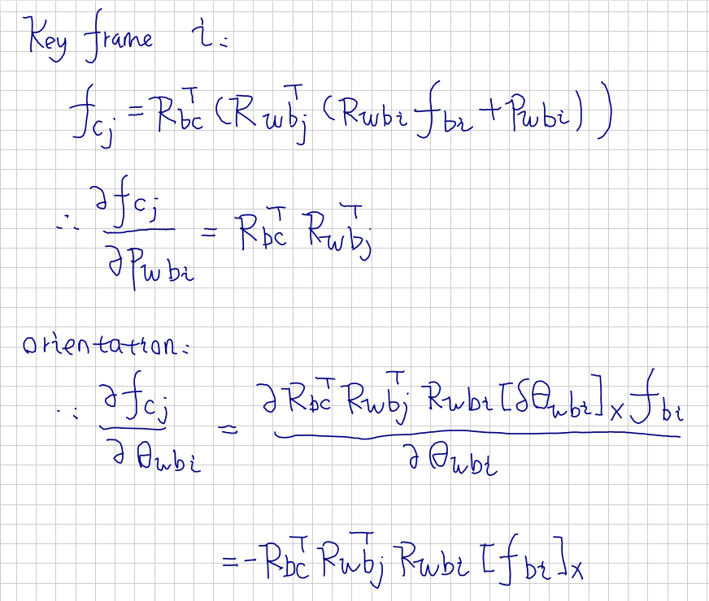

# Jacobian Derivation for Optimization

There are two types of error in VIO bundle adjustment, namely 

* `feature point reprojection error` and 
* `key frame pose constraint under IMU pre-integration`

---

## Prerequisites

`IMU multiplication` can also be expressed as `matrix multiplication`

`left multiplication by quaternion q1`, **q1*q2**, can be expressed as:

```python
LHS * Matrix([w_2, x_2, y_2, z_2])
```

In which LHS is defined as


`right multiplication by quaternion q1`, **q2*q1**, can be expressed as:

```python
RHS * Matrix([w_2, x_2, y_2, z_2])
```

In which RHS is defined as


---

## Reprojection Error

### Overview

A new reprojection error is introduced when `Key Frame i` and `Key Frame j` have common observations


In order to ease later derivation, define intermediate variables for `feature point position representation` as 


And choose intermediate variable for `Jacobian derivation` as


### Derivation

#### Key Frame i



#### Key Frame j


#### IMU-Camera Extrinsic

First comes the Jacobian with respect to `extrinsic position`:


First comes the Jacobian with respect to `extrinsic orientation`, which consists of 2 terms:


#### Inverse Depth


---

## IMU Pre-Integration Constraint

### Overview

The IMU pre-integration constraint is introduced by IMU measurements between two adjacent key frames


### Derivation

#### Position


#### Orientation

The derivation of orientation terms need to use `matrix representation of quaternion product` in section `prerequisite`. It consists of `three terms`, Jacobian with respect to `Key Frame i`, `Key Frame j` and `gyro bias of Key Frame i`


The Jacobian with respect to `Key Frame i`:


The Jacobian with respect to `Key Frame j`:


The Jacobian with respect to `bias of Key Frame i`:

