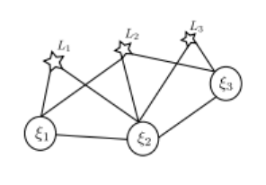

# Visual Inertial Odometry: Sliding Window -- 从零开始手写VIO: Sliding Window

This is the solution of Assignment 04 of Hands on VIO from [深蓝学院](https://www.shenlanxueyuan.com/course/247).

深蓝学院从零开始手写VIO第4节Sliding Window答案. 版权归深蓝学院所有. 请勿抄袭.

---

## Solutions

---

### 1. VIO Information Matrix
### 1. VIO问题的信息矩阵

System's `motion constraints` and `landmark observations` are defined as follows:



#### a. Visualize System Information Matrix
#### a. 绘制系统的信息矩阵

#### b. Visualize System Information Matrix After Pose 1 Have Been Marginalized
#### b. 绘制系统位姿1被边缘化后的信息矩阵
---

### 2. Relationship between the Hessian and Covariance Matrix for Gaussian Random Variable
### 2. 证明多元高斯分布信息矩阵与协方差之间的逆矩阵关系

#### Derivation

---

### 3. Nullspace of Hessian Matrix
### 3. 验证单目SLAM信息矩阵的零空间

#### Up and Running

```bash
# go to assignment workspace:
cd 14-sliding-window/src
# build:
mkdir build && cd build && cmake .. && make -j2
# run:
./hessian_nullspace_test
```

#### Implementation

The full solution code is available [here](src/hessian_nullspace_test.cpp). The core snippet for information matrix setup is shown below. `The Jacobian for camera pose` is with respect to `world frame`.

```c++
    // observe landmarks:
    LandmarkGenerator landmark_gen(-4.0, 4.0, 8.0, 10.0);
    for(size_t m = 0; m < M; ++m)
    {
        Eigen::Vector3d Pw = landmark_gen.Get();

        for (size_t n = 0; n < N; ++n) {
            // observe landmark:
            Eigen::Matrix3d Rcw = camera_pose.at(n).Rwc.transpose();
            Eigen::Vector3d Pc = Rcw * (Pw - camera_pose.at(n).twc);
            
            // intermediate variables:
            double x = Pc.x();
            double y = Pc.y();
            double z = Pc.z();
            double z_2 = z * z;

            // reprojection Jacobian with respect to normalized P:
            Eigen::Matrix<double,2,3> jacobian_uv_Pc;
            jacobian_uv_Pc << 
                fx/z,    0, -x * fx/z_2,
                   0, fy/z, -y * fy/z_2;

            // reprojection Jacobian with respect to landmark position Pw:
            Eigen::Matrix<double,2,3> jacobian_Pj = jacobian_uv_Pc * Rcw;

            Eigen::Matrix<double,2,6> jacobian_Ci;

            Eigen::Matrix3d P_hat;
            P_hat << 
                 0, -z, +y,
                +z,  0, -x,
                -y, +x,  0;

            jacobian_Ci.block<2, 3>(0, 0) = jacobian_uv_Pc * Rcw;
            jacobian_Ci.block<2, 3>(0, 3) = jacobian_uv_Pc * P_hat;

            // update Hessian:
            H.block<6, 6>(      n*6,       n*6) += jacobian_Ci.transpose() * jacobian_Ci;
            H.block<6, 3>(      n*6, N*6 + m*3) += jacobian_Ci.transpose() * jacobian_Pj;
            H.block<3, 6>(N*6 + m*3,       n*6) += jacobian_Pj.transpose() * jacobian_Ci;
            H.block<3, 3>(N*6 + m*3, N*6 + m*3) += jacobian_Pj.transpose() * jacobian_Pj;
        }
    }
```

#### Results

The `Top 10` and `Bottom 10` (in decreasing order) `singular values` of system information matrix are listed below. The result shows that `the nullspace dimension of monocular SLAM information matrix` is `7`

```bash
# run:
./hessian_nullspace_test
# singular values:
Singular Values:
      1: 139.32
      2: 121.319
      3: 101.458
      4: 81.2006
      5: 62.5098
      6: 54.0467
      7: 50.8862
      8: 47.0733
      9: 47.0605
     10: 42.697
    ...
    ...
    ...
    111: 0.0019239
    112: 0.00139512
    113: 0.00059486
    114: 3.76745e-17
    115: 2.60258e-17
    116: 1.70444e-17
    117: 1.59613e-17
    118: 1.03517e-17
    119: 8.11649e-18
    120: 6.73708e-18
```