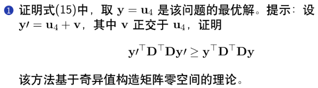
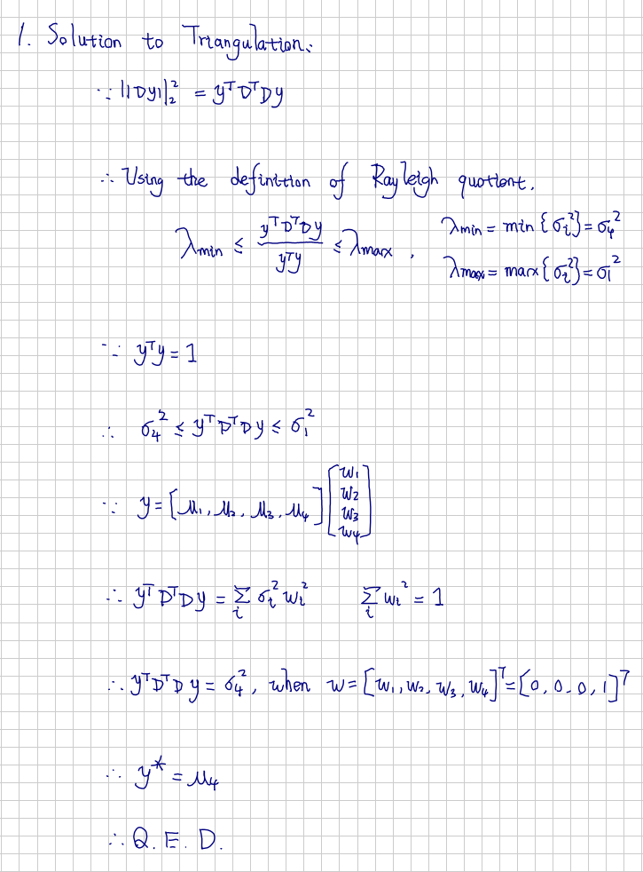

# Visual Inertial Odometry: Visual Frontend -- 从零开始手写VIO: Visual Frontend

This is the solution of Assignment 06 of Hands on VIO from [深蓝学院](https://www.shenlanxueyuan.com/course/247).

深蓝学院从零开始手写VIO第6节Visual Frontend答案. 版权归深蓝学院所有. 请勿抄袭.

---

## Solutions

---

### 1. Prove the Optimality of the Solution to Eq. 15
### 1. 证明下列策略为式15的最优解



#### Proof



---

### 2. Implement the Triangulation for Feature Points and Pass the Simulation Test
### 2. 完成特征点三角化代码, 并通过仿真测试

The full source code can be found [here](triangulate.cpp). Below is the code snippet for core triangulation logic: 

```c++
    // triangulation:
    const size_t M = end_frame_id - start_frame_id;
    Eigen::MatrixXd D(2*M, 4);

    for (size_t i = 0; i < M; ++i) {
        size_t index = start_frame_id + i;

        Eigen::Matrix3d Rcw = camera_pose.at(index).Rwc.transpose();
        Eigen::Vector3d tcw = -Rcw*camera_pose.at(index).twc;
        Eigen::MatrixXd Pcw(3, 4);

        Pcw.block<3, 3>(0, 0) = Rcw;
        Pcw.block<3, 1>(0, 3) = tcw;

        double u = camera_pose.at(index).uv(0);
        double v = camera_pose.at(index).uv(1);

        D.block<1, 4>(      i << 1, 0) = u*Pcw.block<1, 4>(2, 0) - Pcw.block<1, 4>(0, 0);
        D.block<1, 4>((i << 1) + 1, 0) = v*Pcw.block<1, 4>(2, 0) - Pcw.block<1, 4>(1, 0); 
    }
    
    // here SVD solver is used since the eigen vector of D.transpose()*D is just V:
    Eigen::JacobiSVD<Eigen::MatrixXd> svd(D, Eigen::ComputeThinU | Eigen::ComputeThinV);
    Eigen::VectorXd u_min = svd.matrixV().col(3);
    // normalize:
    Eigen::Vector3d P_est(
        u_min(0) / u_min(3),
        u_min(1) / u_min(3),
        u_min(2) / u_min(3)
    );
```

The output is shown below. It can be seen from the result that

* The triangulation quality is `Good` because the large enough ratio between the last two singular values.
* The estimation is accurate.

```bash
[Singular Values]:
	1:21.6427
	2:2.7832
	3:0.8504
	4:0.0000

	Quality Ratio: 1353862865733823.2500

[Result Summary]:
	Ground Truth: 
		-2.9477 -0.3308  8.4379
	Estimation: 
		-2.9477 -0.3308  8.4379
	Error: 
		0.0000
```

---

### 3. Visualize the Ratio Between the Smallest and the Second Smallest Singular Value as Measurement Noise Changes
### 3. 请对测量值加上不同噪声, 观察最小奇异值与第二小奇异值之间的比例变化, 并绘制比例变化的曲线

---

### 4. Visualize the Ratio Between the Smallest and the Second Smallest Singular Value as Measurement Window Expands
### 4. 固定噪声方差参数, 将观测图像扩展为多帧, 观察最小奇异值和第二小奇异值之间的比例变化, 并绘制比例变化的曲线