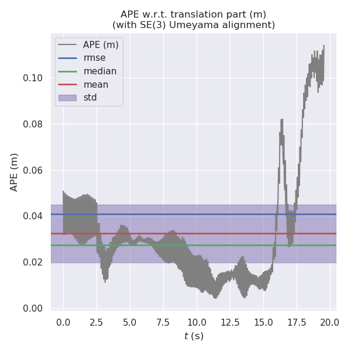
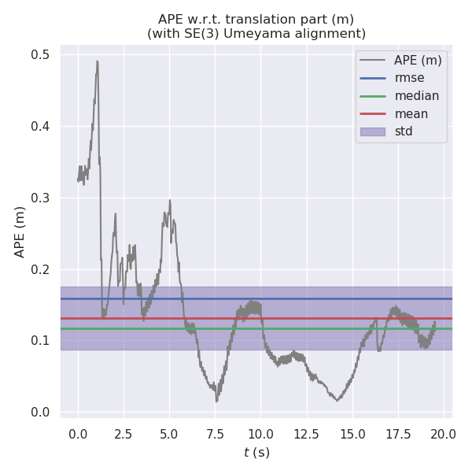

# Visual Inertial Odometry: VINS Initialization -- 从零开始手写VIO: VINS Initialization

This is the solution of Assignment 07 of Hands on VIO from [深蓝学院](https://www.shenlanxueyuan.com/course/247).

深蓝学院从零开始手写VIO第7节VINS Initialization答案. 版权归深蓝学院所有. 请勿抄袭.

---

## Problem Statement

将第二讲视觉特征与IMU仿真数据接入VINS代码, 分析不同噪声条件下轨迹估计结果.

Run `VINS` on `Simulation Data (with mono-camera observations and IMU observations)` and: 

* Visualize the estimated trajectory
* Evaluate estimation quality with [`evo`](https://github.com/MichaelGrupp/evo) 

---

## Solutions

In order to run `Shenlan VINS` on `Simulation Data (with mono-camera observations and IMU observations)`, change the following configurations. The full configuration file is available at [here](vins-mono/config/vio_simulation.yaml)

```yaml
# camera model: 
model_type: PINHOLE
camera_name: camera
image_width: 640
image_height: 640
distortion_parameters:
   k1: 0.0
   k2: 0.0
   p1: 0.0
   p2: 0.0
projection_parameters:
   fx: 460.0
   fy: 460.0
   cx: 255.0
   cy: 255.0

# extrinsic parameters from camera to IMU(body):
# a. orientation, R_bc:
extrinsicRotation: !!opencv-matrix
   rows: 3
   cols: 3
   dt: d
   data: [ 0.0, 0.0, -1.0,
          -1.0, 0.0,  0.0, 
           0.0, 1.0,  0.0]
# b. position, T_bc
extrinsicTranslation: !!opencv-matrix
   rows: 3
   cols: 1
   dt: d
   data: [0.05, 0.04, 0.03]

# visual frontend publish rate, match that from vio simulation
freq: 30                
```

Besides, a new data loader for `Simulated Landmark Data` should also be added. The full configuration file is available at [here](vins-mono/src/System.cpp)

```c++
// new data loader:
void System::PubImageData(double dStampSec, const KeyFrame &keyframe)
{
    if (!init_feature)
    {
        cout << "1 PubImageData skip the first detected feature, which doesn't contain optical flow speed" << endl;
        init_feature = 1;
        return;
    }

    if (first_image_flag)
    {
        cout << "2 PubImageData first_image_flag" << endl;
        first_image_flag = false;
        first_image_time = dStampSec;
        last_image_time = dStampSec;
        return;
    }
    // detect unstable camera stream
    if (dStampSec - last_image_time > 1.0 || dStampSec < last_image_time)
    {
        cerr << "3 PubImageData image discontinue! reset the feature tracker!" << endl;
        first_image_flag = true;
        last_image_time = 0;
        pub_count = 1;
        return;
    }
    last_image_time = dStampSec;
    // frequency control
    if (round(1.0 * pub_count / (dStampSec - first_image_time)) <= FREQ)
    {
        PUB_THIS_FRAME = true;
        // reset the frequency control
        if (abs(1.0 * pub_count / (dStampSec - first_image_time) - FREQ) < 0.01 * FREQ)
        {
            first_image_time = dStampSec;
            pub_count = 0;
        }
    }
    else
    {
        PUB_THIS_FRAME = false;
    }

    if (PUB_THIS_FRAME)
    {
        pub_count++;
        shared_ptr<IMG_MSG> feature_points(new IMG_MSG());
        feature_points->header = dStampSec;
        vector<set<int>> hash_ids(NUM_OF_CAM);
        for (int i = 0; i < NUM_OF_CAM; i++)
        {
            for (size_t j = 0; j < keyframe.landmarks.size(); ++j) {
                int p_id = keyframe.landmarks.at(j).id;

                double x = keyframe.landmarks.at(j).p_normalized.x();
                double y = keyframe.landmarks.at(j).p_normalized.y();
                double z = 1.0;

                Eigen::Vector3d P_world = Vector3d(x, y, z);
                const Eigen::Vector2d &p_image = keyframe.landmarks.at(j).p_image;

                hash_ids.at(i).insert(p_id);

                feature_points->id_of_point.push_back(p_id * NUM_OF_CAM + i);

                feature_points->points.push_back(P_world);
                
                feature_points->u_of_point.push_back(p_image.x());
                feature_points->v_of_point.push_back(p_image.y());
                // TODO: fix landmark velocity estimation for vio simulation
                feature_points->velocity_x_of_point.push_back(0.0);
                feature_points->velocity_y_of_point.push_back(0.0);
        }
            // skip the first image; since no optical speed on frist image
            if (!init_pub)
            {
                cout << "4 PubImage init_pub skip the first image!" << endl;
                init_pub = 1;
            }
            else
            {
                m_buf.lock();
                feature_buf.push(feature_points);
                // cout << "5 PubImage t : " << fixed << feature_points->header
                //     << " feature_buf size: " << feature_buf.size() << endl;
                m_buf.unlock();
                con.notify_one();
            }
        }
    }
}
```

---

### 1. Data with No Measurement Noise
### 1. 仿真数据集无噪声

Run the following command to reproduce the analysis on `noise-free IMU measurements`:

```bash
# go to workspace:
cd /workspace/assignments/17-vins-initialization/doc/noise-free
# run analysis:
evo_ape tum ground-truth.txt vins-estimation.txt -va --plot --plot_mode xy --save_results results.zip
```

The results are as follows. From the visualization we can conclude that **the VINS is functionally correct**. That is, **it can give correct trajectory estimation given raw IMU and camera measurements**.

Noise Level                |APE                        |Error on Trajectory        
:-------------------------:|:-------------------------:|:-------------------------:
Noise Free                 ||

---

### 2. Data with Measurement Noise
### 2. 仿真数据集有噪声

To analyze `measurement noise's impace on trajectory estimation`, the following three experiments will be performed:

* `Noise Level Proper` VINS uses the same noise parameters as VIO simulation
    ```yaml
    # a. proper noise level:
    acc_n: 0.2687       # acc_noise_sigma * sqrt(1.0/imu_frequency).
    gyr_n: 0.2121       # gyro_noise_sigma * sqrt(1.0/imu_frequency).     
    acc_w: 7.07e-6      # acc_bias_sigma / sqrt(1.0/imu_frequency).
    gyr_w: 7.07e-7      # gyro_bias_sigma / sqrt(1.0/imu_frequency).
    ```
* `Noise Level Underestimate` VINS noise level is 3 times smaller than that used by VIO simulation
    ```yaml
    # b. under-estimate:
    acc_n: 0.08956      # 0.333 * acc_noise_sigma * sqrt(1.0/imu_frequency).
    gyr_n: 0.07071      # 0.333 * gyro_noise_sigma * sqrt(1.0/imu_frequency).     
    acc_w: 2.357e-6     # 0.333 * acc_bias_sigma / sqrt(1.0/imu_frequency).
    gyr_w: 2.357e-7     # 0.333 * gyro_bias_sigma / sqrt(1.0/imu_frequency).
    ```
* `Noise Level Overestimate` VINS noise level is 3 times larger than that used by VIO simulation
    ```yaml
    # c. over-estimate:
    acc_n: 0.8061       # 3.0 * acc_noise_sigma * sqrt(1.0/imu_frequency).
    gyr_n: 0.6364       # 3.0 * gyro_noise_sigma * sqrt(1.0/imu_frequency).     
    acc_w: 2.121e-5     # 3.0 * acc_bias_sigma / sqrt(1.0/imu_frequency).
    gyr_w: 2.121e-6     # 3.0 * gyro_bias_sigma / sqrt(1.0/imu_frequency).
    ```

Run the following command to reproduce the analysis on `IMU measurements with noise`. Here use `Noise Level Proper` as example:

```bash
# go to workspace:
cd /workspace/assignments/17-vins-initialization/doc/with-noise/proper-prior
# run analysis:
evo_ape tum ground-truth.txt vins-estimation.txt -va --plot --plot_mode xy --save_results results.zip
```

The results are as follows.

Noise Level                |APE                        |Error on Trajectory        
:-------------------------:|:-------------------------:|:-------------------------:
Proper                    ||
Underestimate             ||
Overestimate              ||


The comparison between the above 3 configurations are visualized as follows:

APE                        |Summary                    |Distribution        
:-------------------------:|:-------------------------:|:-------------------------:
||

From the visualization we can conclude that:

* **Proper Noise Estimation is Vital** that is why the calibration toolbox introduced in Chapter 2 matters.
* **Overestimate is Better Than Underestimate** Compared with underestimation, the performance degradation caused by overestimation is less severe. This is good for engineering solutions for real applications.

---