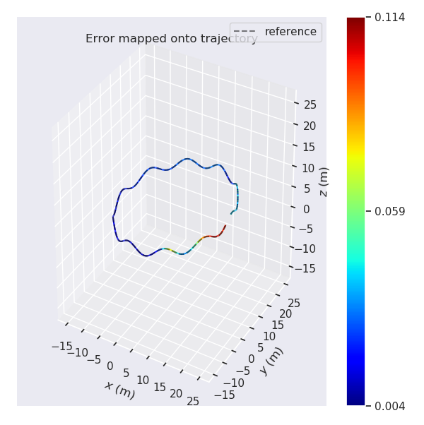
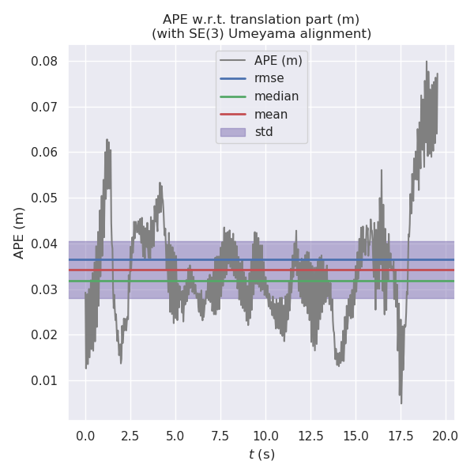
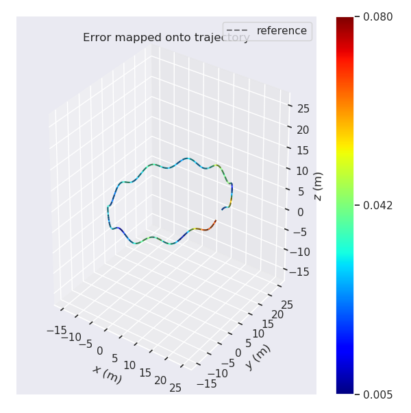

# Visual Inertial Odometry: VINS Initialization -- 从零开始手写VIO: VINS Initialization

This is the solution of Assignment 07 of Hands on VIO from [深蓝学院](https://www.shenlanxueyuan.com/course/247).

深蓝学院从零开始手写VIO第7节VINS Initialization答案. 版权归深蓝学院所有. 请勿抄袭.

---

## Problem Statement

将第二讲视觉特征与IMU仿真数据接入VINS代码, 分析不同噪声条件下轨迹估计结果.

Run `VINS` on `Simulation Data (with mono-camera observations and IMU observations)` and: 

* Visualize the estimated trajectory
* Evaluate estimation quality with [`evo`](https://github.com/MichaelGrupp/evo) 

---

## Solutions

In order to run `Shenlan VINS` on `Simulation Data (with mono-camera observations and IMU observations)`, change the following configurations. The full configuration file is available at [here](vins-mono/config/vio_simulation.yaml)

```yaml
# camera model: 
model_type: PINHOLE
camera_name: camera
image_width: 640
image_height: 640
distortion_parameters:
   k1: 0.0
   k2: 0.0
   p1: 0.0
   p2: 0.0
projection_parameters:
   fx: 460.0
   fy: 460.0
   cx: 255.0
   cy: 255.0

# extrinsic parameters from camera to IMU(body):
# a. orientation, R_bc:
extrinsicRotation: !!opencv-matrix
   rows: 3
   cols: 3
   dt: d
   data: [ 0.0, 0.0, -1.0,
          -1.0, 0.0,  0.0, 
           0.0, 1.0,  0.0]
# b. position, T_bc
extrinsicTranslation: !!opencv-matrix
   rows: 3
   cols: 1
   dt: d
   data: [0.05, 0.04, 0.03]

# visual frontend publish rate, match that from vio simulation
freq: 30                
```

---

### 1. Data with No Measurement Noise
### 1. 仿真数据集无噪声

Run the following command to reproduce the analysis on `noise-free IMU measurements`:

```bash
# go to workspace:
cd /workspace/assignments/17-vins-initialization/doc/noise-free
# run analysis:
evo_ape tum ground-truth.txt vins-estimation.txt -va --plot --plot_mode xy --save_results results.zip
```

The results are as follows. From the visualization we can conclude that **the VINS is functionally correct**. That is, **it can give correct trajectory estimation given raw IMU and camera measurements**.

Noise Level                |APE                        |Error on Trajectory        
:-------------------------:|:-------------------------:|:-------------------------:
Noise Free                 ||

---

### 2. Data with Measurement Noise
### 2. 仿真数据集有噪声

To analyze `measurement noise's impace on trajectory estimation`, the following three experiments will be performed:

* `Noise Level Proper` VINS uses the same noise parameters as VIO simulation
* `Noise Level Underestimate` VINS noise level is 5 times smaller than that used by VIO simulation
* `Noise Level Overestimate` VINS noise level is 5 times larger than that used by VIO simulation

Run the following command to reproduce the analysis on `IMU measurements with noise`. Here use `Noise Level Proper` as example:

```bash
# go to workspace:
cd /workspace/assignments/17-vins-initialization/doc/with-noise/proper-prior
# run analysis:
evo_ape tum ground-truth.txt vins-estimation.txt -va --plot --plot_mode xy --save_results results.zip
```

The results are as follows.

Noise Level                |APE                        |Error on Trajectory        
:-------------------------:|:-------------------------:|:-------------------------:
Proper                    ||
Underestimate             ||
Overestimate              ||

---