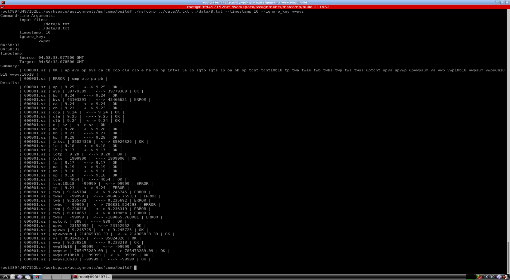

# Solution to msfcomp

This is the solution to `msfcomp`

---

## Up and Running

Use the following commands to build the solution

```bash
# build solution:
mkdir build && cd build && cmake .. && make -j2
# run on test data:
./msfcomp ../data/A.txt ../data/B.txt --timestamp 123 --ignore_key d vwpvs
```

The sample output for Q1 is shown below:

